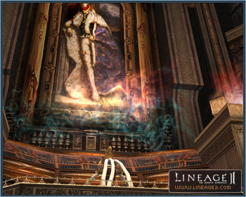

# Monsters

[Frintezza](#frintezza) | [Life Crystals](#life-crystals)

Monsters with unique battle characteristics have been added in accordance with player level increases and other improvements to the game.

The monsters can have the following new abilities when fighting within any of the hunting grounds:

- May use a Healing Potion in the middle of a battle.
- May use counter-skills to attack when being attacked with certain skills.
- May summon a distant attacking player to them.
- May pick up dropped items on the ground at certain time intervals.

Monsters that present many different abilities based on various battle situations have also been added.

## Raid Boss Monsters

The abilities of a raid boss monster has increased overall, and the rewards have also increased.

Just like the raid bosses, boss-ranked monsters (i.e., Ant Queen, Core, Orfen, and Zaken) and their monster followers now use petrification or silence when they are attacked by players 9 or more levels higher, or if they are using skills.

Raid monsters have been added to the newly added territories in Chronicle 5.

## Frintezza

Frintezza, the son of Baium of Elmoreden, has been added as a new boss monster.

Frintezza was granted eternal life from a devil, and he presents a unique battle style and characteristic than that of any other existing boss monster.

### Location and Entry

Frintezza resides in the last tomb beyond a secret wall that is connected to the Imperial Tomb. In order to enter, players must satisfy the entry conditions through a related quest that begins with the Nameless Spirit within the Four Sepulchers.

A minimum of four parties may enter; five parties at most can enter. These parties must be organized through a command channel and the command channel leader must possess Frintezza's Magic Force Field Removal Scroll.

### The Last Imperial Tomb

The Last Imperial Tomb is made up of a long passageway and a room where Frintezza resides. In the passageway connected to Frintezza's room, you can gain many items that will be useful in your battle with Frintezza.

## Life Crystals

Rewards from the raid monsters have been diversified, and a new process of item assembly has been added.

Many different kinds of Life Crystals may be acquired from hunting raid monsters at level 40 and above. These crystals can be assembled through an Adventure Guild or the Adventure Guild Manager to create C Grade, B Grade, and A Grade items (weapons, armor, accessories, hair accessories, etc.).

When a clan that owns a castle hunts a certain raid monster, an Adventure Guild Manager who can assemble A-grade weapons and armor appears in a castle town that is owned by the clan. Certain Life Crystals, dropped by raid monsters, may be changed to the Life Crystal necessary for assembling A-grade weapons and armor through an Adventure Guild Manager.

You may also gamble by trading a Life Crystal for other items with an Adventure Guild NPC.
