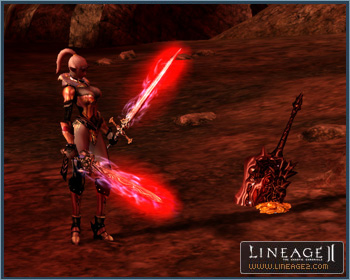
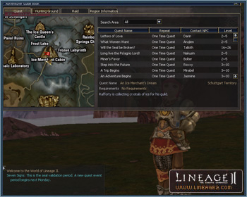

# Items

[Instant Effect Items](#instant-effect-items) | [Demonic Sword Zariche](#the-demonic-sword-zariche) | [Armor Set Bonuses](#armor-set-bonuses) | [Adventurer's Guide Book](#adventurers-guide-book) | [New Items](#new-items) | [Recipes](#recipes)

## Instant Effect Items

In order to maximize the efficiency of solo hunting, instant effect items have been added. Instant effect items are only dropped in areas set as solo hunting grounds. When hunting monsters in these areas, instant effect items, such as items to increase your HP/MP regeneration or P. Atk./M. Atk are dropped.

The instant effect items are as follows:

- **Herb of Life:** recovers HP.
- **Herb of Mana:** recovers MP.
- **Herb of Strength:** temporarily increases P. Atk.
- **Herb of Magic:** temporarily increases M. Atk.

Herbs of Life and Herbs of Mana do not recover HP and MP at any standard rate; they recover a certain % of total HP and MP of the character that picks them up. Herbs of Strength and Herbs of Magic have overlapping effects with existing skills that have similar effects and their duration time is 2 minutes.

Instant effect items cannot be stored in inventory and will immediately take effect when they are picked up.

If an instant effect item is dropped by a monster and not picked up within 15 seconds, they will disappear.

When a party member picks up an instant effect item while they are hunting, the effect will be applied instantly to the person who picked it up regardless of the party's looting rules.

## The Demonic Sword Zariche

The weapon of slaughter, The Demonic Sword Zariche (hereafter Zariche), was once used by the Demon Bremmnon, one of the four demon kings.

### Drop Rate and Possession Rules

- All monsters in the world have the potential to drop it. However, only one of these exists in the whole world.
- It is impossible to drop, exchange, or destroy this item from your inventory.
- When Zariche is dropped in the world, the entire world becomes dark for a short period of time, the ground shakes, and a system message notifies all players that the demonic sword has been found.
- The character that acquires Zariche goes into a chaotic state (red) instantly, and his/her HP, CP, and MP are fully recovered (100%).
- Once obtained, the character's karma becomes maximized. Unless Zariche leaves the character, the character will always have karma.
- When a character acquires Zariche, it is equipped automatically and is impossible to un-equip.
- Zariche automatically disappears after a certain period of time (once acquired).
- When a character who possesses Zariche dies, it disappears or is dropped immediately.
- Zariche will still automatically leave its owner at the appropriate time regardless if they are logged in or not.
- The character who possesses Zariche will be notified by a system message with how much time is remaining before Zariche leaves.

### Wars and Parties

The following will be applied to the character who possesses Zariche in PvP, clans wars, and in parties.

- A player carrying Zariche cannot attack players that are level 20 or lower. In the same respect, players must be level 21 or higher to attack the character wielding Zariche.
- When striking (excluding magic and physical skills) players, including Heroes, their CP is instantly reduced to 0.
- When a Hero strikes (excluding magic and physical skills) a character wielding Zariche, the CP of that character is instantly reduced to 0.
- PK penalties such as experience point loss, item drops, karma increases, etc. will not be applicable to either side when a player wielding Zariche is involved.
- A player wielding Zariche cannot join a party with other players.
- If a player acquires Zariche while in a party, that character is automatically withdrawn from that party.
- The player wielding Zariche cannot use the party matching system or command channel.
- The player wielding Zariche cannot give or accept buffs and may not be healed or heal other players. However, he or she may use buffs and heal themselves.
- The player wielding Zariche may summon a pet/servitor, but may not ride a pet.

### Olympiad and Heroes

- The player wielding Zariche cannot participate in the Olympiad.
- When a Hero acquires Zariche, skills designed for Heroes may still be used.

### Ability and Life Span

- When a player wielding Zariche kills another player, Zariche's lifespan shortens but the sword's abilities increase.
- Zariche causes its wielder to recognize everyone involved in a siege war as enemies.
- When a player wielding Zariche dies and the sword's abilities have been enhanced, the sword will be dropped and its abilities will return to normal.

## Armor Set Bonuses

Additional effects will be bestowed when complete armor sets are enchanted to +6 and above. Each individual item in the set will need to be enchanted to +6 or above in order to benefit from the new effects.

These effects differ depending on each individual armor type or grade.

## Adventurer's Guide Book

An Adventurer's Guide Book has been added for quest information, hunting grounds, raid boss monsters, areas, etc.

Raid scores and ranking can be viewed in the raid information window. Raid score is calculated in one month cycles, and when a new cycle starts, the score from the previous period is initialized.

The new period starts the 1st of every month at 05:00. The previous score and ranking will be displayed for 1 week, and after one week the information of the current period will be displayed.

The book can be purchased from a grocer in each village.

## New Items

### Weapons

D Grade through A Grade weapons have been added.

| Item Type | Item Name (P. Atk/M. Atk) | Grade | Crystal Count | Special Ability 1 | Special Ability 2 | Special Ability 3 |
|-----------|---------------------------|-------|---------------|-------------------|-------------------|-------------------|
| Two-Handed Sword | **Titan Sword** (96/47) | D | 2545 | - | - | - |
| Two-Handed Sword | **Pa'agrian Sword** (169/76) | C | 1720 | Focus (Red) | Health (Green) | Critical Drain (Blue) |
| Two-Handed Sword | **Guardian Sword** (236/99) | B | 1746 | Health (Green) | Critical Drain (Red) | Critical Bleed (Blue) |
| Two-Handed Sword | **Infernal Master** (259/107) | A | 1464 | Focus (Blue) | Critical Damage (Green) | Haste (Red) |
| Sword | **Priest's Sword** (32/35) | D | 743 | - | - | - |
| Sword | **Sword of Magic Fog** (63/63) | D | 2545 | - | - | - |
| Sword | **Mysterious Sword** (85/81) | C | 916 | Acumen (Red) | Magic Power (Green) | Magic Weakness (Blue) |
| Sword | **Ecliptic Sword** (125/111) | C | 2452 | Greater Empower (Red) | Magic Power (Green) | Magic Silence (Blue) |
| Sword | **Wizard's Tear** (155/132) | B | 1746 | Acumen (Red) | Magic Power (Green) | Conversion (Blue) |
| Two-Handed Blunt Weapon | **Titan Hammer** (96/47) | D | 2545 | - | - | - |
| Two-Handed Blunt Weapon | **Dwarven Hammer** (190/83) | C | 2452 | Health (Green) | Anger (Red) | Critical Bleed (Blue) |
| Two-Handed Blunt Weapon | **Karik Horn** (169/76) | C | 1720 | Focus (Blue) | Haste (Green) | Critical Drain (Red) |
| Two-Handed Blunt Weapon | **Star Buster** (236/99) | B | 1746 | Health (Red) | Haste (Green) | Rsk. Focus (Blue) |
| Two-Handed Blunt Weapon | **Ice Storm Hammer** (213/91) | B | 1157 | Focus (Red) | Anger (Green) | Critical Bleed (Blue) |
| Two-Handed Blunt Weapon | **Destroyer Hammer** (259/107) | A | 1464 | Health (Red) | Haste (Green) | Critical Drain (Blue) |
| Two-Handed Blunt Weapon | **Doom Crusher** (282/114) | A | 2160 | Health (Red) | Anger (Green) | Rsk. Haste (Blue) |
| Blunt Weapon | **Priest's Mace** (63/63) | D | 2545 | - | - | - |
| Blunt Weapon | **Ecliptic Axe** (125/111) | C | 2452 | Conversion (Red) | Magic Power (Green) | Magic Hold (Blue) |
| Blunt Weapon | **Spell Breaker** (140/122) | B | 1157 | Acumen (Blue) | Magic Mental Shield (Green) | Magic Hold (Red) |
| Blunt Weapon | **Kaim Vanul's Bones** (155/132) | B | 1746 | Mana Up (Red) | Magic Silence (Green) | Conversion (Blue) |
| Blunt Weapon | **Spiritual Eye** (170/143) | A | 1464 | Mana Up (Red) | Magic Poison (Green) | Acumen (Blue) |
| Blunt Weapon | **Flaming Dragon Skull** (186/152) | A | 2160 | Acumen (Red) | Magic Power (Green) | Magic Silence (Blue) |

### Courage Charms

Courage Charms, items that can prevent the reduction of experience points upon death in a siege, have been added.

These charms may be stored in inventory and used similarly to a Lucky Charm (by double-clicking on it.) Only Courage Charms that are the same level as one's expertise skill level or an upper-grade Courage Charm may be used.

When a player dies in a siege and the Charm is in effect, experience points are not lost. This is only applicable when a death occurs on the battlefield.

The effect of the Courage Charm does not overlap with other buffs and is applied separately. The effect lasts about 2 hours.

It can be purchased from Trader Ralford in the Ivory Tower located in Oren Territory. Courage Charms may be exchanged or traded.

### Clan Armor Sets

Clan Apella armor sets may be purchased by using clan reputation points. An Apella set can only be worn by the Baron class and above.

Academy members can gain a Clan Oath armor set through a quest.

Armor sets by type are listed below:

| Type | D Grade | A Grade |
|------|---------|---------|
| Heavy Armor Set | Clan Oath Plate Armor | Apella Plate Armor |
| Heavy Armor Set | Clan Oath Gauntlet | Apella Gauntlet |
| Heavy Armor Set | Clan Oath Sabaton | Apella Solleret |
| Heavy Armor Set | Clan Oath Great Helm | Apella Great Helm |
| Light Armor Set | Clan Oath Brigandine | Apella Brigandine |
| Light Armor Set | Clan Oath Leather Gloves | Apella Leather Gloves |
| Light Armor Set | Clan Oath Boots | Apella Boots |
| Light Armor Set | Clan Oath Helm | Apella Helm |
| Robe Set | Clan Oath Aketon | Apella Doublet |
| Robe Set | Clan Oath Padded Gloves | Apella Silk Gloves |
| Robe Set | Clan Oath Shoes | Apella Sandals |
| Robe Set | Clan Oath Cap | Apella Cap |

### Hair Accessories

Twelve new hair accessories have been added.

- **Raid Challenger Circlet:** Beginners' circlet for raid challengers.
- **Raid Adventurer Circlet:** Intermediate circlet for raid adventurers.
- **Raid Master Circlet:** Advanced circlet for raid masters.
- **Ice Fairy Sirra's Circlet:** Obtained after defeating Ice Fairy Sirra.
- **Academy Circlet:** Given to the Academy graduates.
- **Rune Circlet:** Symbolized with by a rose. Only a Lord or clan members of Rune can wear it. Alliance members cannot wear it.
- **Schuttgart Circlet:** Symbolized by a hammer and torch. Only the lord and clan members of Schuttgart can wear it. Alliance members cannot wear it.
- **Party Hat:** Pointy hat accessory. It uses two head accessory slots.
- **Feathered Hat:** A dandy wide-brimmed hat with a feather. It uses two head accessory slots.
- **Artisan's Goggles:** Big goggles over the eyes. It uses two head accessory slots.
- **Little Angel Wing:** Wing-shaped hair accessory.
- **Fairy Antennae:** Cute antennae hair accessory with stars attached.

## Recipes

Recipes for the new Chronicle 5 weapons have been added.

Recipes for the A Grade items below are now dropping from monsters:

- Sealed Dark Crystal Leather Mail (60%)
- Sealed Tallum Leather Mail (60%)
- Sealed Nightmare Leather Mail (60%)
- Sealed Majestic Leather Mail (60%)
- Sealed Dark Crystal Leggings (60%)
- Sealed Tallum Tunic (60%)
- Sealed Dark Crystal Robe (60%)
- Sealed Robe of Nightmare (60%)
- Sealed Majestic Robe (60%)
- Sealed Tallum Stockings (60%)
- Sealed Dark Crystal Shield (60%)
- Sealed Shield of Nightmare (60%)
- Sealed Dark Crystal Boots (60%)
- Sealed Tallum Boots (60%)
- Sealed Boots of Nightmare (60%)
- Sealed Majestic Boots (60%)
- Sealed Dark Crystal Gloves (60%)
- Sealed Tallum Gloves (60%)
- Sealed Gauntlets of Nightmare (60%)
- Sealed Majestic Gauntlets (60%)
- Sealed Dark Crystal Breast Plate (60%)
- Sealed Tallum Plate Armor (60%)
- Sealed Armor of Nightmare (60%)
- Sealed Majestic Plate Armor (60%)
- Sealed Dark Crystal Gaiters (60%)
