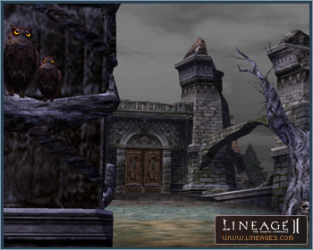
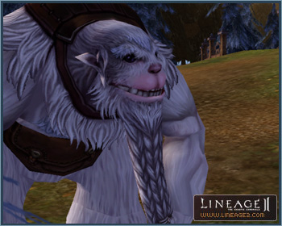

# Castles and Clan Halls

[New Castles and Clan Halls](#rune-castle-and-schuttgart-castle) | [Wild Beast Reserve](#wild-beast-reserve) | [Fortress of the Dead](#fortress-of-the-dead) | [Rainbow Springs Chateau](#rainbow-springs-chateau)

## Rune Castle and Schuttgart Castle

Rune Castle and Schuttgart Castle have been added to the Rune Territory and Schuttgart Territory respectively.

Rune Castle is a royal castle like Aden Castle, and it receives a tribute from Goddard Castle and Schuttgart Castle.

### New Clan Halls in Rune and Schuttgart

Seven contracted clan halls have been added to the Rune Township and four contracted clan halls have been added to the Town of Schuttgart.

The clan halls in the Rune Township are A-Grade clan halls; the clan halls in the Town of Schuttgart are B-Grade clan halls.

## Wild Beast Reserve

The Wild Beast Reserve is north of the Beast Farm and similar to the Bandit Stronghold's clan hall battle system; it is a contested hideout. The clan must be level 4 or higher to participate.

Only the first five clans to arrive may participate in the contest after qualifying (A Grand Plan for Taming Wild Beasts quest) and speaking to a messenger NPC at the entrance of the Wild Beast Reserve.

The A Grand Plan for Taming Wild Beasts quest may only last for one hour prior to the start of the clan hall war.

Clan members who want to participate in the contest have to register with the messenger NPC and have a maximum of 18 members participate.

When a player dies during a clan hall war, he/she is resurrected at the restart point and must return to the battlefield through a gatekeeper who is in that area.

There are monsters only found in the Wild Beast Reserve, and they are easier to tame than the ones in the Beast Farm.

## Fortress of the Dead

The Fortress of the Dead is located southeast of the Rune Township and is a contested hideout similar to the siege style of the Devastated Castle clan hall. It is of the highest grade among all contested clan halls.

Only a clan level 4 or higher may participate.

Siege registration is open up to two hours before a war and is scheduled through the messenger NPC outside of the clan hall.

The siege war follows the same rules as Devastated Castle. The siege war goes on for one hour, and the clan that contributes the most to killing Lidia von Hellmann takes possession of the clan hall. If the followers of Lidia von Hellmann, Alfred von Hellmann, and Giselle von Hellmann are killed, the clan hall war will be a lot easier.

The siege war ends upon the death of Lidia von Hellmann; just as in Devastated Castle, and if there is no clan that has killed the applicable NPC, the clan hall is under the NPC's possession until the next siege war.

The clan that owned the clan hall previously will be automatically registered in the next clan hall war.

The possessing clan hall leader can ride on a wyvern.

## Rainbow Springs Chateau

Rainbow Springs Chateau is located north of the Hot Springs area. A new style of siege war has been applied to it, which is different from previous contested clan hall war styles.

In order to own the clan hall, winning is decided through a mini-game. Only a clan level 3 or higher is allowed to participate and the maximum number of clans is four. Participants may have 5 or more members in their party.

### How to Participate

A clan leader in possession of a "Rainbow Springs Clan Hall War Decree" may register to participate through a messenger NPC up to one hour before the contest begins. The top four clans, owning the highest number of Rainbow Springs Clan Hall War Decrees amongst them, will be chosen to compete and their clan leaders notified through a system message.

Rainbow Springs Clan Hall War Decrees may be obtained by fishing in the Hot Springs area of Goddard. However, a player must use Hot Springs Bait for fishing bait.

If a participating clan requests disorganization in the middle of a siege war registration period, the siege war participation registration is automatically cancelled. However, the certificates are not returned at this time.

A participating clan may cancel its participation up until the end of the registration period. If this happens, the clan will only get back half of their submitted certificates.

The clan that owns the Rainbow Springs Chateau is automatically registered for the next contest. In this case, the top three clans, owning the highest number of Rainbow Springs Clan Hall War Decrees amongst them, will be chosen to compete.

### Battle Method

A Rainbow Springs Chateau siege war is held at the east arena of Rainbow Springs.

After clans are selected to compete, the contest is comprised of a one-hour waiting period, a contest time of 58 minutes, and an end time of 2 minutes.

Registered clans must organize one party with five or more members, with their clan leader as the party leader. The party must move to the arena before the siege war starts and enter the arena through the Caretaker. The surrounding area of the arena is a Peaceful Zone.

Participating clans enter into different game fields respectively and through the Caretaker.

Upon entering the arena, all buffs that are active on all participating characters will be removed, and summoned pet/servitors will disappear and cannot be summoned back into the arena.

Once the contest begins, a Hot Springs Yeti and a Hot Springs Gourd appear in the center of the arena and treasure chests appear randomly throughout the arena.

The Hot Springs Yeti announces the game rules and helps guide players.

All of the Hot Springs Yeti's shouts may be collected and then exchanged with/for various Hot Springs items. Text exchange or Hot Springs item use is only available to the clan leader and clan members.

Participants can break the spawned treasure chests in the arena and can acquire text passages. Text items cannot be exchanged; therefore to give them to other characters, they should be dropped first and then picked up.

Treasure Chests can only be damaged with your bare hands, however Mimics can be attacked with P. Atk and M. Atk.

When using Hot Springs Nectar, an Enraged Yeti is spawned at certain intervals and interrupts the game. The Enraged Yeti can be attacked with P. Atk. and M. Atk.

The Hot Springs items may be used when the Hot Springs Yeti is a target, and they can reduce the HP of the gourd, cast debuff on other teams, change the gourd, or recover.

The team that first destroys the Hot Springs Gourd wins the game. All the participants are then teleported outside of the arena after a 2-minute delay.

At the end of the game, a manager NPC appears and cleans the arena by picking up all the item drops.

The game continues even if the server goes down in the middle of the mini-game.
