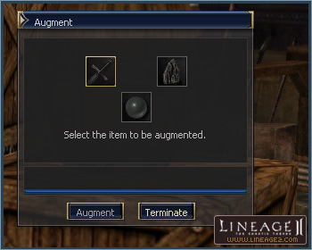
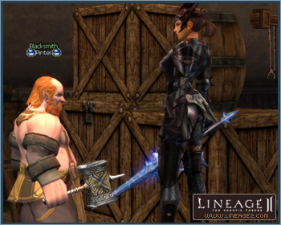

# Weapon Augmentation

A weapon augmentation system has been added to enable players to add new bonuses to their weapons with the help of a Blacksmith. A Life Stone and Gemstones will be required for each augmentation.

Augmentations can also be removed by Blacksmiths for a fee.

## Augmenting Your Weapon

You can augment weapons through the Blacksmith NPC of every village, except in the starting villages for each race and Gludin Village.

All weapons that are C Grade through S Grade can be augmented. C Grade and B Grade weapons require Gemstone D, and A Grade and S Grade weapons need Gemstone C.

For each item to be augmented, a Life Stone and Gemstones are needed, along with the weapon the player wants to augment. Life Stones can be acquired from hunting monsters. There is a higher chance of obtaining a high-level Life Stone from raid/boss monster rather than from an ordinary monster. A Life Stone shows the level of the character who can use it.

For the augmentation order, select the weapon to be augmented, the Life Stone, and Gemstones in the Augment window. Drag and drop the items from the inventory to add them to the Augment window. Click the Augment button.

Blacksmith NPCs can also remove augmentations, and a fee is assessed during the process.

## Bonuses Granted

The bonus granted during augmentation is random, determined by the levels of the Life Stone and the weapon. The success rate is 100%.

The types of bonuses are as follows:

- Increased basic abilities (STR, CON, INT, MEN)
- Increased battle values (P. Atk., P. Def., M. Atk., Accuracy, etc.)
- Additional skill (Active, Passive, Chance skill)

The bonus will not take effect when the augmented weapon has a higher grade than the character's expertise level.

When a weapon is augmented, a prefix will be added to the weapon name.

## Details

The augmented weapon cannot be exchanged, dropped, traded, sold, freighted, or deposited in the clan warehouse. However, private warehouse storage is possible. An item that has had its augmentation removed can be transferred normally.

Weapons with special abilities or an enchantment can be augmented. It is also possible to add a special ability or to enchant augmented items.

Even if you remove a weapon's augmentation, the special ability or enchant status will not change.

When a bonus is added while augmenting with a Life Stone that is above mid-grade, the weapon will glow.

An augmented weapon cannot be used for crafting dual swords.

An augmented weapon cannot be used to trade with the Blacksmith of Mammon.
