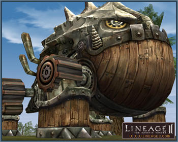

# Skills and Magic

[New Skills](#new-skills) | [Changes to Existing Skills](#changes-to-existing-skills)

## New Skills

The following new skills have been added, and the following items are required in order to use some of them: Phoenix Blood, Einhasad's Holy Water, Battle Symbol, and Magic Symbol. These can be purchased from Trader Ralford in the Ivory Tower.

| Name | Mastery Level | Class | Description |
|------|--------------|-------|-------------|
| Banish Seraph | 55 | Dark Avenger, Shillien Knight | Frightens an angel, causing it to flee. Lethal strike is possible. Consumes 5 Soul Ores. |
| Shock Stomp | 55 | Warlord | Puts nearby enemies in a momentary state of shock and cancels their targets with a forceful foot stomp. Can be used while equipped with a spear. |
| Invocation | 56 | Bishop, Elder, Shillien Elder | Meditate to increase the MP regeneration rate significantly while your body remains immobile. P. Def is significantly decreased and the meditation cancels when attacked. |
| Aura Flash | 58 | Sorcerer, Spellsinger, Spellhowler | Unleashes an attack on nearby enemies and cancels their targets. Consumes 2 Spirit Ores. |
| Escape Shackle | 60 | Treasure Hunter, Plains Walker, Abyss Walker | Allows you to escape from a captured state. |
| Break Duress | 60 | Tyrant | Uses Focus energy to escape from a slow or immobile state. Requires a level 2 Focus Charge. |
| Sonic Move | 62 | Gladiator | Significantly increases speed by detonating a Sonic Force charge. Requires a level 2 Sonic Force charge. Can be used while equipped with a dual sword. |
| Summon Attract Cubic | 62 | Temple Knight | Summons an Attract Cubic. Attract Cubics can continuously use hate and hold magic on an enemy. Requires 10 Crystal: D Grade. |
| Celestial Shield | 64 | Bishop | Temporarily makes the target invincible with holy power. |
| Summon Swoop Cannon | 68 | Warsmith | Summons Swoop Cannon. Requires 46 Crystal: A-Grade. Consumes 21 Gemstone: B-Grade per minute. |
| Battle Force | 77 | All Warrior Characters | Delivers your energy to a party member. The delivery is canceled when you incur damage. |
| Spell Force | 77 | All Wizard Characters | Delivers your magic power to a party member. The delivery is canceled when you incur damage. |
| Braveheart | 78 | Dreadnought, Duelist, Titan, Fortune Seeker, Maestro | Recovers 1000 CP by increasing your will to fight. |
| Force Meditation | 78 | Grand Khavatari | Mediate to increase HP/MP regeneration while your body remains immobile. P.Def. is significantly reduced and your meditation is canceled if you sustain damage. Level 3 FocusedForce charge required. |
| Pa'agrio's Emblem | 78 | Dominator | Increases an ally's resistance to debuff attacks and attacks that cancel buffs for a set duration of time. |
| Gate Chant | 78 | Doomcryer | Summons a party member. Consumes 4 Summon Crystals. |
| Inner Rhythm | 78 | Sword Muse, Spectral Dancer | MP consumption for song/dance is decreased. |
| Knighthood | 78 | Phoenix Knight, Hell Knight, Eva's Templar, Shillien Templar | Increases P. Def. when wearing heavy armor. Adds additional shield defense power. |
| Master of Combat | 78 | Dreadnought, Titan, Grand Khavatari, Fortune Seeker, Maestro, Duelist | Increases the attack strength of a sword, blunt weapon, spear, dual sword, or hand-to-hand combat weapon. Also increases maximum CP. |
| Archery | 78 | Sagittarius, Moonlight Sentinel, Ghost Sentinel | Increases attack strength and maximum attack range while using a bow. |
| Assassination | 78 | Adventurer, Wind Rider, Ghost Hunter | Increases attack strength and the rate of deadly attack while using a dagger. |
| Arcane Lore | 78 | Archmage, Mystic Muse, Storm Screamer | Increases resistance to elemental attacks and increases magic power. |
| Necromancy | 78 | Soultaker | Increases resistance to dark attacks and increases magic power. |
| Summon Lore | 78 | Arcana Lord, Elemental Master, Spectral Master | Increases P. Def. when equipped with Robe/Light Armor and increases Casting Speed. Decreases MP consumption for magic skills. |
| Divine Lore | 78 | Cardinal, Hierophant, Eva's Saint, Shillien Saint, Dominator, Doomcryer | Decreases MP consumption for magic skills. |
| Song of Silence | 79 | Sword Muse | Plays a song that temporarily disables all of the enemy's physical and magical skills. |
| Soul of the Phoenix | 79 | Phoenix Knight | Bestows you with the ability to revive yourself from death, retaining all buffs/debuffs except for Noblesse Blessing and Lucky Charm. Consumes 1 Phoenix Blood. |
| Shield of Revenge | 79 | Hell Knight | Temporarily reflects damage from a melee physical attack skill back to the enemy. |
| Sonic Barrier | 79 | Duelist | Uses sonic force to create a temporary protective barrier. Becomes invincible to regular strikes, skills, and buffs/debuffs. Requires a level 5 Sonic Focus charge. |
| Force Barrier | 79 | Grand Khavatari | Uses spiritual forces to create a temporary protective barrier that is invulnerable to regular strikes, skills, and buffs/debuffs. Requires a level 4 FocusedForce charge. |
| Mirage | 79 | Adventurer | Gives a chance to cancels the target of an enemy that attacks you. |
| Dodge | 79 | Wind Rider | Temporarily evades a melee physical attack skill. |
| Counter Attack | 79 | Ghost Hunter | Reflects damage caused by a melee physical attack skill back to the enemy. |
| Summon Feline King | 79 | Arcana Lord | Summons the Feline King. Requires 2 Crystals: A Grade. Consumes 1 additional crystal at 14 regular intervals. Takes away 10% of earned EXP. |
| Summon Magnus the Unicorn | 79 | Elemental Master | Summons Magnus the Unicorn. Requires 2 Crystals: A Grade. Consumes 1 additional crystal at 14 regular intervals. Takes away 10% of earned EXP. |
| Summon Spectral Lord | 79 | Spectral Master | Summons a Spectral Lord. Requires 2 Crystals: A Grade. Consumes 1 additional crystal at 14 regular intervals. Takes away 10% of earned EXP. |
| Cleanse | 78 | Cardinal | Cancels all of your target's debuffs. Consumes 1 Einhasad's Holy Water. |
| Salvation | 79 | Cardinal | Revives a dead character to a recovered state. All buff/debuff effects except Noblesse Blessing and Lucky Charm are retained during death. Consumes 2 Einhasad's Holy Waters. |
| Mystic Immunity | 79 | Hierophant | Makes the targeted party member immune to buff/debuff for a set duration of time. |
| Spell Turning | 79 | Hierophant | Interferes with your opponent's casting by nullifying their magic casting. |
| Magnus' Chant | 79 | Doomcryer | Allows the spirit of an ancient magus to possess a party member for a set duration of time. Consumes 40 Spirit Ore. |
| Victories of Pa'agrio | 79 | Dominator | Allows the spirit of an ancient hero to possess an ally for a set duration of time. Consumes 40 Spirit Ore. |
| Pa'agrio's Fist | 79 | Dominator | Increases an ally's maximum CP and fully restores it. Consumes 20 Spirit Ore. |
| Symbol of Defense | 80 | Phoenix Knight, Hell Knight, Eva's Templar, Shillien Templar | Generates a signet that maximizes the defense abilities of those nearby. Applies to all targets within the affected area. The effect disappears if you leave the area. Can be used when Battle Force is level 2 or higher. Consumes 1 Battle Symbol. |
| Symbol of Noise | 80 | Sword Muse, Spectral Dancer | Generates a signet that cancels singing or dancing abilities nearby. Applies to all targets within the affected area. The effect disappears if you leave the area. Can be used when Battle Force is level 2 or higher. Consumes 1 Battle Symbol. |
| Symbol of Resistance | 80 | Titan, Fortune Seeker | Generates a signet that maximizes the resistance to abnormal status of those nearby. Applies to all targets within the affected area. The effect disappears if you leave the area. Can be used when Battle Force is level 2 or higher. Consumes 1 Battle Symbol. |
| Symbol of the Fist | 80 | Dreadnought, Maestro | Generates a signet that maximizes the HP/CP recovery rate of those nearby. Applies to all targets within the affected area. The effect disappears if you leave the area. Can be used when Battle Force is level 2 or higher. Consumes 1 Battle Symbol. |
| Symbol of Energy | 80 | Duelist, Grand Khavatari | Generates a signet that increases P. Atk. and force of those nearby. Applies to all targets within the affected area. The effect disappears if you leave the area. Can be used when Battle Force is level 2 or higher. Consumes 1 Battle Symbol. |
| Symbol of the Sniper | 80 | Sagittarius, Moonlight Sentinel, Ghost Sentinel | Generates a signet that maximizes the archery skill of those nearby. Applies to all targets within the affected area. The effect disappears if you leave the area. Can be used when Battle Force is level 2 or higher. Consumes 1 Battle Symbol. |
| Symbol of the Assassin | 80 | Adventurer, Wind Rider, Ghost Hunter | Generates a signet that maximizes dodge ability and the chance of inflicting a deadly attack. Applies to all targets within the affected area. The effect disappears if you leave the area. Can be used when Battle Force is level 2 or higher. Consumes 1 Battle Symbol. |
| Volcano | 80 | Archmage | Consecutive strikes inflict a great amount of fire damage. You cannot move while casting the magic. Additional MP is consumed every time the effect is produced. Can be used when Spell Force is level 3 or higher. Consumes 1 Magic Symbol. |
| Cyclone | 80 | Storm Screamer | Consecutive strikes inflict a great amount of wind damage. You cannot move while casting the magic. Additional MP is consumed every time the effect is produced. Can be used when Spell Force is level 3 or higher. Consumes 1 Magic Symbol. |
| Raging Waves | 80 | Mystic Muse | Consecutive strikes inflict a great amount of water damage. You cannot move while casting the magic. Additional MP is consumed every time the effect is produced. Can be used when Spell Force is level 3 or higher. Consumes 1 Magic Symbol. |
| Gehenna | 80 | Soultaker | Consecutive strikes inflict a great amount of dark damage. You cannot move while casting the magic. Additional MP is consumed every time the effect is produced. Can be used when Spell Force is level 3 or higher. Consumes 1 Magic Symbol. |
| Day of Doom | 80 | Soultaker | Generates a signet that produces a strong curse to decrease all abilities. Applies to all targets within the affected area. The effect disappears if you leave the area. Can be used when Spell Force is level 3 or higher. Consumes 1 Magic Symbol. |
| Anti-Summoning Field | 80 | Arcana Lord, Elemental Master, Spectral Master | Generates a signet that sends a servitor to another dimension at regular intervals. Applies to all servitors in the affected area. Can be used when Spell Force is level 2 or higher. Consumes 1 Magic Symbol. |
| Purification Field | 80 | Cardinal | Cancels all debuffs of nearby allies. Can be used when Spell Force is level 2 or higher. Consumes 1 Magic Symbol. |
| Miracle | 80 | Cardinal | Regenerates HP of all nearby allies. Can be used when Spell Force is level 2 or higher. Consumes 1 Magic Symbol. |
| Flames of Invincibility | 80 | Dominator | Blesses nearby clan and alliance members with fire, making them invincible. Can be used when Spell Force is level 2 or higher. Consumes 1 Magic Symbol. |
| Mass Recharge | 80 | Eva's Saint, Shillien Saint | Greatly regenerates MP of party members. Can be used when Spell Force is level 3 or higher. Consumes 1 Magic Symbol. |

Dispel skills have a chance of nullifying Force Barrier, Sonic Barrier, and Celestial Shield.

The re-use time for the following skills is not affected by the caster's Casting Speed: Invocation, Celestial Shield, Salvation, Soul of the Phoenix, Symbol of Defense, Symbol of Noise, Symbol of Resistance, Symbol of Honor, Symbol of Energy, Symbol of the Sniper, Symbol of the Assassin, Volcano, Cyclone, Raging Waves, Day of Doom, Gehenna, Anti-Summoning Field, Purification Field, Miracle, Flames of Invincibility, Mass Recharge.

Spellbooks (and one Blueprint) for the following skills can be purchased at the Rune, Goddard or Ivory Tower spellbook shops. Players have a chance to buy them every hour:

- Spellbook: Celestial Shield
- Spellbook: Invocation
- Spellbook: Summon Attract Cubic
- Spellbook: Aura Flash
- Blueprint: Summon Swoop Cannon

### Swoop Cannon

Player characters who reach level 68 of the Warsmith class will gain access to the Swoop Cannon, a new siege summon.

The Swoop Cannon is a siege servitor designed for attack. It cannot be used to defend. It is different from previous siege servitors in that it can use its skill without switching modes.

It can be summoned only within the Siege War Zone.

46 A Grade Crystals are required for the initial summoning. After it is summoned, B Grade Gemstones are continuously consumed at a rate of 21 per minute.

The Swoop Cannon's attack goes in the direction it is facing, regardless of whether a target has been selected. Its ranged attack fires in a parabolic arc. All players and NPCs who are near where its shots land — allies, enemies and neutral parties alike — will incur damage. When a shot falls on an ordinary field (non-siege zone), battleground, or the border area of an ordinary field, it damages players on the ordinary field and it incurs a PK penalty.

Shots cannot damage castle walls, doors, or headquarters.

The Swoop Long Shot and Swoop Middle Shot skills cannot be used inside a castle, along the castle wall area, nor outside a battleground.

Flash Gunpowder is consumed during attack. Flash Gunpowder can be purchased in the Town of Schuttgart and Rune Township.

The Swoop Cannon disappears when it is defeated.

### Castle-Owning Clan Skills

New skills have been added to a circlet that can be equipped by clan members who control a castle, and to a crown that can be equipped by a castle lord.

The Lord's Crown can be obtained from the Chamberlain, and each castle's circlet can be purchased from the Chamberlain.

Also, Academy members have been changed so that they cannot equip a castle circlet.

| Item | Equip Requirements | Skill | Effect |
|------|-------------------|-------|--------|
| Castle Circlet | Clan member in possession of a castle | Residential Shock Immunity | Increases resistance to stun for a set duration of time |
| The Lord's Crown | Clan lord in possession of a castle | Clan Gate | Creates a gate for summoning clan members |

**Residential Shock Immunity:** Greatly but temporarily increases resistance to shock attacks.

**Clan Gate:** Creates a gate for summoning clan members. The caster cannot move while the gate is in effect. The Clan Gate skill is located in the active skill window when the Lord's Crown is equipped. When the lord's skill is used, a summoning field is created near the lord, and the lord is put into an immobile state. At that time, a system message stating that a Gate has been created appears to all clan members who are logged on. For 2 minutes, clan members can speak with the Court Magician inside the castle and teleport to the lord's location.

The skill is located in the active skill window when the item is equipped.

When ownership of the necessary castle is lost, the item automatically disappears and the skill is also lost.

## Changes to Existing Skills

- The power of Stunning Shot has been slightly increased.
- The requirements for casting Benediction have been changed from HP 25% to MP 25%.
- Mana Burn and Mana Storm now awaken a target under the Sleep effect.
- The effects for the following skills have been decreased (maximum damage effect during a critical attack): Death Whisper, Dance of Fire, Eye of Pa'agrio, Chant of Rage.
- Elven Elders and Shillien Elders, classes that possess the Recharge skill, are no longer affected by Recharge.
- The Wizard class attack spells have been changed to allow the target a chance to defend against the following: Wind Strike, Aqua Swirl, Twister, Blaze, Death Spike, Prominence, Ice Dagger, Hurricane.
- The Greater Heal skills and Chant of Life/Heart of Pa'agrio magic effects have been changed to permit receiving the effects at the same time. You can now receive both effects at the same time. Also, a continuous heal buff is placed in the buff slot.
- The location of a healing potion's effect has been changed from the buff slot to a healing potion slot.
- A Bishop who has trained level 11 in the Major Heal skill can now use skill enchantment.
- The fleeing effect of Curse Fear and Horror has been changed to now affect players.
- The effect of Soulshots on melee attack skills has been greatly increased.
- The Magical Backfire skill's effect has been increased.
- The effects of the following skills have been greatly increased: Whirlwind, Thunder Storm, Hammer Crash, Soul Breaker, Tribunal, Judgment, Armor Crush, Shock Blast.
- When using a skill after using Soulshot, you can now inflict more damage than before (not using a Soulshot has the same effect as before): Power Strike, Power Shot, Stunning Shot, Stun Attack, Iron Punch, Stunning Fist, Sting, Wild Sweep, Power Smash, Triple Slash, Double Shot, Burst Shot, Spinning Slash, Thunder Storm, Punch of Doom, Poison Blade Dance, Sword Symphony, Fatal Strike, Hammer Crash, Burning Fist, Soul Breaker, Crush of Doom, Strider Siege Assault, Lethal Shot, Sonic Rage, Force Rage, Earthquake, Spoil Crush, Hamstring Shot, Shock Blight, Armor Crush, Evade Shot, Tribunal, Judgment, Psycho Symphony, Demon Blade Dance, Double Sonic Slash, Sonic Blaster, Sonic Storm, Sonic Buster, Triple Sonic Slash.
- The following skills can now be enchanted: Tribunal, Judgment, Arrest, Shackle, Mass Shackle, Banish Undead, Critical Blow, Mortal Strike, Stealth, Sand Bomb, Mass Curse Fear, Mass Curse Gloom, Trance, Erase, Magical Backfire, Mana Burn, Mana Storm, Turn Undead, Major Heal, Major Group Heal, Summon Swoop Cannon, Shock Stomp, Aura Flash, Banish Holy.
- The success rates for the following skills have been increased: Seal of Chaos, Seal of Poison, Seal of Winter, Seal of Flame, Seal of Gloom, Seal of Mirage.
- The effect of the Deflect Arrow skill levels 2, 3 and 4 have been greatly increased.
- The success rate of the Serenade of Eva skill has been increased, and the re-use delay has been greatly increased.
- The effects and use requirements for Sonic Buster, Sonic Storm, Force Burst, and Force Storm have been changed. The focus use requirement has been raised by 1.
- The character becomes semi-invisible when using the Silent Move, Chameleon Rest, Dance of Shadows, and Stealth skills.
- The first two skill levels of Summon Mechanic Golem now require Crystal: D Grade to summon the servitor.
