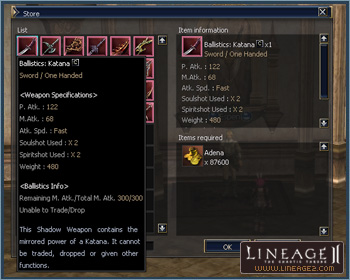

# Shadow Weapons

Temporary weapons with short lifespans have been added to increase access to varied weapons.

## Details

A Shadow Weapon has the same abilities and appearance as an ordinary weapon, but it has a limited lifespan.

When a Shadow Weapon's total duration or mana reaches 0, it will be removed from inventory and disappear.

The remaining duration or mana is consumed from the time the item is equipped, and the consumption ends when it is no longer equipped.

**Warning:** If the item is equipped and unequipped multiple times, the remaining duration or mana is consumed faster than normal. Logging in and out of the game with the weapon equipped will also decrease its duration.

As a short-term item, shadow weapons cannot be moved through trading, drop, or cargo, and it can only be stored in a private warehouse. Short-term items also cannot be enchanted, augmented, given a special ability or crystallized.

A weapon that is obtained by using a Shadow Weapon Exchange Coupon has a lower total duration or mana than a Shadow Weapon bought at a weapon shop.

## Obtaining Shadow Weapons

A Shadow Weapon can be formed from various B, C or D Grade weapons.

Players who complete a transfer quest will receive an exchange coupon that can be traded for a Shadow Weapon. Players will receive a D Grade Shadow Weapon Exchange Coupon after completing the first class transfer, and a C Grade Shadow Weapon Exchange Coupon after completing the second class transfer.

A Shadow Weapon exchange coupon cannot be traded, dropped or sold at a private store. If you take the Shadow Weapon exchange coupon to the grand master class NPC, you can receive a Shadow Weapon as a reward.

B and C Grade weapons can be purchased with Adena from the town's weapon merchant.

Shadow weapons can be purchased by characters that are above level 40, and the weapon item type that can be purchased changes depending on the player's level.
