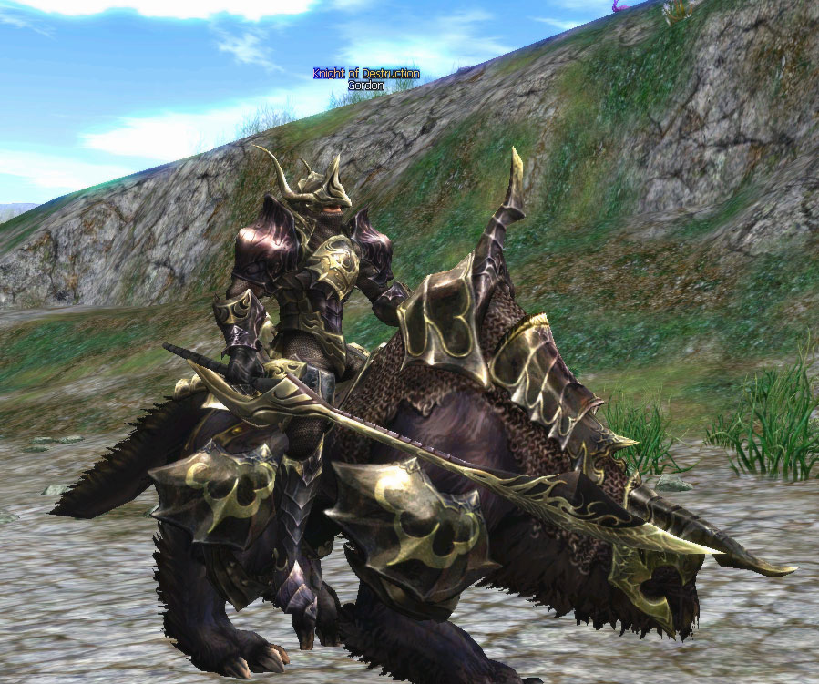

# Monsters

[Raid Boss Monsters](#raid-boss-monsters) | [Antharas and Valakas](#antharas-and-valakas) | [Other Changes](#other-changes)

## Raid Boss Monsters

The roaming raid monster Gordon has been added in the Goddard region. When Gordon sees a player that carries a cursed sword (Zariche or Akamanah), it will attack in order to steal the sword.

- The appearance and speed of certain raid monsters have been changed.
- The impact effect has been added to certain raid monsters.
- If you fail against the Pagan Temple raid boss, the raid boss will now return to its original position.
- When you open the Gate of Splendor to the raid boss room in the Monastery of Silence, the left and right doors have been changed to open at the same time. The doors also have been changed so that 60 seconds after they open and close, neither will open again for 30 minutes. The Gate of Splendor can no longer be opened using the Unlock skill.
- The problem of the aggressive raid boss Gigantic Chaos Golem of the Pavel Ruins not attacking when a player passes by has been changed.
- The forced display before Frintezza that appeared outside the Last Imperial Tomb has been changed.
- Baium's inability to kill the player that awakened it has been changed.
- Raid boss Master Anays of the Monastery of Silence has been changed. If raid boss Master Anays is outside when it receives a player's attack, it will teleport back into the room. If the raid boss is outside and its subordinate receives an attack while it is also outside, the raid boss will teleport back into the room. When the raid boss is inside the room and its subordinates are outside, if a player attacks a subordinate, the raid boss will remain in the room, and the player will only battle with the subordinates. (Subordinates do not give experience.) If the raid boss is outside when the server goes down, it will teleport back into the room.
- With the fortress update, the locations of raid bosses Eye of Beleth and Kelbar have been changed, and monsters that used to appear at the fortress' location have all been removed.

## Antharas and Valakas

The HP, P. Def., and M. Def. of Antharas and Valakas have been decreased.

The appearance of the boss land dragon Antharas has been changed. Antharas' difficulty level and reward will appear in relation to the raid participation members. The reward will increase in relation to Antharas' difficulty level.

Antharas' subordinate monsters have been added, and the total appearance time is decided in relation to the raid participation members.

If you defeat Antharas' subordinate, you can obtain a useful recovery item for the raid.

## Other Changes

- The ordinary monsters in the following hunting grounds have been set at level 80: Pagan Temple, Monastery of Silence, Imperial Cemetery, Forge of the Gods, Dimensional Rift, Ketra/Varka Silenos Stronghold.
- In hunting grounds that are above level 80, the ordinary monsters have all been changed to level 80. But the monsters' abilities and rewards remain the same as before, except for treasure chests.
- Treasure chests can no longer appear in fields near a newly-added fortress. This includes the areas of the Floran Agricultural Area, Dragon Valley, Plunderous Plains, and Hunters Valley.
- The experience points loss problem when a player character dies above the battlefield after mounting a wyvern has been changed.
- A problem with the Dark Elf Village Gatekeeper's social animation has been changed.
