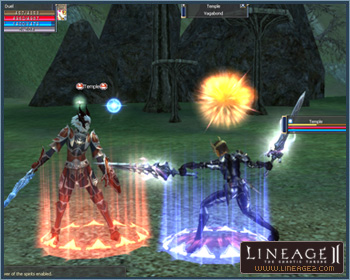

# Dueling System

[Dueling Methods](#dueling-methods) | [Requirements](#requirements) | [Cautions](#cautions) | [Ending a Duel Early](#ending-a-duel-early)

A system that permits Player versus Player duels and party versus party duels outside of the arenas has been added.

- The player can enter duels when they are not in combat.
- Duels are possible regardless of the level difference between the opponents.
- There is no penalty (abnormal status or experience points loss) for a defeat.
- When a duel/party duel ends, the participants' HP, MP, and CP return to what they were before the duel. All abnormal status magic incurred during the event disappear at the end of the duel.
- If you click Decline Duel in the Game tab of the Options window, you can automatically decline a challenge.

## Dueling Methods

### One-on-One Duels

You can request a one-on-one duel by using the `/duel` command or the Duel icon in the Actions window.

You win the duel when your opponent's HP reaches 1.

Each one-on-one duel is 2 minutes long.

### Party versus Party Duels

You can request a party vs. party duel by using the `/partyduel` command or the Party Duel icon in the Actions window. A party duel challenge must be made by a party leader, but it can be made to any member of the opposing party.

When the opposing party accepts a party duel, all party members of both sides are moved to an arena.

If you don't want to receive challenges, the party leader may check Decline Duel in the Game tab of the Options window.

Each party vs. party duel is 2 minutes long.

During a duel, all escape-related skills and items cannot be used.

## Requirements

If any party member is in any of the following states, that party cannot request or accept party duels:

- When in combat or duel, or chaotic state
- When participating in the Olympiad Games
- During private store or private manufacture
- When HP/MP is below 50% (including death)
- When in a siege (clan or ally participating in a siege)
- When the one challenged to a party duel is a member of the challenger's party
- When in a zone where restarting is prohibited
- When inside a siege war zone
- When the challenge requester and recipient are more than a certain distance apart
- When there is no empty space in the party-use arena
- When the challenge recipient is in an opponent's hall during a siege
- When riding a strider or wyvern
- When in a peace zone or battle zone

## Cautions

- When a party in a command channel requests or accepts a party duel, that party is automatically withdrawn from the command channel.
- When a party requests or accepts a party duel during party matching, it is removed from party matching.
- Any trading of a party member is automatically canceled at the time he/she is moved to the party-use arena.
- When a player attacks an NPC or receives an attack from an NPC during a one-on-one duel, the duel ends, and HP/MP/CP are not restored to their pre-duel levels.

## Ending a Duel Early

Duels can be ended prematurely in one of the following ways:

- Use of the command `/withdraw` during the duel
- When the distance between players becomes too far during a duel (such that the target window disappears)
- When a player moves to an area where a duel is impossible after it begins
- When a player attacks another player first during a duel
- When a player attacks or receives an attack from an NPC during a one-on-one duel (including skill/magic)
