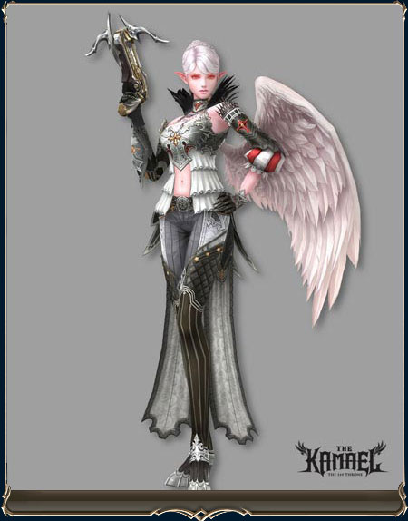
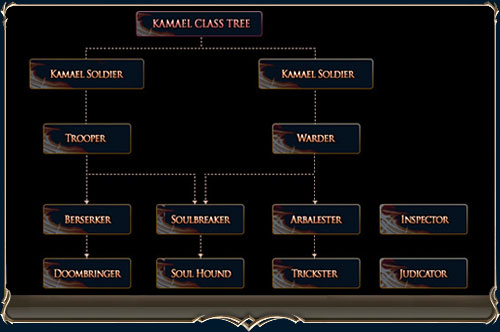
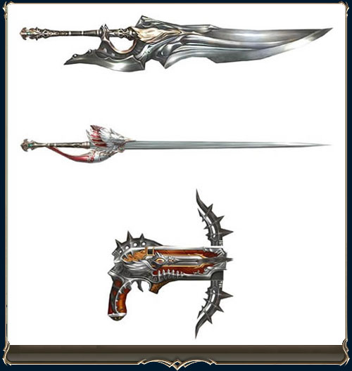

# New Race

[Characteristics](#characteristics) | [Classes](#classes) | [Kamael-Exclusive Weapons](#kamael-exclusive-weapons)

A new race, Kamael, has been added. Kamael characters start out on the Isle of Souls, which is located to the west of the Dark Elven Village. A Kamael Tutorial has also been added to the game.

## Characteristics

The Kamael are a new dark-attributed race. Because of their dark nature, healing magic is less effective when used on them.

The Kamael require souls to perform most of their attack skills. Once they learn the Soul Mastery skill at level 5, Kamael are able absorb souls automatically while hunting monsters, every time they earn a certain amount of experience. They can also sacrifice some of their own HP or use skills to recharge souls.

Collected souls are displayed on the Buff/De-buff Status Bar, and they last for 10 minutes from the last time a soul was absorbed.

The Kamael cannot sub any other race's classes; conversely, no other races may sub Kamael classes either.

When a Kamael character reaches level 75 on their first and second subclasses, one of two hidden third sub-classes will become available (Inspector and Judicator).

Kamael subclass info is available from the Kamael Grandmaster NPC in Giran, Aden, and Rune Township.

## Classes

**Male Kamael**

- Male Kamael Soldier -> Trooper (1st) -> Berserker (2nd) -> Doombringer (3rd)
- Male Kamael Soldier -> Trooper (1st) -> Soul Breaker (2nd) -> Soul Hound (3rd)

**Female Kamael**

- Female Kamael Soldier -> Warder (1st) -> Soul Breaker (2nd) -> Soul Hound (3rd)
- Female Kamael Soldier -> Warder (1st) -> Arbalester (2nd) -> Trickster (3rd)

## Kamael-Exclusive Weapons

The Kamael are capable of converting existing weapons into Kamael-exclusive weapons (Ancient Sword, Rapier, and Crossbow) using their unique weapon conversion skill.

Kamael-exclusive weapons can be converted from weapons that are D-grade or higher, and the weapons can be traded or dropped.

Not all weapons can be converted; only the following weapons can be converted into Kamael-exclusive weapons:

- Two-handed Sword <--> Ancient Sword
- One-handed Sword <--> Rapier
- Bow <--> Crossbow (Bow-gun)

The Kamael skill that allows for weapon conversion is available after the first class transfer. The weapon conversion skill will only work on the weapon you currently have equipped.

When a weapon is converted, its enchant value, special abilities, and elemental attributes remain the same; however, augmented weapons cannot be converted.

A converted weapon can be enchanted and bestowed with special abilities, augments, or elemental attributes.

A Kamael-exclusive weapon can be converted back to its original form as long as it has not been augmented. It will retain all of its enchant values, special abilities, and attributes.
