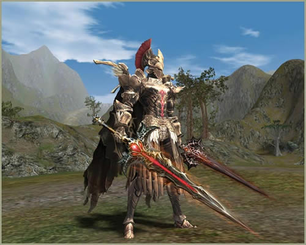

# Transformations

[Transformation Types](#transformation-types) | [Transformation Procedure](#transformation-procedure) | [Cancelling Transformations](#cancelling-transformations) | [Acquiring the Transformation Skill](#acquiring-the-transformation-skill) | [Transformation Conditions and Restrictions](#transformation-conditions-and-restrictions) | [Transformation State](#transformation-state)

Special transformations have been added.

## Transformation Types

Combat and non-combat transformations are available. Combat transformations are broken down into two types: common transformations and race-specific transformations.

## Transformation Procedure

Players can transform by using special transformation skills or by attaching a talisman to a bracelet.

There are also transformation scrolls available through the new auction system, and a special type of transformation that utilizes armor obtained from Hellbound.

Players are automatically transformed when they acquire one of the cursed swords (Demonic Sword Zariche and Blood Sword Akamanah).

## Cancelling Transformations

- A transformation can be cancelled by using the Cancel Transformation skill.
- A transformation is cancelled upon death.
- If a transformation has been enabled by an item, it is cancelled upon un-equipping that item.
- A transformation is cancelled after certain period of time.
- A transformation is cancelled in water (with the exception of the cursed sword transformations).

## Acquiring the Transformation Skill

After a player completes the "More than Meets the Eye" quest (level 50+), the first transformation skill can be learned from the Wizard Avant-Garde on the second floor of the Ivory Tower.

Players must acquire the first transformation skill, in order to acquire other transformation skills.

A Transform Sealbook is required to learn additional transformation skills.

The various transformation tomes can be purchased from the Guild Adventurer or the Black Marketeer of Mammon as follows:

- **Transform Sealbook - Onyx Beast:** can be purchased from the Avant-Garde NPC with Adena
- **Transform Sealbook - Death Blader:** can be purchased from the Black Marketeer of Mammon NPC with Ancient Adena
- **Transform Sealbook - Apostle Grail:** can be purchased from the Guild Adventurer NPC in the Gludin Village
- **Transform Sealbook - Unicorn:** can be purchased from the Guild Adventurer NPC in the Oren Castle Village
- **Transform Sealbook - Lilim Knight:** can be purchased from the Guild Adventurer NPC in the Oren Castle Village
- **Transform Sealbook - Golem Guardian:** can be purchased from the Guild Adventurer NPC in the Schuttgart Castle Village
- **Transform Sealbook - Inferno Drake:** can be purchased from the Guild Adventurer NPC in the Schuttgart Castle Village
- **Transform Sealbook - Dragon Bomber:** can be purchased from the Guild Adventurer NPC in the Aden Castle Village

Crystal of Life and Adena are required to purchase the Transform Sealbook from a Guild Adventurer NPC.

Non-combat transformations can be acquired by attaching a talisman to a bracelet.

Talismans for the non-combat transformation skills can be acquired in the Rainbow Clan Hall or the Wild Beast Reserve.

## Transformation Conditions and Restrictions

- A player must not have a Servitor or Pet summoned in order to transform.
- A player must not be riding a Strider or Wyvern in order to transform.
- A player must not have the Mystic Immunity skill active in order to transform.
- A player must not be on a moving ship in order to transform.
- A player cannot use a ferry while transformed.
- If a cursed sword is acquired while transformed, the cursed-sword transformation will override the current one.

## Transformation State

- A player may only use transformation-specific skills while transformed.
- The effects of skills, such as buffs and debuffs, remain when a player transforms.
- When a player transforms, the transformation's stats are applied.
- Players cannot challenge other players to a duel or party duel while transformed.
- When a player is transformed by a cursed sword, the name of the respective cursed sword will replace the character's name. Also, the name of the cursed sword appears in the Chat Window instead of the player's name, and the player holding the cursed sword cannot use the Shout and the Trade channels. (The original name is shown in Clan Chat, Alliance Chat, and whispers.)
- Players cannot switch or add a subclass while they are transformed.
- Players cannot transform during the Grand Olympiad Games.
