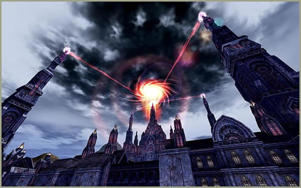
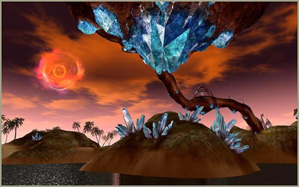
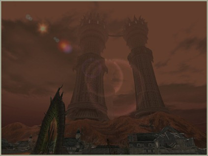

# Hunting Zones

[Isle of Souls](#isle-of-souls) | [Isle of Prayer](#isle-of-prayer) | [Hellbound](#hellbound) | [Instanced Dungeons](#instanced-dungeons) | [Existing Hunting Grounds](#existing-hunting-grounds)

## Isle of Souls

The Isle of Souls has been added to the west of the Dark Elven Village.

The Isle of Souls is the starting point for the Kamael, and a hunting area for players who are level 20 or below.

Any other race can teleport to the Isle of Souls by using a Newbie Travel Token. Players may acquire a Newbie Travel Token after they complete the tutorial.

There are total of three Strongholds on Isle of Souls. Players who are under level 20 and have not yet performed the first class transfer can move to these areas free-of-charge by speaking to the Gatekeeper NPC in the Kamael Village.

There are two dungeons (Nornil's Garden and Nornil's Cave) on the Isle of Souls. Nornil's Garden can be entered by a party consisting of two members or more, one of which must be a Kamael that has the "Into the Large Cavern" quest. Nornil's Cave has no prerequisites or other restrictions, but players will want to bring friends when they venture inside — it hosts some of the highest-level monsters on the island.

## Isle of Prayer

The Isle of Prayer has been added to the east of Alligator Island in Innadril Territory.

The Isle of Prayer is a hunting ground for players who are level 78 and higher. It is home to various monsters with greatly increased AI that will challenge even the most seasoned players.

There are two instanced dungeons on the Isle of Prayer, called the "Dark Cloud Mansion" and the "Crystal Caverns".

### Dark Cloud Mansion

The Dark Cloud Mansion can be entered by a party consisting of two members who are level 78 or higher.

Players can learn helpful and important information on getting into and getting through the Crystal Caverns in this area.

### Crystal Caverns

The Crystal Caverns can be entered by a party consisting of two to nine members who are level 78 or higher.

The Crystal Caverns consist of three areas: Emerald Square, Steam Corridor, and Coral Garden. A party may enter only one of the three areas at a time.

### Baylor

In order to face Baylor, players must have obtained the three crystal types from the Raid Bosses in the Emerald Square, the Steam Corridor, and the Coral Garden.

When entering Baylor's lair, one of the three Crystal Caverns Raid Boss crystals will be consumed at random.

The "[color] Seed of Evil - Shard" can be obtained by hunting in the Isle of Prayer. This item allows players to obtain S-80 armor materials from Blacksmith Ram inside the Crystal Caverns.

## Hellbound

Hellbound, the hiding place of Beleth, has been added south of the Wastelands near Gludio Town.

Hellbound Island is the highest-level hunting ground in the game. It is not visible on the Mini Map.

The map of Hellbound can be obtained inside Hellbound.

Hellbound is blocked by Beleth's magical barrier. A continuous collective effort is required from each player in order to enter Hellbound.

After completing all the quests from the Isle of Prayer, players can learn how to enter Hellbound from Galate in Heine Village.

Players must earn the trust of the Hellbound natives in order to gain access to the Iron Castle where Beleth resides.

Players can increase the Hellbound natives' trust level by killing monsters, or by completing quests for them.

The Hellbound natives' trust level can be increased or decreased depending on players' actions and effort.

As players earn more trust from the Hellbound natives, more tasks will become available.

## Instanced Dungeons

The Instanced Dungeon system has been added. This system allows multiple parties to simultaneously enter different instances of an area for a certain period of time.

### Entry

- Each dungeon can be entered via an Entrance NPC. Certain requirements must be met in order to enter an instanced dungeon, including a set level, number of party members, a specific item, and/or a quest.
- The request to enter an instanced dungeon must be made by the party leader.
- There is a limit to the number of instanced dungeons players may enter per day.
- If players are moved outside of an instanced zone by teleporting to the nearest town after death, or by using a Scroll of Escape, they can re-enter the area as long as their instance of the dungeon still exists.
- If players log in after logging out inside an instanced dungeon, they are moved outside the dungeon. After rejoining the party, they can re-enter the area as long as their instance of the dungeon still exists.
- If a party leader has already initiated the instance, they cannot invite a new member to join their party from inside the instance. The party's size cannot be increased once they are inside the dungeon.
- Players cannot use the Party Member Summon Skill while inside instanced dungeons; however, the Party Member Summon Skill can be used to summon original members of the party upon entry that are inside the castle/fortress-related dungeons.

### Exit

Players are automatically moved outside an instanced dungeon in following situations:

- **Mission Completion:** Players within an instanced dungeon are moved outside after five minutes of completing a mission. (This only applies to zones that do not have a teleport cube in them.)
- **Time Limit Reached:** If the allotted instance time runs out, the party will be moved outside of the instanced dungeon.
- **Server Issues:** If any server-related technical problems occur, such as a server outage, all instanced dungeons will be reset and players are moved outside of instanced dungeons.

### Instanced Dungeon Reset

The instanced dungeon resets if all the party members who were inside leave the area. Below are the specifics on when each instanced dungeon resets after all party members leave:

- The following dungeons reset immediately: Nornil's Garden and Dark Cloud Mansion.
- The following dungeons reset after 20 minutes: Castle/Fortress Instanced Dungeons, Chromatic Caverns, and City Dungeons.

If a mission is completed, or the time limit is approaching, the remaining time is displayed.

### Instanced Dungeon Time Limits

The maximum time limit for each instanced dungeon is as follows:

- Nornil's Garden (70 mins)
- Dark Cloud Mansion (30 mins)
- Crystal Cavern (90 mins)
- Castle Underground Dungeon (60 mins)
- Fortress Monster Prison (60 mins)

### Instanced Dungeon Refresh Times

Once used, the instanced dungeon can be re-used after a certain period of time. The instanced dungeon refresh times are as follows:

- Nornil's Garden - 2 hours
- Dark Cloud Mansion - no time limit
- Crystal Cavern - 24 hours
- Castle Underground Dungeon - 4 hours
- Fortress Monster Prison - 4 hours

### New Command

`/instancezone` is a newly added command. This command will show the time remaining before you can enter the instanced dungeons again.

## Existing Hunting Grounds

The monster levels in the Temple of the Pagans, the Monastery of Silence, Primeval Island, and Forge of the Gods have been adjusted.
