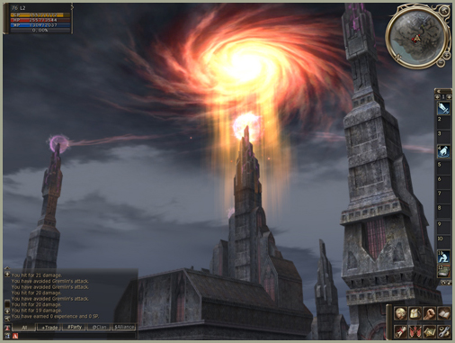

# User Interface

The overall User Interface design and font have been redesigned.

## Party Information Window

A party member's status window can be re-ordered within the party list. While holding the "Alt" key, the Status Window can be dragged to other spot within the list.

Pet/Servitor information, including HP/MP/Buff/Debuff, can also be identified within the Party Member Status Window.

## Improved Radar Feature

The radar now shows terrain information.

Various features have been included on the radar, such as hiding a player's location, fixed radar position, and party member/monster location.

## Item Information Link

You can share your item information with other players. When you click on an item while pressing the "Shift" key, the item information is linked automatically in chat.

## Skill Window

Active skill information is categorized into Normal, Buff, Debuff, and Toggle within the Skill Window.

## Macros

A maximum of 48 macros can be created.

## Game Option

In the Option Menu, keyboard shortcuts can be changed.

In Option Menu, an "Improved Shader" function has been added.

## Inventory

The location of items within a player's inventory is stored.

At the upper-right corner of the Inventory page, the "Inventory Auto Sort" button has been added. Players can press this button to automatically sort the items in their inventory.

## Other Changes

- If a Dwarf or Artisan class tries to delete items that can be crystallized, they are crystallized automatically instead.
- Attribute information has been added to the Character Status Window.
- Various Game Option information and in-game interface features have been improved.
- When you have Enter Chat selected from Options, the first window is from F1-F12, and the expanded options are from 1 to =.
