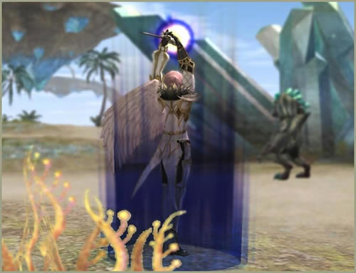

# Skill Changes

[New Skills](#new-skills) | [Skill Enchantments](#skill-enchantments) | [Existing Skill Changes](#existing-skill-changes)

## New Skills

| Class | Skill Name | Effect |
|-------|-----------|--------|
| Sword Muse | Song of Elemental | Significantly increases the four types of elemental resistance for all party members. |
| Spectral Dancer | Dance of Alignment | Significantly increases Holy/Unholy resistance for all party members. |
| Dagger Classes | Critical Wound | Increases the critical damage inflicted on target. Effect 1. |
| Dagger Classes | Binding Trap | Detects traps below Level 78. |
| Dagger Classes | Remove Trap | Disarms traps below level 78. |
| Archer Classes | Counter Chance | The skill casting speed and the MP consumption of the skills have a chance to be greatly decreased when attacked. An equipped bow is required in order to use this skill. |
| Archer Classes | Counter Rapid Shot | The bow attack speed of all party members has a chance to be increased when attacked. An equipped bow is required in order to use this skill. |
| Archer Classes | Counter Dash | The speed of all party members has a chance to be increased when attacked. An equipped bow is required in order to use this skill. |
| Archer Classes | Counter Mind | The user's MP has a chance to be recovered when attacked. An equipped bow is required in order to use this skill. |
| Titan | Over the Body | Your fighting spirit and determination give you a temporary boost of courage and allow you to push your body past normal limits. |
| Fortune Seeker | Spoil Bomb | AoE skill that puts targets into spoil state. Targets then explode after a set time (this does not cause AoE damage). |
| Archmage | Fire Vortex Buster | Detonates the Fire Vortex around an enemy to inflict heavy damage. |
| Archmage | Count of Fire | Uses the power of fire to inflict damage by burning the target for a set amount of time. |
| Mystic Muse | Ice Vortex Crusher | Crushes the enemy in an Ice Vortex to inflict heavy damage. |
| Mystic Muse | Diamond Dust | Freezes targets within range to decrease their speed. |
| Mystic Muse | Throne of Ice | Uses the power of ice to inflict damage by freezing the target for set amount of time. |
| Storm Screamer | Wind Vortex Slug | Batters the enemy with a Wind Vortex to inflict heavy damage. |
| Storm Screamer | Empower of Echo | Increases the power of magic by increasing MP consumption. |
| Storm Screamer | Throne of Wind | Uses the power of wind to inflict the damage by continuously slashing the target for set amount of time. |
| Bishop | Divine Power | Temporarily increases the power of recovery magic. |
| Eva's Saint | Mana Gain | Allows the target to receive greater effects from the Recharge skill. |
| Shillien Saint | Mana Gain | Allows the target to receive greater effects from the Recharge skill. |
| Doom Cryer | Chant of Protection | Temporarily reduces the amount of critical damage party members receive from enemies. |
| Overlord | Seal of Blockade | Instantly prevents general attacks of nearby enemies, making them unable to attack. |
| Knight Classes | Iron Shield | Increases the shield block rate in certain probability when attacked. |
| Knight Classes | Shield of Faith | Maximizes the physical and magical defense power of party members, and takes damage for them as long as the skill is active. |

## Skill Enchantments

Various new ways of skill enchanting have been added.

### Safe Skill Enchant

Failing a skill enchantment does not decrease the enchant skill level.

The amount of SP and Exp. consumed is three times greater than that of a regular skill enchant.

Giant's Codex - Mastery is required.

### Enchant Route Change

The skill enchantment route can now be changed to a different route.

The skill enchantment level has a chance to decrease up to three levels when changing the skill enchantment route.

Giant's Codex: Discipline is required, along with some SP and Exp. consumption.

### Skill Un-enchanting

Enchanted skills can be un-enchanted one level at a time. Some of the consumed SP will be returned.

Giant's Codex: Oblivion is required.

### New Enchantment Route

Active, Passive, and Toggle skills can be enchanted.

Various new enchantment types have been added.

Some skills can be enchanted with elemental attributes.

## Existing Skill Changes

- Debuff skill durations have been adjusted.
- DoT skill effects have been significantly increased.
- The effect of evading physical skills is now added to Ultimate Evasion skill.
- The Erase skill's re-use time has been increased.
- The Shield Mastery skill increases shield defense power.
- The Bless Shield skill's increased shield defense rate has been reduced slightly.
- The Shield Stun attack now increases the target's aggressiveness.
- The Advanced Block skill's increased shield defense power has been reduced slightly.
- Sonic Focus and FocusedForce can now collect energy up to grade 8.
- Plainswalkers' Critical Chance skill level has been increased.
- Abyss Walkers' Critical Power skill level has been increased.
- The Frenzy skill's increased power is now reduced if the character's HP goes above 30%.
- The power of Aggression and Aura of Hate skills have been significantly increased, as well as their reuse time. It has also been changed so that it is not affected by attack speed improvement buffs.
- The Vengeance skill's aggression power has been increased significantly.
- The chance to evade critical damage has been added to the Light Armor Mastery skill that can be learned by Rogues, Elven Scouts, Assassins, and Monks.
- The received critical damage reduction effect has been added to the Heavy Armor Mastery skill that can be learned by Knights, Elven Knights, and Palus Knights.
- The Riposte Stance, Physical Mirror, and the Magical Mirror skills can now reflect buff/de-buff skills as well.
- The Sword Symphony skill can now affect other players, and its power and success rate have been increased.
- The Mass Curse Fear effect and Word of Fear skill can now affect other players, and their re-use time has been increased.
- The effect of vampiric skills has been changed. These skills now absorb a certain percentage of the target's remaining HP rather than certain percentage of inflicted damage.
- The target-cancelling effect of the Shock Blast skill has been improved, and its casting time has been reduced.
- The Revival skill's requirement has been changed from 5% HP to 10% HP.
- The Lion Heart skill's reuse time has been reduced.
- Skills that previously targeted alliance members will now affect only immediate clan members.
- The Mana Burn and Mana Storm skills' power has been decreased, and their re-use time has been increased.
- The Aura Sink and Seal of Gloom skills' power have been decreased.
- Players can now receive Heal and Recharge effects from a servitor during a duel.
- The Holy Weapon skill's effect now affects magic skills as well.
- The displayed effect of some abnormal states (ice, wind, fire, paralysis, petrification, MP-DoT) has been changed.
- The vampiric skills with the polearm weapons will now work differently. The amount of absorbed HP will be exponentially reduced after the first target. For example, the amount of absorbed HP gained from the second target will be less than that from the first, the third less than the second, and so on.
- A bug has been fixed where the stacking of aggression occurred when using a spear to attack several monsters.
- Only one attribute-related attack buff can be applied at a time. (For defense, several buffs can be applied.) For example, if a water-attributed attack buff is applied while having the fire-attributed attack buff, the effect of the fire-attributed attack buff will be cancelled.
