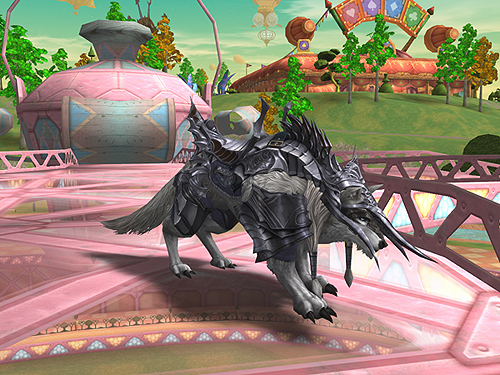
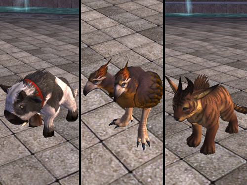

# Pets and Servitors

[New Pets](#new-pets) | [Servitors](#servitors) | [System Improvements](#system-improvements)

## New Pets

All pets can be raised up to level 86. The Pet Manager NPCs now carry a pet raising guide that includes helpful tips and information for raising your pets.

### Fenrir

If your summoned Great Wolf is above level 70, you can evolve it into a Fenrir that is mountable by speaking with the Pet Manager NPCs.

### Improved Baby Buffalo, Kookaburra, and Cougar

If your summoned baby Buffalo, Kookaburra, or Cougar is level 55 or above, you can evolve it into an improved pet by speaking with the Pet Manager NPC. An improved baby pet can cast buffs on its owner.

### Great Snow Wolf, Snow Fenrir, and Red Dusk/Red Star/Red Wind Strider

All members of a clan that is in possession of the Rune or Aden Clan Halls may exchange their normal wolf or strider pet for a Clan Hall one.

This can be done by speaking to the Clan Hall Gatekeeper located outside the clan hall. A Great Wolf can be exchanged for a Great Snow Wolf. A Fenrir can be exchanged for a Snow Fenrir, and Striders may be exchanged for a Red Star, Red Dusk, or Red Wind Strider, respectively.

The Great Snow Wolf, Snow Fenrir, and Red Striders possess unique skills that ordinary pets do not, and their defense and mounted moving speed are higher than those of normal (non Clan Hall obtained) pets.

The special Clan Hall obtained pets cannot be used unless a clan is in possession of a Clan Hall, but they can be exchanged again for the previous pets through the Pet Trader Mickey NPC in the Towns of Aden and Rune Township.

The summoning collars for the Great Snow Wolf, Snow Fenrir, Red Dusk/Red Star/Red Wind Strider cannot be dropped, exchanged, or sold.

## Servitors

An attribute system that allows the summoners to transfer their attribute abilities to the servitor has been added. This only applies to Warlocks, Phantom Summoners, and Elemental Summoners and their associated third class.

When the summoner equips a weapon with an attribute that corresponds with that of the servitor, 80% of the corresponding attribute value automatically applies to the servitor.

The attribute value only applies to the servitor's attacks power, not to its defense power.

When the summoner receives an item grade penalty, the attribute system does not apply on their pets.

When the attribute of the equipped weapon does not correspond with that of the servitor, the attribute system does not apply.

## System Improvements

### Pet Weapon Upgrades

You can upgrade an ordinary Wolf's weapons to a Great Wolf's weapons, and a Great Wolf's weapons to a Fenrir's weapons through the Pet Manager NPCs.

### System Messages

You can now see your servitor's or pet's battle-related messages.

### Instant Herb Items

Instant Herb items are now applied properly to pets.
