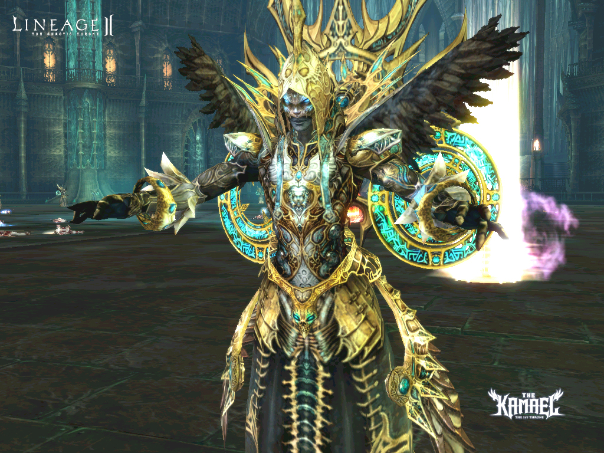
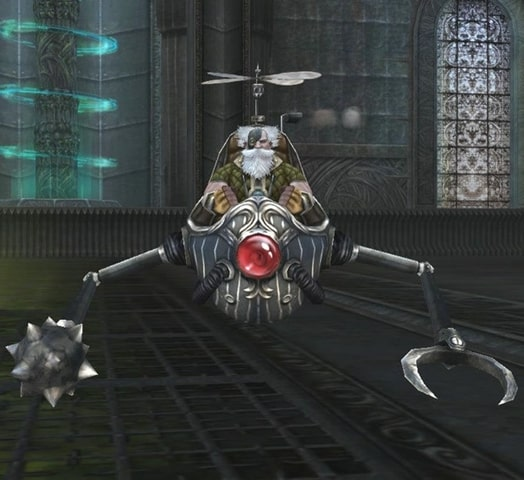

# Hunting Grounds

[Hellbound - Steel Citadel](#hellbound-steel-citadel) | [Existing Hunting Grounds](#existing-hunting-grounds)

## Hellbound - Steel Citadel

The Steel Citadel is where the raid boss Beleth resides. It is an extremely challenging hunting ground that is composed of various battle areas.

In order to enter the Steel Citadel, you must maintain the trust of the Hellbound natives and continually contribute to their cause.

The Steel Citadel is a massive castle that is composed of many areas (Base Tower, Tower of Infinitum, Tully's Workshop, and Tower of Naia).

If you disconnect while you are inside Base Tower, Tower of Infinitum, or Tully's Workshop, you must reconnect within 10 minutes or you will be moved out to the oasis near the Steel Citadel.

### Base Tower

The Base Tower is a two-story labyrinth. You must complete the Base Tower in order to enter the Tower of Infinitum.

A high level of trust must be maintained with the Hellbound natives in order to achieve this.

### Tower of Infinitum

The Tower of Infinitum is where the raid bosses Demon Prince and Ranku reside. You can enter the Tower of Infinitum after completing the Base Tower. You must complete the Tower of Infinitum in order to enter Tully's Workshop.

### Tully's Workshop

Tully's Workshop is where the raid monster Darion resides. It is composed of eight floors, and you must defeat Darion in order to enter the Tower of Naia.

### Tower of Naia

The Tower of Naia is where the raid monster Epidos and the boss monster Beleth reside. The Tower of Naia is a breakthrough-type dungeon where you must complete each section within a certain time limit.

## Existing Hunting Grounds

- The rewards from the monsters residing on Primeval Isle have been greatly increased.
- The power of the damage zone near the Core area has been slightly increased.
- Specific monsters located in Hellbound - Magic Barrier that were not dropping the proper rewards have been adjusted. They now drop the proper rewards.
- The NPC Shade, minion of Dark Water Dragon, will no longer re-spawn after a certain number of deaths.
- The issue with the Dark Water Dragon not attacking back when its minion Shade is attacked has been fixed.
- NPC Jirrone, Buron, and Bernarde in Hellbound will now provide more detailed information about Hellbound.
- When Baylor is defeated, the instanced zone will be deleted 5 minutes after he dies.
- The Minions of Core will now return to their original position if they are moved outside of the boss zone.
- The number of monsters in Chromatic Highlands have been adjusted.
