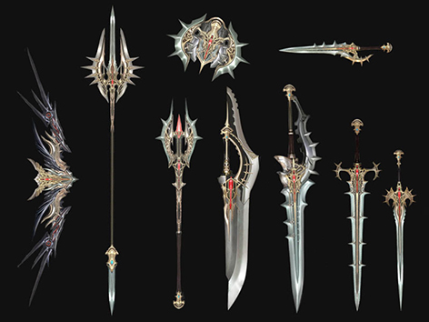

# Items

[Weapons & Armor](#weapons-armor) | [Shirts](#shirts) | [Agathions](#agathions) | [Talismans](#talismans) | [C-Grade Weapon & Armor Sales](#c-grade-weapon-armor-sales) | [Other Changes](#other-changes)

## Weapons & Armor

New top-level S-80 grade weapons and armor have been added.

### Weapons

**Dynasty Staff**
- Red Soul Crystal - Stage 14: Mana Up
- Green Soul Crystal - Stage 14: Conversion
- Blue Soul Crystal - Stage 14: Acumen

**Dynasty Crusher**
- Red Soul Crystal - Stage 14: Anger
- Green Soul Crystal - Stage 14: Health
- Blue Soul Crystal - Stage 14: Rsk. Focus

**Icarus Sawsword**
- Red Soul Crystal - Stage 15: Focus
- Green Soul Crystal - Stage 15: Health
- Blue Soul Crystal - Stage 15: Light

**Icarus Heavyarms**
- Red Soul Crystal - Stage 15: Focus
- Green Soul Crystal - Stage 15: Health
- Blue Soul Crystal - Stage 15: Light

**Icarus Spirit**
- Red Soul Crystal - Stage 15: Acumen
- Green Soul Crystal - Stage 15: Mana Up
- Blue Soul Crystal - Stage 15: Conversion

**Icarus Spitter**
- Red Soul Crystal - Stage 15: Cheap Shot
- Green Soul Crystal - Stage 15: Guidance
- Blue Soul Crystal - Stage 15: Focus

**Icarus Disperser**
- Red Soul Crystal - Stage 15: Focus
- Green Soul Crystal - Stage 15: Evasion
- Blue Soul Crystal - Stage 15: Critical Damage

**Icarus Trident**
- Red Soul Crystal - Stage 15: Anger
- Green Soul Crystal - Stage 15: Critical Stun
- Blue Soul Crystal - Stage 15: Light

**Icarus Hammer**
- Red Soul Crystal - Stage 15: Anger
- Green Soul Crystal - Stage 15: Health
- Blue Soul Crystal - Stage 15: Rsk. Focus

**Icarus Hall**
- Red Soul Crystal - Stage 15: Mana Up
- Green Soul Crystal - Stage 15: Conversion
- Blue Soul Crystal - Stage 15: Acumen

**Icarus Hand**
- Red Soul Crystal - Stage 15: Rsk. Evasion
- Green Soul Crystal - Stage 15: Focus
- Blue Soul Crystal - Stage 15: Haste

**Icarus Stinger**
- Red Soul Crystal - Stage 15: Focus
- Green Soul Crystal - Stage 15: Health
- Blue Soul Crystal - Stage 15: Light

**Icarus Wingblade**
- Red Soul Crystal - Stage 15: Focus
- Green Soul Crystal - Stage 15: Health
- Blue Soul Crystal - Stage 15: Light

**Icarus Shooter**
- Red Soul Crystal - Stage 15: Cheap Shot
- Green Soul Crystal - Stage 15: Guidance
- Blue Soul Crystal - Stage 15: Focus

### Armor

- Dynasty Platinum Plate: Shield Master, Weapon Master, Force Master, and Bard
- Dynasty Jewel Leather Mail: Dagger Master, Bow Master, Force Master, Weapon Master, Enchanter, and Summoner
- Dynasty Satin Tunic: Healer, Enchanter, Summoner, and Wizard

## Shirts

Shirts that are C-grade and above can be exchanged via the fortress Support Unit Captain NPC or the castle Court Magician NPC for shirts with one stat bestowment option (HP, MP, or CP). A shirt's stat bestowment option will only apply when the shirt is enchanted to +4 or more.

## Agathions

You can purchase a new Agathion from the armor merchant in the Giran Luxury Shop.

When you purchase an Agathion, there is a random chance that you will receive an existing Agathion, or one of the new Agathions.

If you happen to purchase an old Agathion, you can double-click on it to receive a reward in place of it.

## Talismans

You can purchase talismans and a C-grade bracelet that can equip talismans in Giran (Jewelry Shop), Rune (Magic Shop) and Aden (Accessory Shop); however, they will not be as effective as the talismans you can obtain from a fortress.

## C-Grade Weapon & Armor Sales

You can now purchase some C-grade armor from the weapon and armor merchants in Giran, Rune, and Aden. The Luxury Shop has been changed and will now only sell mid-level C-grade weapons and armor.

## Other Changes

- The corresponding quest name has been added to all quest item tool tips.
- The spell casting time for the Blessed Scroll of Resurrection has been decreased from 15 seconds to 3 seconds.
- Active skills that have been bestowed on augmented weapons have been changed so that the skills cannot be used for 30 seconds after equipping.
- The refresh timer for active skills bestowed on augmented weapons has been modified so that even when the item is unequipped, the refresh timer continues to count down. For example, when an item with a bestowed skill has a remaining refresh time of 10 minutes, the item is equipped for 5 minutes, then unequipped and put into the inventory for 3 minutes, only 2 minutes of re-use time will be remaining for that skill when the item is re-equipped.
- The following changes have been made to Apella armor: Increased maximum CP and when the wearer is damaged by another player, a debuff no longer occurs. Instead, the player who is wearing the armor is now buffed.
  - **Heavy:** Increased M. Def., decreased chance of getting critical hit from another player (+ increased critical strike rate)
  - **Light:** Increased dodge, decreased critical damage amount from another player (+ increased attack speed)
  - **Robe:** Increased P. Def., increased moving speed (+ increased M. Atk.)
- An ordinary Apella set can be upgraded to an Improved Apella set from clan merchants "Mulia" and "Ilia" with Clan Reputation, Knight's Epaulettes, and Adena.
- The "Light" SA option on a weapon has been improved.
- Beginning armor could not be exchanged by the Kamael merchant NPC named Trevor. This has been fixed, and Trevor will now exchange beginning armor.
- The spellbooks that are required to learn level 40 through level 74 skills can now be purchased from the following merchant NPCs in newbie towns. (All spellbooks for the skills that you can learn without spending any SP will still need to be acquired from monsters.)
  - Human classes: Talking Island (Silvia)
  - Elf classes: Elven Village (Creamees)
  - Dark Elf classes: Dark Elven Village (Minaless)
  - Orc classes: Orc Village (Wosca)
  - Dwarf classes: Dwarf Village (Mion)
  - Kamael classes: Kamael Village (Miflen)
- All spellbooks for skills that are level 74 and below now have level requirement information to learn the skill.
- The issue with required crafting materials for creating following S-grade weapons and armors being missing has been fixed. (The added crafting materials are High Quality Leather/Suede, Asope, and Compound Braid.)
  - Sealed Imperial Crusader Gauntlet
  - Sealed Imperial Crusader Boots
  - Sealed Imperial Crusader Shield
  - Sealed Imperial Crusader Helmet
  - Sealed Draconic Leather Armor
  - Sealed Draconic Leather Gloves
  - Sealed Draconic Leather Boots
  - Sealed Major Arcana Robe
  - Sealed Major Arcana Gloves
  - Sealed Major Arcana Boots
  - Sealed Major Arcana Circlet
  - Basalt Battle Hammer
  - Dragon Hunter Axe
  - Saint Spear
  - Demon Splinter
  - Arcana Mace
  - Draconic Bow
- The issue with the number of some required crafting materials (Compound Braid & Asofe) not being set correctly to create following items has been fixed:
  - Draconic Bow
  - Sealed Draconic Leather Helmet
