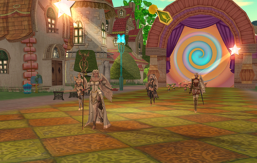

# Monster Parade

A representation of each type of monster and NPC has been added to Fantasy Isle.

## NPC Parade

The NPC parade, which takes place several times a day (according to the in-game time), goes through each type of play area on Fantasy Isle, allowing you to explore the wide array of NPC appearances that you have seen throughout the lands of Aden and Elmore. The parade occurs at set times (according to the in-game time). You can see each character's unique appearance depending on whether you see the parade in the day or in the evening.

## Monster/NPC Appearances

When a parade occurs, some of the participating monsters and NPCs can be seen at the performance area on Fantasy Isle. These appearances show you a different side to the monsters and NPCs you know and love through special performances such as singing, circus team acts, and monster talent shows.
