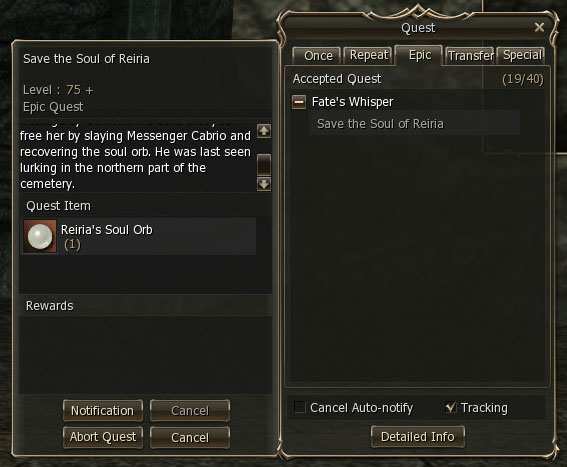
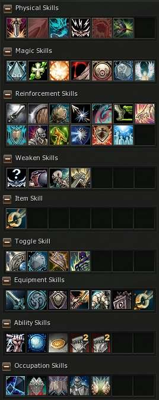
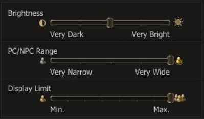

# Interface Changes

## Quest Notification Function

A quest tracker has been added to make it easier to check the process of a quest. Select the quest in progress from the quest info window (Alt+U). Press the "Notification" button at the bottom of the window to open the tracker - this will allow you to quickly check your progress. You can register up to five quests to the tracker.

## Shortcut Keys

The shortcut key function has been improved. Default values as well as saved key values can now be changed.

## Bundle Sale

The bundle sale function has been separated from the private store window and has been added as an independent action.

## Skill Info Window

To make skill management easier, the skills window (Alt+K) has been made more detailed. Passive skills are now categorized under various expandable and collapsable headings rather than in one general "Passive Skills" area.

## System Message

The battle system message has been improved. It now shows info such as the names of the attackers and defenders, magic information and so on depending on the situation.

## Olympiad

An Olympiad notice function has been added to make it easier to watch the Olympiad.

The Olympiad Manager NPC will announce the arena number along with the upcoming match 60 seconds before the match begins.

When you select "Watch Match" via the Olympiad Manager NPC, you can now check the status of each arena.

## Adjustable Character Display Option

An option (slider) that adjusts the number of characters and NPCs that appear on the screen has been added.
