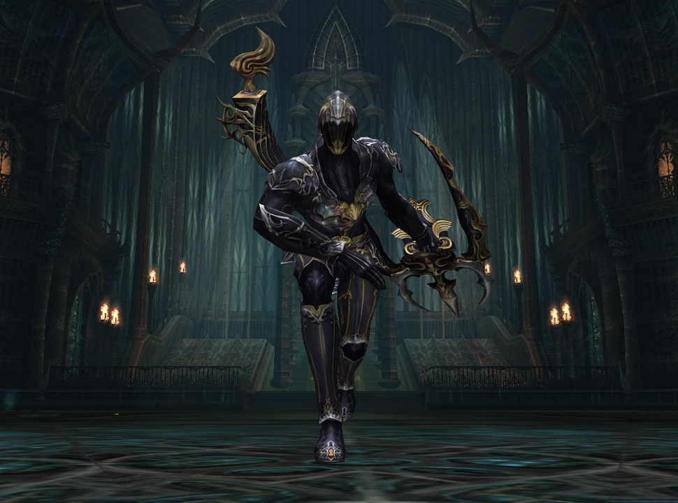
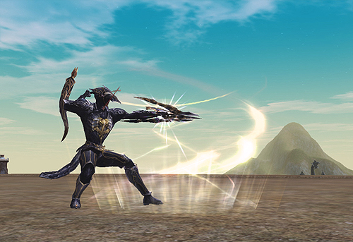

# Transformations

## New Transformations

New transformations (normal and rare) have been added. You can use them after you've completed the "More Than Meets the Eye" quest and have acquired the skill "Transform - Onyx Beast."

- The Soulshot particle effect and sound will no longer apply when you are in a transformed state.
- The Hero particle effect does not occur while you are in a transformed state.

## Normal Transformation Types

Normal transformation types (warrior, magician, etc.) have been added for characters that are levels 70-80.

These transformations function according to a specific job class, one has healer skills, one has wizard skills, and the other three have various warrior skills. After you obtain the transformation sealbook through hunting, you can acquire the corresponding transformation skill from Avant-Garde, the Transformation Wizard.

## Rare Transformation Types

Rare transformation types have been added. These transformations have significantly stronger battle abilities than other transformations. You can acquire the "Transformation Sealbook" by hunting specific raid monsters, and you can acquire the transformation skill by taking the sealbook to Avant-Garde the Transformation Wizard.

The raid monsters that possess the Transformation Sealbooks and the player-character levels required to use them are as follows:

- **Zaken** - Can be used by a player whose level 60 or higher
- **Anakim** - Can be used by a player whose level 70 or higher
- **Benom** - Can be used by a player whose level 70 or higher
- **Gordon** - Can be used by a player whose level 76 or higher
- **Ranku** - Can be used by a player whose level 76 or higher
- **Kechi** - Can be used by a player whose level 76 or higher
- **Demon Prince** - Can be used by a player whose level 76 or higher
