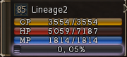

# Vitality System

A vitality system that provides bonus experience during hunting has been added.

Vitality Points can be acquired when your characters are offline, in a peace zone, or hunting Raid Bosses.

When you accumulate Vitality Points and raise your Vitality Level, the bonus experience points that you acquire increase in proportion to your Vitality Level.

When you obtain experience points by hunting regular monsters rather than bosses or raid monsters, Vitality Points are consumed.

You can check your character's Vitality Level by viewing either your Status Window or your Character Status Page.

There are four levels of vitality:

- **Level 1** - 150% increase in experience gain.
- **Level 2** - 200% increase in experience gain.
- **Level 3** - 250% increase in experience gain.
- **Level 4** - 300% increase in experience gain.
