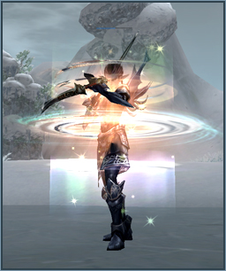
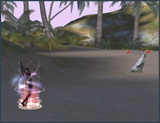

# New Skills

[Vanguard](#vanguard) | [Inquisitor](#inquisitor) | [Other Classes](#other-classes)

## Vanguard

The new skill "Vanguard" has been added for all Knight classes. This skill can first be acquired at level 43.

A dual-sword or two-handed sword are required for all Vanguard stance-specific skills. Paladins and Temple Knights will utilize the two-handed swords, while Dark Avengers and Shilen Knights will use the dual-swords.

New physical attack skills have been added that can only be used while in the Vanguard stance. These skills can first be acquired at level 44 and are listed below.

- **Power Divide** - Delivers a powerful blow that seems to cleave the enemy in half. Requires that a two-handed sword or a two-handed blunt weapon are equipped. Ignores shield defense. Over-hit is possible.
- **Full Swing** - Attacks nearby enemies by widely swinging a two-handed weapon. Requires a two-handed weapon. Ignores shield defense. Over-hit is possible.
- **Double Strike** - Delivers a powerful blow to the enemy by alternating between two swords. Requires a dual-sword. Ignores shield defense. Over-hit is possible.
- **Blade Hurricane** - Attacks nearby enemies with a dual-sword. Requires a dual-sword. Ignores shield defense. Over-hit is possible.

While in the Vanguard stance, Knight classes are also able to use some of their regular class-specific skills, if they already have them. These skills are listed below.

| Class | Skill |
|-------|-------|
| Paladin | Aggression, Aura of Hate, Angelic Icon, Tribunal, Holy Blade, Holy Armor |
| Dark Avenger | Aggression, Aura of Hate, Summon Dark Panther, Horror, Judgment, Reflect Damage |
| Temple Knight | Aggression, Aura of Hate, Summon Storm Cubic, Summon Life Cubic, Summon Attractive Cubic, Tribunal, Holy Armor |
| Shillien Knight | Aggression, Aura of Hate, Summon Vampiric Cubic, Summon Phantom Cubic, Summon Viper Cubic, Life Leech, Lightning Strike, Judgment |

## Inquisitor

The new skill "Inquisitor" has been added for all Healer classes. This skill can first be acquired at level 44.

New magic attack skills that can only be used while in the Inquisitor state have been added. These skills can first be acquired at level 44 and are listed below.

- **Divine Punishment** - Brings down the gods' retribution upon an enemy.
- **Divine Flash** - Detonates sacred energy to attack surrounding enemies.
- **Surrender to the Holy** - Instantly decreases resistance to divine attacks and increases resistance to darkness attacks.
- **Divine Curse** - Casts the wrathful curse of the gods to reduce the effect of recovery magic by half and continuously decrease HP.

While in the Inquisitor stance, Healer classes are also able to use some of their regular class-specific skills, if they already have them. These skills are listed below.

| Class | Skill |
|-------|-------|
| Bishop | Invocation, Holy Weapon, Celestial Shield, Hold Undead, Turn Undead |
| Elven Elder | Invocation, Holy Weapon, Wild Magic, Turn Undead |
| Shillien Elder | Invocation, Holy Weapon, Empower, Wild Magic |

## Other Classes

Other new class-specific skills have been added. The following skills are acquired by double-clicking on the corresponding spellbook.

| Class | New Skill | Description | Level |
|-------|-----------|-------------|-------|
| Abyss Walker | Shadow Step | Cancels the enemy's target and instantly decreases the distance to the enemy. | 72 |
| Plainswalker | Shadow Step | *(same as above)* | 72 |
| Treasure Hunter | Shadow Step | *(same as above)* | 72 |
| Abyss Walker | Evasion Counter | Has a chance to stun the enemy during evasion. | 74 |
| Plainswalker | Evasion Chance | Has a chance to increase your mortal attack rates during evasion. | 74 |
| Treasure Hunter | Evasion Haste | Has a chance to increase your attack speed during evasion. | 74 |

The following are new class-specific skills.

| Class | New Skill | Description | Level |
|-------|-----------|-------------|-------|
| Warsmith | Repair Golem | Repairs a summoned golem. | 40 |
| Warsmith | Armor Plate | Temporarily equips a summoned golem with an additional armor plate to increase P.Def. and maximum HP. | 40 |
| Warsmith | Strengthen Golem | Temporarily increases a summoned golem's attack power and attack speed. | 43 |
| Warsmith | Temper | Tempers metal to enhance the P.Def. of Heavy Armor. | 46 |
| Warsmith | Tan | Cures leather to increase the P.Def. and Evasion of Light Armor. | 46 |
| Warsmith | Embroider | Embroiders cloth to increase P.Def. and MP recovery speed. | 46 |
| Warsmith | Sharpen | Sharpens a bladed weapon to increase P. Atk. and Critical Rate. | 49 |
| Warsmith | Spike | Adds a spike to a blunt weapon to increase P. Atk. and shock attack rate. | 49 |
| Warsmith | Restring | Enhances the string of a bow or crossbow to increase P. Atk. and range. | 49 |
| Warsmith | Summon Merchant Golem | Summons a trader association golem who can do basic transactions. | 52 |
| Inspector | Expert Casting | Increases casting speed and decreases magic reuse time. | 40 |
| Shillien Elder | Bless the Blood | Instantly bestows the blessing of blood upon party members. Has chance to recover HP when being attacked. | 40 |
| All Kamael | Fast Recovery | Increases HP/MP/CP regeneration. | 43 |
| Prophet | Steal Mana | Has a chance to recover MP when striking. | 44 |
| Berserker | Body Reconstruction | Recovers all HP by reconstructing one's own body. | 52 |
| Berserker | Blood Pact | Temporarily increases party members' maximum HP and HP regeneration through a blood pact. | 55 |
| Soul Breaker | Painkiller | Momentarily suppresses pain and prevents damage. When the duration ends, one feels weak. | 58 |
| Soul Breaker | Soul Web | Spreads a soul net and momentarily decreases the enemies' speed. | 62 |
| Arbalester | Oblivion Trap | Summons a mental trap. The enemy will have a chance to lose their target on every attack. | 64 |
| Arbalester | Imbue Seed of Destruction | Plant a Seed of Destruction in the enemy's body. The seed grows inside the body, sucking up the enemy's mana, and blocks the enemy's skill use when it becomes full grown. | 68 |
