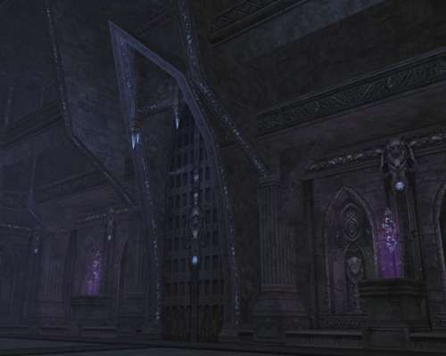

# Hunting Grounds

## Kamaloka

The instanced dungeon hunting ground Kamaloka has been added. The entry requirements for this new instanced dungeon are as follows:

- **Entry NPC** - Guard Captain
- **Party Requirement** - Party of 2-6
- **Type** - Raid-type hunting ground
- **Instanced Zone Duration** - 30 minutes
- **Entry Limitations** - Once per day

The entry limitation time resets every day at 6:30 AM (server time). The Guard Captain NPC is located at the center of each village or town that is listed below.

Locations of Kamaloka and character levels needed for entry are as follows:

- **Gludio Castle Town:** Bathis (levels 18-31)
- **Dion Castle Town:** Lucas (levels 28-41)
- **Town of Heine:** Gosta (levels 38-51)
- **Town of Oren:** Mouen (levels 48-61)
- **Town of Schuttgart:** Vishotsky (levels 58-71)
- **Rune Township:** Mathias (levels 68-78)

## Cruma Tower

- The amount of Exp. and SP players get from hunting monsters in Cruma Tower have been increased.
- New event monsters that can change or help the hunting flow have been added.
- Characters that are level 56 and above can no longer enter Cruma Tower.

## Monsters

A dungeon monster's ability to return to its location when it goes outside a certain range has been enhanced.

## Hellbound

If a character enters Hellbound for the first time, everyone else on the server can enter by completing "Path to Hellbound" quest instead of "That's Bloody Hot" quest.

## Miscellaneous

The hunting efficiency of close-range melee classes has been increased in Varka Silenos Outpost, the Outlaw Forest, and the Garden of Beasts.
