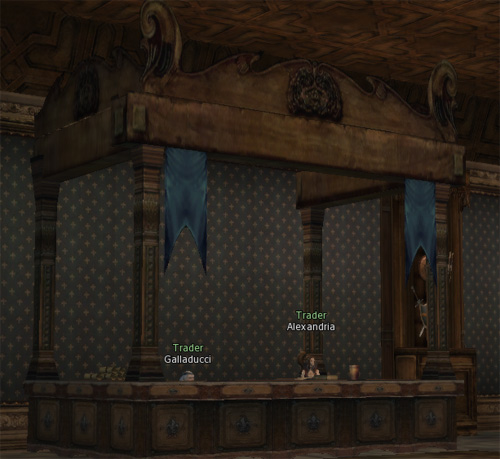

# Items

## Decreased Item Prices

The shop prices for all weapons, armor, and accessories have been lowered.

## Item Manufacturing

When crafting an item, there is a chance that the crafter could create two items from one set of materials, or that the created item is a Foundation Item.

A Foundation Item can be refined into a Masterwork Item by the Blacksmith of Mammon.

Masterwork Weapons may be converted into Kamael-exclusive weapons and dual-swords.

## New Weapons, Armor, and Accessories

Common Items have been added up to A-grade. These items have the same stats as Superior Items, but they cannot be enchanted, enhanced, or augmented. They can be purchased at shops or obtained through hunting regular monsters.

You can purchase a Luxury Gold Circlet and a Luxury Silver Circlet at the Luxury Shop in Giran.

## Shop Sales and Added Exchange Items

Shops now sell up to top-tier C-Grade items, and the Luxury Shop sells up to low-tier B-Grade items.

B-Grade items can be exchanged for a different item of the same grade through the Blacksmith of Mammon. (Superior Items cannot be exchanged.)

## Magic Accessories Augmentation

Superior and Masterwork jewelry such as rings, necklaces, and earrings can now be augmented.

## Herbs

New instant herbs have been added. The duration for instant herbs has been increased from 2 minutes to 5 minutes.
