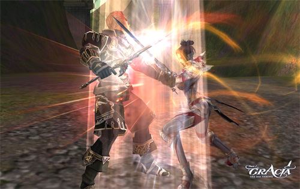

# PVP Changes

## Fame

Fame can be acquired only by characters above level 40 who have completed the second class change.

Fame can be obtained through various activities such as advancing onto a registered battlefield (a castle siege, fortress siege, or hideout siege) and defeating an enemy.

The best scores by ranking are registered at the Festival of the Darkness, and if your affiliated clan is victorious, you receive a certain amount of Fame from the Festival Guide as a reward.

### Olympiad

You can obtain Fame by consuming a Noblesse gate pass through the Olympiad Guide.

Fame is consumed when using various abilities through the "Fame Guide" who is located in the Town of Aden and Rune Township.

There is a limit to how much Fame a character can earn. Once the cap is reached, no more Fame will be earned.

## Fame Rewards

Superior and Masterwork top-tier A-Grade weapons and armor have a PvP augment option that can be purchased with Fame. (This makes the weapon and armor no exchange/no drop.) In addition, once the item has been specialized, you can no longer refine, crystallize, convert or add an attribute to it. Enchanting, however, is still permissible.

Consumables and talismans of each type (including those for class use) that are needed on the battlefield can be purchased with Fame.

- They can be exchanged for a certain amount of Clan Fame.
- They can be exchanged to reduce your PK Count.

## Battlefield Penalty

A character that is registered on the designated battlefield does not incur any Exp. penalty upon death; however, a death on the registered battlefield reduces some stats for a certain amount of time.

Various penalties can be cancelled through the "Recovery Spellbook for Battlefield Use", and this can be purchased through the Fame Guide.

## Charm of Courage

The Charm of Courage's effect has been changed to allow resurrection on the same spot upon death on the battlefield.

## Changes to PvP Duel Status Mark Time

The purple condition duration has been increased from 40 to 120 seconds, and the removal notification time has been increased from 5 to 20 seconds.

The rate at which a character name flashes when the PVP flag is about to drop will get faster as time runs out.
