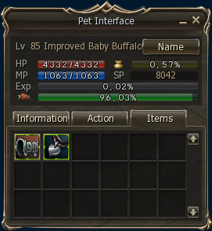

# Pets and Servitors

## New Pet Items

A resistance to magic pet accessory has been added.

Armor that can be used by baby pets (including improved baby pets) has been added.

## Improved Pet System

The amount of time you have to revive your pet before it disappears has been increased to 24 hours. This resurrection period does not apply to pets who die from starvation.

## Servitor Changes

Servitors' battle values (HP, Physical Attack, Magic Attack and Defense) have been changed.

Merrow the Unicorn & Magnus the Unicorn: The maximum number of monsters that can be attacked with AoE magic has been decreased.

## New Servitor Buffs

New skills have been added to Feline Queen, Unicorn Seraphim, and Nightshade.

- **Feline Queen:** Blessed Body, Blessed Soul, and Haste
- **Unicorn Seraphim:** Acumen, Clarity, Empower, and Wild Magic
- **Nightshade:** Death Whisper, Focus, and Guidance
