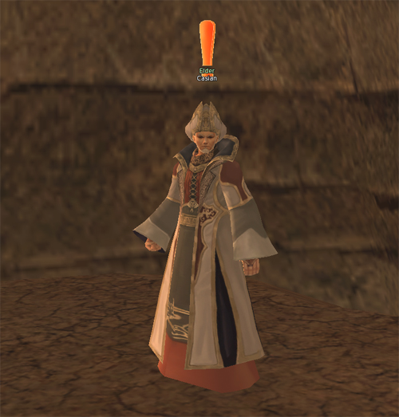

# Quests

## New Quests

### Traces of Evil

- **Level:** 15
- **Type:** Repeatable
- **Description:** Countless animals near the Orc Village are being contaminated and dying off because of a curse from Kasha, the evil spirit of decay and death. Orc Trader Kunai of the Duda-Mara tribe asks you to obtain some Kasha Spider's Rotten Secretion to use in investigating the cause.
- **Starting City/Village:** Orc Village
- **NPC:** Kunai

### Invention Ambition

- **Level:** 18
- **Type:** Repeatable
- **Description:** Inventor Maru asks you to collect Energy Ore, which she needs as ingredients for her energy conversion device experiment. Energy Ore can be easily obtained from almost all the monsters in the Eastern Mining Region.
- **Starting City/Village:** Dwarf Village
- **NPC:** Inventor Maru

### Good Work's Reward

- **Level:** 39
- **Type:** One-Time Quest
- **Description:** Blueprint Seller Daeger tells you that Mark was supposed to come and see him but has not. Daeger asks that if you see Mark, you should tell him to come find him. (Players can complete this quest as an alternative way to change to their second class instead of the original second class-change quest.)
- **Starting City/Village:** Giran
- **NPC:** Daeger

### A Special Order

- **Level:** 40
- **Type:** One-Time Quest
- **Description:** Helvetia's requests make no sense. Has something happened? Helvetia says that a jar of seeds that she ordered has not arrived, and she asks you to find Warehouse Chief Gesto to check on it.
- **Starting City/Village:** Giran
- **NPC:** Helvetia

### Path to Hellbound

- **Level:** 78
- **Type:** One-Time Quest
- **Description:** Casian says that he can't help, and suggests that you seek out Galate at the Ivory Tower instead.
- **Starting City/Village:** Wasteland
- **NPC:** Casian

## Existing Quests

- The first job change quest's level requirement has been changed from level 19 to level 18.
- The rewards for the first and second job change quests have been modified.
- For the second job change quests, the item drop rate has been increased and the item collection amount has been decreased.
- Master Toma's location has been fixed. He no longer moves to other areas.
- The rewards for Clan Fame-related quests have been increased.
- The level needed to perform the Merciless Punishment quest has been changed from 12 to 10.
- The reward amounts for one-time quests have been increased. (Some quest rewards are the same as before.)
- The item drop rates for repetitive quests have been increased. (Some quest rewards are the same as before.)
- Characters are able to advance more easily to their first job change by obtaining specific quest suggestions from the Newbie Guides in their starting village. These quests begin at level 6.
