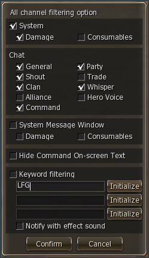
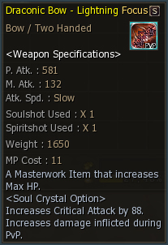
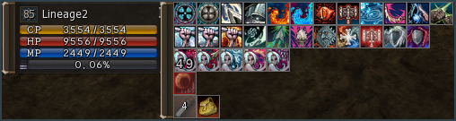

# Interface Changes

## Keyword Filtering

You can enter your text into your Chat Window Options under Keyword Filtering. When the corresponding text is generated (from an item dropping, the item name being typed in a chat channel, etc.), the bottom row of text in your Chat Window will mark that specific keyword or keywords. Your game will also make a notification sound if you selected "Notify with effect sound" under Keyword Filtering.

## Item Name Color

Item names appear in a different color on the item description, depending on the item's rarity. For instance, Common Item names are grey, Rare and Foundation Item names are white, and Masterwork Item names are yellow.

## Buff Removal Function

For beneficial effect buffs, you can remove the buff by pressing Alt and left-clicking on the buff icon. (Song and dance-related buffs cannot be removed.)

## New Buff Slot

A buff slot has been added for song/dance buffs and debuff-related uses.

## Eval/Endorse System

The Recommendation System has been renamed to the Eval/Endorse System. The way it works has not changed.
