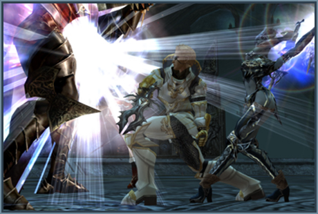
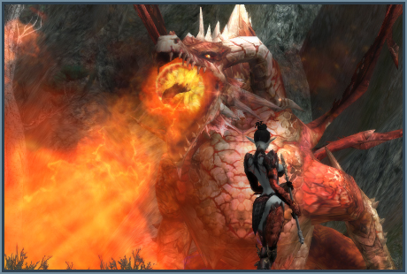
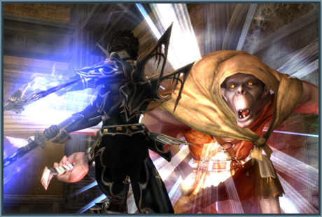

# Hunting Grounds

## Kamaloka - Labyrinth of the Abyss

The instant zone hunting ground "Kamaloka - Labyrinth of the Abyss" has been added.

To enter Kamaloka - Labyrinth of the Abyss, you must meet the following requirements:

| Requirement | Details |
|-------------|---------|
| Entrance NPC | Guard Captain |
| Group | 2 - 9 party members |
| Type of Instance | A breakthrough type raid boss battle |
| Duration | 45 Minutes |
| Entry Restrictions | Each character can only enter once per day |
| Instant Zone Reset | The zone resets after 5 minutes if no PC's are inside. |

The entry restriction time resets at 6:30 AM daily.

## Pailaka

The instant zone hunting ground "Pailaka" has been added.

Only characters who are in the process of a Pailaka-related quest and who meet the entry level requirements for the corresponding instant zone can enter.

| Location | Level | Required Quest | Time Limit |
|----------|-------|---------------|------------|
| Pailaka - Forgotten Temple | 36-42 | Pailaka - Song of Ice and Fire | 60 Min. |
| Pailaka - Devil's Isle | 61-67 | Pailaka - Devil's Legacy | 90 Min. |
| Pailaka - Varka Silenos | 73-77 | Pailaka - Injured Dragon | 90 Min. |

## Kratei's Cube

The competition-type PvP hunting ground "Kratei's Cube" has been added.

You can teleport to the entrance of Kratei's Cube through NPC Paddies on Fantasy Isle.

Characters level 70 and above can register individually through the Kratei's Cube Entrance Manager.

There are 3 Kratei's Cube arenas set up by level range. Each arena can hold a maximum of 25 characters at a time. The level ranges are as follows:

- Level 70-75
- Level 76-79
- Level 80+

Characters who are chaotic, in possession of a cursed sword or currently in a party may not participate.

### Kratei's Cube Rules

1. A Kratei's Cube match begins every 30 minutes from the top of the hour, and lasts for 20 minutes.
2. Once you have requested entry into Kratei's Cube (through the Entrance Manager), you will be moved into a waiting room 3 minutes before the match begins.
3. You can receive Kill Points through PvP and PvE inside Kratei's Cube. Even if a character is killed, there is no death penalty.
4. A character who is killed during a match is moved to the waiting room and can re-enter through the Kratei's Cube Match Manager.
5. Registration ends 3 minutes before each match.
6. The Entrance Manager makes periodic announcements, alerting players on how long they'll have to wait for the next match.

### Rewards

1. At the end of a Kratei's Cube match, you will receive Experience, SP and Fantasy Isle coins.
2. The exact amount of your reward depends on the match results, the number of participants, individual ranking and cumulative result values.
3. You are ineligible to receive any reward if you score less than 10 Kill Points.
4. Fantasy Isle coins can be exchanged for various items through NPC Paddies of Fantasy Isle.

### Leaving During a Match

You will be removed from the registration list and/or will be ineligible for any rewards for the following reasons:

1. If you request to participate in a match, enter the waiting room, and then cancel the match through the Kratei's Cube Match Manager and leave.
2. If you use a Scroll of Escape for a village, castle, hideout or fortress during a match.
3. If you die during a match and do not return through the Entrance Manager (meaning that you do not complete the match).
