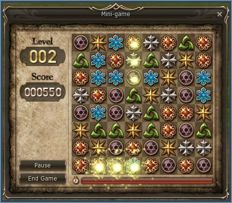

# Mini-Game

- A simple and enjoyable mini-game has been added.
- It can be accessed using the `/minigame` command or by clicking the "Mini-Game" icon in the Action Window.
- The game requires you to create an icon chain of 3 in a row, either horizontally or vertically.
- To do this, select the icon that you want to move. Then click on an adjacent square, where you want the selected icon moved to.
