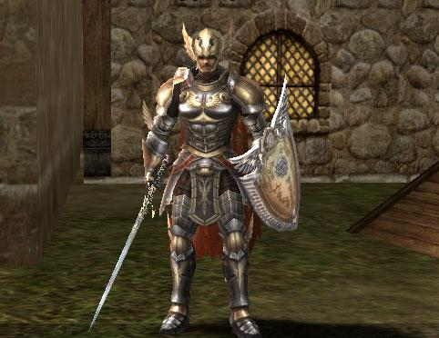

# Territory War

Territory battles, unlike castle sieges where the battles are led by clans, is a new PvP concept in which clanless and casual players can have an effect on the supremacy of a continent by participating as a 'mercenary' in disputes between territories.

## Territory

Castle ownership has been expanded into territory ownership. Where previously a castle was the highest form of ownership available, this facet of game play has been expanded to include the castle, the local town/village and the nearby hunting grounds. This new territory system will foster a complimentary relationship between clans and general users, boost economic profits, and increase the influence that both clans and casual users have in the development of the land.

## Territory Components

A territory consists of a castle, the corresponding town or village, territory fortress and hunting ground. There are presently 9 existing territories:

- Gludio
- Dion
- Giran
- Oren
- Aden
- Innadril
- Goddard
- Rune
- Schuttgart

## Territory War: Pre Battle

At the end of a castle siege, the corresponding territory enters Territory War standby status. This is automatically done by the system and following changes will occur:

1. A Territory Manager NPC appears within the castle's corresponding village/town. The Territory Manager will be stationed near the Manor Manager of each town. A Territory Manager sells territory specific products that can be purchased using Territory Badges as partial currency.
2. A Mercenary Captain NPC appears within the castle's corresponding village/town. The Mercenary Captain will be stationed near the Manor Manager of each town. One can participate in a territory war as a mercenary through the Mercenary Captain. In addition, this NPC also sells various items which can be used during a territory battle. He also offers a quest that allows the player to raise one's mercenary rank.

## Proclaiming Lord

After the territory becomes Territory War standby status, the castle lord can then proceed with the 'Path to Becoming a Lord' quest. This quest is offered by each castle Chamberlain.

### Conditions for proclaiming a territory lord

1. The castle should have either no relation or contract status with all player owned fortresses in the territory (excluding a border fortress). If a fortress has claimed its independence within the territory, then the castle lord cannot be proclaimed as lord of the territory.
2. One has to complete the 'Path to Becoming a Lord' quest.
3. One has to complete the quest 2 hours prior to the start of the territory war.

### The following changes occur when a territory lord is proclaimed:

1. Being proclaimed as territory lord is a necessary condition to expand a clan's level to 11.
2. The territory lord's clan emblem is automatically registered to all NPC's residing within their territory.
3. 10% increase in seed sales and crop purchases.

### Territory lord proclamation will automatically be cancelled under following situations:

1. When the clan is disbanded.
2. When the lord is changed at the end of a castle siege.
3. When proclaiming lord is cancelled, all activated functions will be initialized.

## Territory War: Battle

### Cycle and Beginning

Territory wars will occur one day before the castle sieges and will have the same 2 week cycle. To accommodate this, the castle siege schedule will be modified. All territory wars will occur on Saturday from 20:00 - 22:00 CST. All castle sieges are being moved to Sundays from 16:00 - 18:00 and from 20:00 - 22:00 CST.

### Occurrence of Territory Battle

Upon the completion of a castle siege, territory status is automatically given to the winning clan. The territory war will begin on the designated date/time, regardless of whether the castle-owning clan leader has been declared as lord. Being declared as the lord of the territory is done through a specific quest. And it is only after being proclaimed as territory lord that you are able to participate in a territory war.

### Register to Participate

1. To participate, players must register through the Mercenary Captain of their chosen territory.
2. Whether you are in a clan or not, anyone outside of that territory's castle owning clan can register for participation. You can register either as an individual, or you can register your entire clan at once.
   - Any clan member who has the appropriate clan permissions can register their clan in a territory war.
   - Individual participants who want to join as mercenaries must register for themselves.
   - Only characters level 40 and above who have completed their 2nd class transfer can participate in a territory war.
3. Territory War registration and cancellation end 2 hours before the battle begins.
4. Registration can be cancelled in the same way it is requested. When you speak to a Mercenary Captain, the button that you push (Merc Request) to register will then toggle to Merc. Cancel. So if you wish to cancel your registration, simply click the button again.
5. Castle owning clans will automatically be registered.

### Beginning of Territory Battle

1. Once a territory battle begins, the castle, the area surrounding the castle and the territory fortress area are changed to the battlefield. Any nonparticipating characters who are located in these areas will be teleported away once the battle begins.
2. The clan lord of the territory can build a headquarters or outpost on the battlefield during a territory war.
3. The other participating clan lords can build a headquarters only.
4. Closed fortress and castle gates are attackable during a territory war.
5. The territory channel is automatically activated 20 minutes before the beginning of battle.
   - This territory is automatically terminated 10 minutes after the territory battle is over.
6. The Territory Ward and Supplies Safe can be found inside each castle. The Territory Catapult is found in the territory fortress.

### Battle Rules

1. Basic rules for a territory war are similar to the rules for a castle siege: participants are divided according to friendly force, enemy, and non-affiliated. Each participating territory has its own territory icon, differentiating friendly and enemy forces. Non-affiliated forces bear no icon above their head during the war.
2. Friendly forces include clan members who belong to the same territory, other registered clans and registered mercenaries.
3. Clan members who belong to different territories are automatic enemies to one another once a territory war has begun.
4. Any players who are not registered in the territory war are considered non-affiliated.
5. All registered participants are marked with a territory symbol above their head. This will allow for ease of recognition on the battlefield.
6. Force attack is not needed while on a battlefield during a territory war. Upon targeting an enemy, your cursor will automatically give you the sword icon. Friendly forces cannot be attacked, not even with force attack.
7. The range attack causes damage to those who are the friendly force and non-affiliated. AOE skills will affect all enemy and non-affiliated forces on the battlefield.
8. PK counts are not applied while on the battlefield.
9. There is no PK penalty because the clan battle status is maintained even though enemies go outside of the battlefield.
10. Any player who leaves the battlefield area during a territory war will be flagged (purple) for 120 seconds.
11. When a registered player dies on the battlefield during a territory war, they will not incur a loss of experience points or item drops.
12. If a non-affiliated (unregistered) player dies on the battlefield, they will incur the same penalty that is received for dying on a General Field.
13. Any players who are registered in the territory battle will have the option of restarting in the following areas:
    - Residence district within the castle and 1st village
    - Residence district within the castle and 1st - Camp and outpost

### Outpost

1. A clan lord who owns a castle can now build an Outpost during a territory war.
2. When a clan lord builds an Outpost, 30 MP and 120 'B-grade gemstones' are consumed.
3. Only one Outpost can be constructed at a time. The lord will also have a skill allowing them to demolish their outpost, thus allowing the player to move their outpost at will during the territory war. However, please note that each construction attempt will still cost the items listed above.
4. Other players cannot destroy an outpost, nor can an outpost be repaired.
5. HP/MP recovery rate for all friendly forces who are located near an outpost will increase by 100%.
6. Any participants who die in the territory battle can restart at an outpost or camp. This includes mercenaries.
7. When a territory battle is over, all outposts and headquarters disappear.

### Conditions for Winning

1. **Territory Ward** - Once a territory battle begins, territory wards are placed inside of all castles where their territories are proclaimed.
2. Once you destroy an opposing castle's territory ward, the ward is immediately equipped on your character.
   - Once you are equipped with a territory ward, you must make your way to your clan's outpost and use the Capture Ward skill. This will place the ward inside your territory's castle.
   - The location of the player who acquires a territory ward can be found on the mini map.
   - When the territory battle ends, the ownership of a territory ward returns to the original castle under the following conditions:
     - When a player has a ward equipped, but hasn't gotten it back to their castle.
     - When the ward is laying on the ground, unclaimed.
   - Any wards successfully taken from other territories will remain in the castle that captured it until the next territory battle. If a castle loses their ward, they must retake it during the next territory war.
3. **Territory Catapult** - When a territory battle begins, the territory catapult spawns in the 1st territory fortress. The 1st territory fortress will be designated with a blue flag on your map.
   - The territory catapult can be attacked by enemies.
   - When the territory catapult is destroyed, all defense NPCs and all defense functions of the castle will disappear and all castle gates are opened.

### Mercenary

All territory battle participants, excluding castle owning clan members, will be guaranteed their anonymity in a territory battle through the following methods:

1. **Disguise Scrolls**
   - In order to maintain individual anonymity, players registered as mercenaries can purchase a Disguise Scroll from the Territory Manager. When used, a Disguise Scroll changes the characters name to 'Guardian' in preparation for the territory battle. The territory for which they are fighting will appear before the word Guardian. For example: if I am fighting for Aden Castle and use a Disguise Scroll, my name will appear as Aden Guardian.
   - A Disguise Scroll can be used 20 minutes prior to the start battle and will last until 10 minutes after the territory battle ends.
   - Each Disguise Scroll lasts for 30 minutes.
   - Character names displayed in chat and combat system messages are also changed. However, the original character name will be displayed in trade windows and private messages.
   - The changed name will be maintained even if one dies or disconnects.
   - One cannot create a private store (buy or sell) or create a dwarven workshop while one is using the disguise scroll.
   - Chaotic characters (including players who have a cursed sword) and Olympiad participants cannot use Disguise Scrolls during Territory War.

2. **Mercenary Transformation**
   - All territory battle participants can purchase the Mercenary Transformation Scroll through a Mercenary Captain. However, only registered participants outside of the castle owning clan can use this item.
   - When a player has been transformed by a Mercenary Transformation Scroll and is in a party, neither the mercenary or the other party members will be able to accumulate Exp or SP. However, Fame Points can still be acquired by the mercenary.
   - By completing the Path to Becoming a Mercenary quest, you will receive an Elite Mercenary Certificate. This certificate will allow you to purchase a wider variety of items through the Mercenary Captain.
   - The mercenary transformation will last for 30 minutes, and the transformation will not be cancelled even if one dies during the war.
   - A Mercenary Transformation Scroll can be used 20 minutes prior to the start of a territory battle.
   - Chaotic characters (including players who have a cursed sword) and Olympiad participants cannot use a Mercenary Transformation during Territory War.

## Territory War: Post Battle

### Territory Specific Rewards

- Each of the nine territories has a specific territory skill associated with it. These skills are called Territory Benefactions.
- When a territory battle ends, the territory skill is applied to all clan members of the castle owning clan (excluding academy members). For example: If the lord of Aden is able to acquire territory wards for Aden, Rune, and Giran, all clan members associated with Aden castle will gain the passive territory skill.
- One has to own the territory ward of one's own territory in order to be acquire the Benefaction skills.
- Even if a different clan lord is delegated, a territory wards and ownership for the corresponding territory do not change.
- Ownership of each territory ward can be found through Mini map -> World Information -> Territory Battle Information. The territory icons next to each clan denote who possesses which wards.

| Territory Special Skill | Skill Effect |
|------------------------|-------------|
| Gludio Territory Benefaction | STR +1 / INT +1 |
| Dion Territory Benefaction | DEX +1 / WIT +1 |
| Giran Territory Benefaction | STR +1 / MEN +1 |
| Oren Territory Benefaction | CON +1 / MEN +1 |
| Aden Territory Benefaction | DEX +1 / MEN +1 |
| Innadril Territory Benefaction | CON +1 / INT +1 |
| Goddard Territory Benefaction | DEX +1 / INT +1 |
| Rune Territory Benefaction | STR +1 / WIT +1 |
| Schuttgart Territory Benefaction | CON +1 / WIT +1 |

### Items sold by Territory Manager

| Type | Category | Effect |
|------|----------|--------|
| Weapons (S Grade) | Warrior-type | 10% increase in physical damage compared to general weapons of the same grade. 10% decrease in magic attack power (M.Atk.) |
| Weapons (S Grade) | Wizard-type | 10% increase in magic damage compared to general weapons of the same grade. 10% decrease in physical damage (P.Atk.) |
| Armor | Apella Combat Set | No class restrictions exist |
| Armor | Apella Combat Set | Decrease rate of experience points in case of death is 40% of the general death cases (existing Apela Set 70%) |
| Belt (C-S Grade) | Supply Box - Belt | Increases defense power (P.Def.) |
| Belt (C-S Grade) | Supply Box - Pouch | When added to a Belt, this item increases the maximum number of inventory slots available. |
| Belt (C-S Grade) | Supply Box - Pin | When combined with a belt, this item will increase a character's maximum weight allowance. |
| Accessory (A-Grade) | Necklace | magic defense power + attribute defense power |
| Accessory (A-Grade) | Ring | magic defense power + attribute defense power |
| Accessory (A-Grade) | Earring | magic defense power + attribute defense power + skills related to resistance |
| Blessed Scroll of Escape | Return to a specific town | Teleport to a village within a territory |
| Talisman | | CT Specialization |
| Hair Accessory | | |

### Territory Special Products

- Any players who participate in a territory battle can purchase the following special products (per territory) through a territory manager.
- Each item sold by the Territory Manager costs both Adena and a certain amount of Territory Badges. These badges are obtained through participation in a Territory War.
- One can combine a belt with a pouch or pin, or break the seal on a pouch or pin, through a Weaver. These NPC's are located near the warehouses in Aden and Rune.
- There is the possibility of failure when opening a Territory Supply Box or attempting to unseal a pin or pouch.
- Only players with a Knight ranking and above can wear a cloak. In order to wear a cloak, one must be part of a castle-owning clan and be equipped with a full set of Vesper Noble or Dynasty armor.
- One can purchase the following items through a Chamberlain and Mercenary:

| Type | Detail | Purchased From |
|------|--------|---------------|
| Cloak | Armor | Castle Chamberlain |
| Strider | Ridable Pet | Mercenary Captain |

### Territory Badge

- Territory badges are acquired through a Territory Manager after completing a quest which occurs during a territory battle. This mission will automatically be assigned to all registered participants who are online during the time when the territory battle is occurring.
- Quest information can be obtained through the World Info portion of your map, or by visiting an Adventure Guildsman.

### Acquiring Noblesse Rank

- A player can now become a noblesse through one of the Territory Managers, regardless of whether they have a subclass or not. To do this costs a specific amount of territory badges.

### Quests and Rewards Exclusive for Territories

- One can receive various rewards such as experience points and SP through territory quests.
