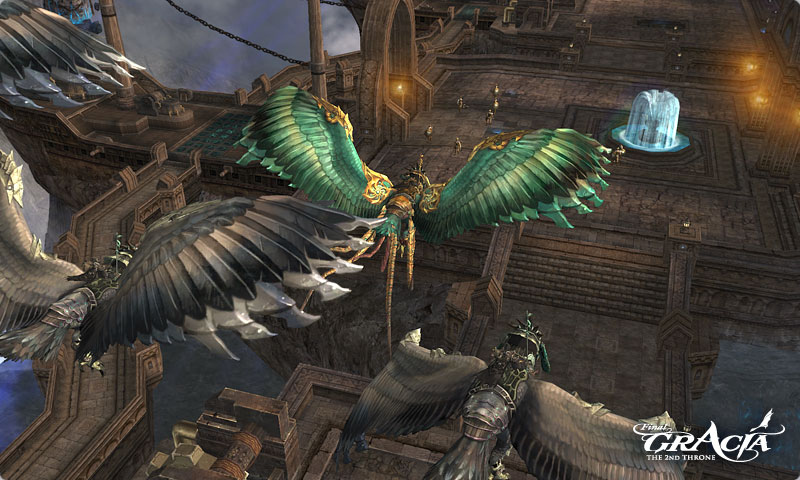
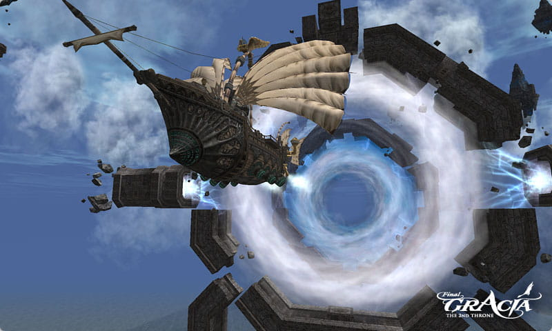

# Flight

## Flying Transformations

1. There are 3 kinds of transformation skills exclusively for flying: Aurabird Falcon, Aurabird Owl, and Final Flying Form.
2. Players acquire the flying transformation spellbooks - Aurabird Falcon or Aurabird Owl by completing the "Good Day to Fly" quest through Engineer Lekon at the Keucereus Alliance Base.
3. Players can purchase the Aurabird Falcon Spellbook, Aurabird Owl Spellbook and Final Flying Form Spellbook through Officer Tolonis at the Keucereus Alliance Base.
4. Aurabird transformation skills can only be used while on the Gracia continent.
5. Aurabird and Flying Final Form transformations can be used in the following areas: All areas in the Keucereus Alliance Base, wharfs in the Seed of Destruction, Seed of Infinity, and Aerial Cleft battlefield.
6. Normal Healing Potions and Buff Scrolls cannot be used while using the Aurabird transformation.
7. While all classes can learn the skills Aurabird Falcon or Aurabird Owl at level 75, Final Flying Form cannot be learned until level 79.

## Misc.

- Conditions have been changed so that one can summon pets while being in a transformed state. However, this does not apply to flying transformations (ie: Aurabirds or Flying Final Form.)

## Airships

### Regularly Scheduled Airship

1. A regularly scheduled airship which provides for transportation between Aden and Gracia has been added.
2. The airship makes a round trip between the Gludio Airship Field and Keucereus Alliance Base.
3. One can move to the Gludio Airship Field for free through the Gatekeepers of Talking Island and Gludio. In addition, one can also access the airship field through Gracia Survivors, which are located in all major towns excluding Hunters Village and Newbie Zones. Traveling by this means will require a fee.

### Clan Airship

1. Exclusive clan airships, which can be used only within the Gracia lands, have been added.
2. Only characters with clan level 5 or higher are able to summon an airship.
3. An Airship Summon License needs to be issued from Engineer Lekon in the Keucereus Alliance Base in order to summon a clan airship (10 energy star stones are needed).
4. 5 Energy Star Stones are needed in order to summon the clan airship, and fuel is consumed when the airship is operating. Fuel (EP) can be replenished by players possessing additional Energy Star Stones.
5. Any players can be aboard the clan airship.
6. Players can control a clan airship if they take command of the ship by targeting the steering column and use a command from their Actions menu. Players can then use mouse clicks to control the airship or use their keyboard to control the ship, similarly to movement as an Aurabird. ('E' for going up and 'Q' for going down, etc.)
