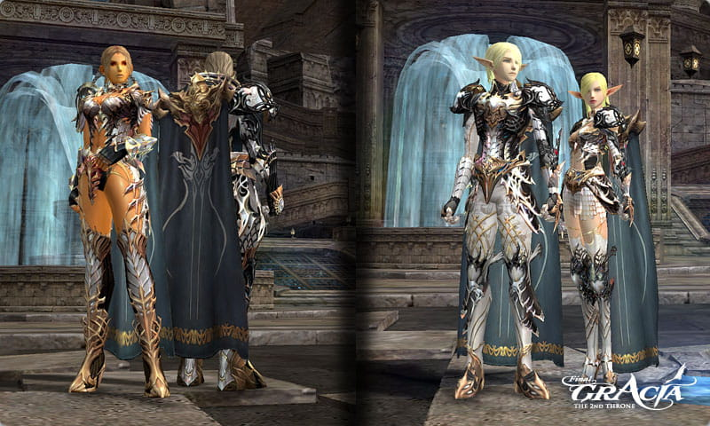

# Items

## Vesper (S84) Weapon/Armor

- New weapons and armors have been added for characters who are level 84 and above.
- If a raid boss is defeated in either the Seed of Destruction or the Seed of Infinity, new items will drop at a 100% rate.
- The seal on an S84 item can be broken through Maestro Ishuma (Gludio Airship Field) or the Blacksmith of Mammon. Maestro Ishuma only breaks the seal on items designated as S80 and higher.
- Vesper armor can be upgraded to Vesper Noble armor using the Vesper Noble Enhance Stone. Vesper Noble armor gives additional stat increases and allows for the use of a cloak.
- The Vesper Noble Enhance Stone can be obtained through the following paths:
  - Obtained through hunting monsters in the Seed of Destruction.
  - Obtained as a quest reward from the Seed of Infinity.

## Dual Daggers

Dual daggers, which can be used by dagger classes only, have been added as follows:

### Type

- Dynasty Dual Dagger = Dynasty Knife + Soul Separator
- Icarus Dual Dagger = Icarus Disperser + Soul Separator
- Vesper Dual Dagger = Vesper Shaper + Naga Storm

### Manufacturing Method

- These can be manufactured by the Blacksmith of Mammon or Maestro Ishuma. The manufacturing method is similar to creating dual swords.

### Conditions for Use

- Only dagger classes above level 81 can equip this item, and only if they acquire the Dual Dagger Mastery Skill.

## Belt

Belts have been newly added and can be acquired through the territory war system. (Refer to the Territory War section)

## Cloak

Ancient Cloak, Knight's Cloak, and Holy Spirit's Cloak, which can be worn by levels 80 and 84 have been added.

### Ancient Cloak

- This item can acquire through quests related to territory battles.
- No exchange, drop, enchant, attribute, or augment.

### Knight's Cloak

- Only higher ranked players within a clan (above Knight) can wear the Knight's Cloak.
- Knight's Cloak can be purchased from the Chamberlain within a castle.
- No exchange, drop, enchant, attribute, or augment.

### Holy Spirit's Cloak

- Obtained from Frintezza, Antharas, Valakas, Beleth, and a boss from both the Seed of Infinity and the Seed of Destruction.
- Can be exchanged and dropped, but enchant, attribute, and augment are not possible.

The Seal on cloaks can be broken through NPC Weavers stationed in Aden and Rune. Cloaks are class dependant. Each class can only equip one specific cloak.

- Kamael Faction: Cloak exclusive for Kamael
- Shield/Force/Weapon/Bard Master Classes excluding Kamael faction: Cloak exclusively for heavy armor.
- Dagger/Bow Master classes excluding Kamael faction: Cloak exclusively for light armor.
- Healer/Enchanter/Wizard/Summoner excluding Kamael faction: Cloak exclusively for robe.

## Sigil

Sigils have been added. Sigils can be worn instead of a shield for wizard, healer, summoner, and enchanter classes.

The effects bestowed are dependant on the class of the character:

1. Wizard classes: MP recovery + Magic power (M.Atk.) increase
2. Healer classes: MP recovery + Heal increase
3. Summoner classes: MP recovery + maximum MP increase
4. Enchanter classes: MP recovery + maximum MP increase

Sigils are only designed for S-grade armor and higher. The 3 sigils currently available are: Arcana Sigil, Dynasty Sigil, and Vesper Sigil.

Sigils can be enchanted, but attributes cannot be endowed on them.

Arcana and Dynasty Sigils are craftable. The Vesper Sigil is drop only.

- As the Arcana and Dynasty Sigils are craftable, foundation and masterwork versions have been added.

Note: The Enchanter designation refers to buffer-type classes (example: Prophet.)

## Attribute Crystals

Due to the addition of the Attribute Crystal, the maximum attribute values which can be endowed on weapon and armor has been increased as follows:

1. Weapon: 150 -> 300
2. Armor: 300 -> 600

- The maximum attribute values which can be endowed using existing attribute stones (ie: Fire Stone, Earth Stone, Water Stone, etc.) have not changed. Weapon attributes go up to 150, and armor attributes up to 300.
- Attribute Stones and Crystals enhance for the same amount. On weapons, each Stone/Crystal gives a 5 point bonus. On armor, each Stone/Crystal gives a 6 point bonus.
- Attribute Crystals can be crafted by using items obtained through collection as ingredients.

## Icarus (S84) Weapons

The following items can be purchased through Kutran, the Special Product Broker, who's located in the Keucereus Alliance Base:

1. Recipes for Icarus weapons
2. Major ingredients of Icarus weapons.

Purchasing these items requires special quest items obtained from the Seeds of Destruction and Infinity.

## Armor Set Effect Changes

- When one wears superior upper body armor and pairs it with other masterwork pieces from the same set, the character will receive both the superior set item bonuses as well as the individual masterwork bonuses.
- Masterwork tops are an exception to the above rule. Because each masterwork top possesses its own specialized set of bonuses, pairing mixtures of masterwork and superior items with a masterwork top will not give you the superior set bonuses associated with the actual set.
- It has been changed so that a rare type upper armor is not manufactured during item creation.
- Existing masterwork upper body pieces can be exchanged for any other masterwork piece within the same set. Or it can be exchanged for its superior equivalent (example: a Masterwork Dynasty Breastplate can be exchanged for a superior Dynasty Breastplate or a set of Masterwork Dynasty Boots). All this is done through the Blacksmith of Mammon.

## General Manufacturing

- Supplies for Aurabird transformations, clan airships, and Attribute Crystal designs can be purchased through NPC Tolonis, located in the Keucereus Alliance Base.
- Design items are registered to your General Recipe Book (Common Craft).

## Other Changes

- The adena limit which was previously 2,147,483,647 has been increased to 99,999,999,999.
- The magic attack power for two-handed magic weapons has been increased slightly.
- Icarus weapons and Vesper weapons/armor can be exchanged for PvP gear through Reputation Manager Rapidus.
- Level 82/84 Life Stones (used for augmenting) can now be obtained through hunting.
- The quantity of items required for manufacturing Dynasty weapons and armor has been considerably decreased.
- The quantity of key Dynasty materials obtained through the exchange of Seeds of Evil has been increased from two to three.
- D ~ B grade general weapons drop instead of Common D ~ B grade weapons now drop in the following:
  1. D/C grade general weapons now drop in all hunting grounds where Common D/C grade weapons have dropped in the past.
  2. B/A grade general weapons now drop in existing hunting grounds where Common B/A grade weapons have been dropped, party-type dungeons, Hellbound, and new hunting grounds.
- It has been changed so that items which drop from monsters will disappear after 10 minutes if they are not picked up. Items dropped by players are not subject to the same limitations.
- Stat values for the following weapons have been changed:
  1. Dynasty Dual Sword: Physical and Magical attack power have been increased.
  2. Icarus Shooter: Physical attack power has been increased.
- The items available through the Rare Item's Broker have been changed.
- System prices and crystal counts for Dynasty/Icarus items have been decreased drastically.
- The class designations on Dynasty upper body armor have been improved. The tool tip for these items will now specifically state the classes which can equip that item.
- Dynasty Leather Mail - conditions to wear for a weapon master have been changed:
  - Existing: Only Kamael can wear
  - Change: All weapon master classes can wear regardless of factions.
- The M.Def. of Dynasty Necklaces and Earrings has been readjusted to normal.
- The quantity of Mammon's Varnish Enhancers which are needed to transform a foundation item into a masterwork item has been increased. This only applies to Dynasty items and above.
  - Dynasty Weapon: 7 -> 12
  - Icarus Weapon: 7 -> 14
  - Dynasty Armor: 4 -> 7
- Maestro Ishuma, who can perform functions similar to the Blacksmith of Mammon, has been added in the Keucereus Alliance Base. All services rendered by this NPC are paid in adena.
- It has been changed so that a spellbook is no longer needed to learn many skills.
- Spellbook seller NPC's have been removed from the game.
- The abnormal problem of rare type and PvP options for some weapons has been corrected.
