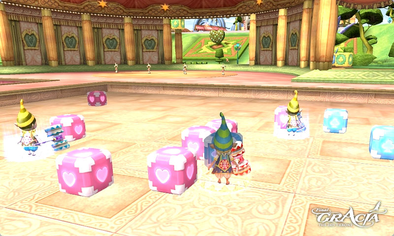

# Fantasy Isle

## Handy's Block Checker

Handy's Block Checker, a mini game which one can experience only on Fantasy Isle, has been added.

### Basic Rules

1. Teams may be up to 6v6 (For a total of 12 players per game.)
2. Games last 5 minutes.
3. There are 4 arenas total.
4. Weapon used: Silly Hammer
5. There are no level requirements to participate.
6. Winning: The team who has flipped more blocks within 5 minutes wins.
7. Playing: Target a block of the opposite teams color and use the Flip Block skill to change the block to your team's color. This skill can be found in your Active skills list.

### Game Registration and Process

1. Players can register for Handy's Block Checker Arena by speaking to one of the Entrance Managers at the Checker Arena on Fantasy Isle.
2. Players can teleport to the front of Handy's Block Checker Arena by speaking with NPC Paddies on Fantasy Isle.
3. The game begins by dividing players into two teams: red and blue. Once there are 2 to 6 players signed up for each team, the game begins automatically.
4. Once the game has started, no other participants are allowed to register for that game. However, there are four arenas. And if one arena is full, players can register with one of the other Entrance Managers.
5. If you are disconnected from the game, you cannot return to the match.
6. Players may not participate if they are registered for any other PvP game, such as the Olympiad, Underground Coliseum or Kratei's Cube. If you attempt to register for a Handy Block Checker game while registered for another PvP game, your other registration will be automatically cancelled.
7. Players who possess a Cursed Weapon may not participate.

### How to Win

1. Only the total number of flipped blocks per team is actively displayed during the match. To see how many blocks each player has turned, click on the mini-game icon located next to your mini-map. This icon is only active for the duration of the game.
2. The winning team is determined at the end of each match by tallying the teams individual scores. The team with the highest overall score will be declared the winner.

### Rewards

1. Mini games do not award EXP or SP.
2. Players receive Fantasy Isle Coins for rewards.
3. Individual ranks are calculated for the winning team, so the number of Fantasy Isle Coins are awarded based on individual rank.
4. If a player is disconnected or leaves the arena during the game, no rewards will be received.

Players can exchange Fantasy Isle Coins for items through the Fantasy Isle Paddies.

## Kratei's Cube

- The numbers of Fantasy Isle Coins which were given to all participants of Kratei's Cube as a basic reward have been increased from 5 to 10.
- The number of Fantasy Isle Coins given when 6 or more people participate in a match has been doubled.
- The amount of Exp. and SP given per match has been increased drastically. However, please note that this amount is based on the amount of Kill Points accrued per match.

## New Rewards

Fantasy Isle Coins can be used to exchange for the following new items:

- Red Boing Fantasy Hammer, Blue Boing Fantasy Hammer, Small Red Boing Fantasy Hammer, Small Blue Boing Fantasy Hammer
- Fish Hat
- Graduation Cap
