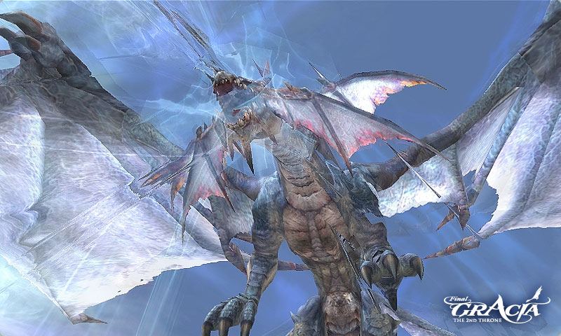

# Miscellaneous Changes

## System Changed Related to Battle

### Changes in Damage due to Evasion and Hit Rate

- In PvP situations, evasion has been improved.
- A higher Evasion rate will result in avoiding more hits during PvP. However, the damage received when a hit lands (under these conditions) has been slightly increased.

### Changes in Magic Critical Damage

- In PvP situations, magic critical damage has been decreased.

### Situations where PvP is applied

- When PC battles with PC
- When a servitor or pet, which was summoned by a PC, battles with another player, pet, or servitor.
- When a PC battles with a player in a transformed state.

## Grade Penalty

### Penalty Changes

1. A penalty effect increases proportional to the grade level difference as the penalty applies when one wears a weapon of higher level than one's own grade.
2. If a character with 20 level wears a C-grade weapon, 1st stage penalty; if a character with 20 level wears a B-grade weapon, 2nd stage penalty will be applied.

### Penalty Effects

- **Stage 1:** Hit decreases by 16, critical rate and damage decrease by 10%, attack power and attack speed decrease by 10%, and failure rate for magic attack increases.
- **Stage 2:** Hit decreases by 16, critical rate and damage decrease by 20%, attack power and attack speed decrease by 10%, and failure rate for magic attack increases.
- **Stage 3:** Hit decreases by 16, critical rate and damage decrease by 30%, attack power and attack speed decrease by 10%, and failure rate for magic attack increases.
- **Stage 4:** Hit decreases by 16, critical rate and damage decrease by 40%, attack power and attack speed decrease by 10%, and failure rate for magic attack increases.

When the grade difference is more than 4 levels, the same penalty as the 4th stage is applied.

## Interface

### Inventory Information

1. A new 3D avatar has been added to the inventory window. The new avatar window will only display currently equipped items.
2. The equipped items portion of the inventory window has been improved.
3. Players can now easily identify appearance changes when items are equipped.

### Mini Map Information

The mini-map now shows both Aden and Gracia continents in separate tabs.

### Quest Information

The quest window has been updated with tabs for easier use. Quests are now categorized according to their types: Single, Repeat, Epic, Transfer, or Special.

### Right Click Mouse Button

1. Players can now disable the right click function which automatically moves the camera view to a set angle. This resolves the issue of accidentally clicking the right mouse button and having the camera view changed.
2. Players can disable the function of the right mouse click by going to Options | Audio/System | Control/Security and removing the checkmark from "Disable right mouse click function."

### Party Decline Option

1. A function which can automatically reject party invitations has been added.
2. Options | Game (tab) | Game System (heading) | Party Request Decline

### Chat Channel Set Function

1. A function which can assign any chat tab as your favorite has been added.
2. To assign your favorite, open Chat Options from the chat window, then click on the tab you want to assign as your favorite.

A Vitality gauge has been added under the experience bar to show players the status of their current Vitality level.

## Other Changes

### Storm Dragon Lindvior

Storm Dragon Lindvior occasionally appears in the Keucereus Alliance Base.

### Res Experience Cap

It has been changed so that recovered experience points due to resurrection do not go over 90%. For example, even though recovered experience points through an Apella set and clan skills may be over 90%, actual recovered experience will not be over 90%.

### Servitor Supplemental Magic

Players now receive supplement magic for servitors through Adventurer Helpers and some Newbie Guides.

- Players must be below level 63 to receive supplemental magic for their servitors.

### Various Changes

- The item 'Agathion Summon Bracelet - Knight' has been added to the store list of Reputation Manager Rapidus.
- Pet inventory functionality has changed:
  - Previously: When a pet was unsummoned due to loss of connection to the server or logging out, all inventory items would return to the player (based on the available inventory slots of the player).
  - Change: When a pet is unsummoned due to loss of connection to the server or logging out, all items held by the pet will remain with the pet until they are summoned again.

### Technical Improvements

- Graphical and loading improvements have been made.
- Some particle effects have been changed and refined.
- Distribution of NPC's after a crash or server restart has been improved. NPC's will now take less time to reappear.
- A few problems related to the realistic water effect option have been corrected, and its performance has been improved dramatically. More people can now use the realistic water effect of Lineage 2.
