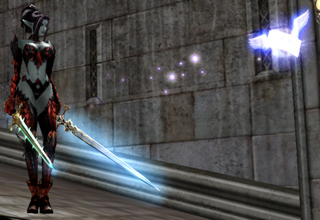
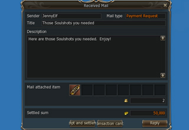

# Почта

Теперь Вы можете послать предметы своим друзьям используя новую систему почтовых отправлений. Есть 2 типа доступных отправлений:

Посылка сообщения с вложениями или без оных. Получателю достаточно кликнуть по иконке сообщения (появляется в левом нижнем углу экрана над окном чата, при получении почты). Сообщения этого типа оплачивает отправитель.
Отправка посылки наложенным платежом. В сообщении указывается стоимость предмета или предметов, и получатель может либо заплатить указанную сумму для получения этих предметов, либо отказаться от них.

## Отправка почты

- Вы можете получить доступ к своему почтовому ящику используя иконку почты (находится сверху системного меню - Alt+X) или используя команду /mailbox в окне чата.
- В письмо можно вложить максимум 8 предметов, стоимость отправки будет увеличиваться в зависимости от "веса" сообщения.
- Отправка и получение почты возможны только в мирных зонах.
- Письмо доходит адресату через 30 секунд.
- Отправка письма может быть отменена:
    - если получатель его еще не прочитал;
    - если сообщение еще не доставлено;
    - если вложение не было оплачено получателем.

## Получение почты

- При получении почты на экране появится иконка почтового сообщения. Вы можете кликнуть по иконке, чтобы проверить входящие сообщения. Иконка входящей почты появляется над окном чата.
- Вы не сможете получить вложения, если в инвентаре не хватает свободных ячеек, или если при получении вложения персонаж получить перевес свыше 100%. Нажав на кнопку оплаты, Вы можете получить вложенные предметы для продажи. Как только вы нажмете "оплатить" соответствующее количество Адены исчезнет из Вашего инвентаря.

## Возврат или удаление почты
- Обычные сообщения без вложений вернуть невозможно. Данный тип сообщений можно только получить или удалить. Перед удаление сообщение необходимо открыть и прочитать.
- Письмо с вложенным предметом может быть прочитано или возвращено отправителю. Такие письма нельзя удалять.
- Непрочитанные сообщение автоматически возвращаются отправителю через 15 дней, но письма без вложений не возвращаются, а автоматически удаляются.
- Непрочитанные возвращенные сообщения автоматически удаляются, их содержимое перемещается на личный склад персонажа через 15 дней.
- Непрочитанные / неподтвержденные сообщения с вложениями на продажу возвращаются автоматически через 12 часов.

## Система фрахта
- Данная система устранена за ненадобностью. Все предметы находившиеся у рабочих складом будут перемещены на личный склад персонажа.