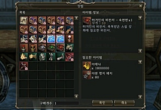
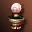

# Битвы за Земли

В отличие от осад, которые основаны на системе кланов, Битвы за Земли дают обычным игрокам возможно поучаствовать в боевых действиях в качестве наемника. Участие в Битвах дает игрокам возможно покупать предметы полезные для PvP и развития персонажа.

Предметы продаются у Управляющих Землями, они располагаются в главном городе каждой Земли. Были добавлены украшения и S80 аксессуары.

- Были добавлены новые предметы для покупки у Управляющего Землями и у Капитана Наемников.
- Стоимость покупки обычного Ездового Дракона уменьшена с 60 до 50 значков Земель.

| Тип предмета | Название | Описание |
| --- | --- | --- |
| Кодексы Гигантов |  Кодекс Гигантов - Забвение | Необходим для отмены зачарования умения. |
| | Кодекс Гигантов - Дисциплина | Необходим для смены типа зачарования умения. |
| | Кодекс Гигантов - Мастерство| Необходим для безопасного увеличения уровня зачарования умения. |
| Талисманы |  Синий Талисман - Разрушитель Чар | Снимает положительные эффекты с противников, находящихся неподалеку. |
| | Синий Талисман - Поглотитель Магии | Забирает положительные эффекты противника. |
| | Красный Талисман - Защитник Земель | Увеличивает Макс. СР, восстанавливает некоторое количество СР. |
| | Синий Талисман - Защитник Правителя | Снижает уровень получаемого урона при PVP. |
| | Белый Талисман - Необоримый Защитник | Увеличивает уровень всех видов стихийной защиты. |
| PvP зелья |  Боевой Великий Эликсир Жизни | Восстанавливает уровень HP. Действует только при использовании персонажами 61-75 уровня. Использование доступно исключительно на поле битвы. |
| | Боевой Великий Эликсир Ментальной Силы | Восстанавливает уровень MP. Действует только при использовании персонажами 61-75 уровня. Использование доступно исключительно на поле битвы. |
| | Боевой Великий Эликсир СР | Восстанавливает уровень СР. Действует только при использовании персонажами 61-75 уровня. Использование доступно исключительно на поле битвы. |
| Пояса | Магическая Заклепка для пояса | Повышает скорость восстановления HP и MP |
| |Магическое Украшение для пояса | Увеличивает силу умений в PvP |

