# Улучшение умений
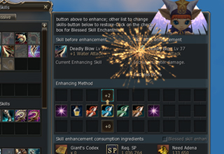
Метод улучшения умений был изменен. Игрокам больше не надо искать нужных NPC для зачарования умений. Новая кнопка добавлена в окно
- Для улучшения умений больше не требуется опыт.
- Для улучшения умений необходимо SP и некоторое количество адены, SP нужно меньше чем требовалось раньше.

## Как улучшить умение
- Снизу окна умений добавлена кнопка, для перехода к интерфейсу зачарования умений. Умения, которые нельзя зачаровать выделены серым.
- Перетащите иконку умения в слот "Текущее умение" (в левой части). Как только умения будет перекинуто в интерфейс зачарования? отобразится стоимость и шанс зачарования и другие параметры.
- Все необходимые опции доступны через данный интерфейс: Благословенное зачарование, Смена типа зачарования, Отмена зачарования.
- Название "Безопасное улучшение" изменено на "Благое зачарование"

В интерфейс улучшения умения добавлена кнопка "Помощь" с детальным описанием процесса зачарования умений.

Изменения в улучшения умений
- Некоторые умения теперь можно зачаровать.
- Для некоторых умений пути улучшения и/или эффект улучшения были изменены.

| Название умения | Тип улучшения | Изменение |
| --- | --- | --- |
| 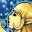 Песня Чемпиона | Время | Добавлена возможность зачаровать умение |
| |Стоимость | Добавлена возможность зачаровать умение |
|  Песня Штормового Ветра | Время | Добавлена возможность зачаровать умение |
| |Стоимость | Добавлена возможность зачаровать умение |
|  Танец Шторма Клинков | Время | Добавлена возможность зачаровать умение |
| |Стоимость | Добавлена возможность зачаровать умение |
| 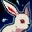 Страх | Шанс | Добавлена возможность зачаровать умение |
| |Стоимость | Добавлена возможность зачаровать умение |
|  Благословение Крови | Время |
| |Мощность | Добавлена возможность зачаровать умение |
|  Защита Души | Мощность | Добавлен новый тип зачарования |
|  Удар в Спину | Дуэль | Изменено действие зачарования |
|  Смертельный Выпад | Дуэль | Добавлен новый тип зачарования |
| 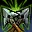 Двойной Выстрел | Дуэль | Добавлен новый тип зачарования |
| 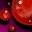 Кровотечение | Мощность | Изменено действие зачарования |
| 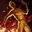 Огненная Ловушка | Мощность | Изменено действие зачарования |
|  Отравляющая Ловушка | Мощность | Изменено действие зачарования |
| 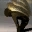 Замедляющая Ловушка | Мощность | Изменено действие зачарования |
|  Ослепляющая Ловушка | Мощность | Изменено действие зачарования |
|  Обездвиживающая Ловушка | Мощность | Изменено действие зачарования |
|  Приманка | Мощность | Изменено действие зачарования |
| 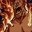 Пульсация Огня | Атака Огнем | Добавлен новый тип зачарования |
| 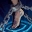 Бриллиантовая Пыль | Атака Водой | Добавлен новый тип зачарования |
| 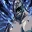 Ледяной Трон | Атака Водой | Добавлен новый тип зачарования |
| 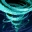 Трон Ветра | Атака Воздухом | Добавлен новый тип зачарования |

