# Умения
## Привязка умений
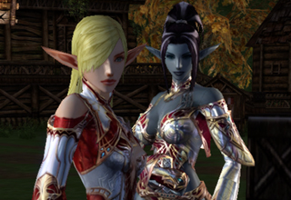

Добавлена система привязки умений, для повышения возможностей целителей в группе.

- Система позволяет целителям (Кардиналу, Жрецу Евы и Жрецу Шилен) получить умения двух других классов. Например, Кардинал сможет выучить умение "Возвращение группы" или Жрецу Шилен умение "Массовое воскрешение".
- Выучить умения можно у обычных наставников класса (жрецов, Великих Магистров, магистров и т.д.). Для изучения 1 умения нужен 1 специальный предмет (Священное Благовоние - Кардинал, Священное Благовоние - Жрец Евы, Священное Благовоние - Жрец Шилен). Эти благовония могут быть получены после завершения квеста на третью профессию. Персонажи класса лекаря, уже имеющие 3 профессию, также получат благовония в свой инвентарь.
- Полученные умения могут быть удалены за 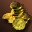 10,000,000 аден. Священное Благовоние для изучения возвращаются персонажу, после удаления умения.
- Некоторые умения, полученные с помощью этой системы можно зачаровать.
- Подкласс также может использовать систему передачи умений, если он соответствует требованиям.

| Класс | Количество благовоний |
| --- | --- |
| Кардинал | 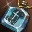 Священное Благовоние - Кардинал 1 шт. |
| Жрец Евы | 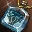 Священное Благовоние - Жрец Евы 1 шт. |
| Жрец Шилен | 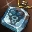 Священное Благовоние - Жрец Шилен 4 шт. |

## Список умений

| Жрец Евы | Жрец Шилен | Кардинал |
| --- | --- | --- |
|  Благословение 1 ур.   Великое Боевое Лечение 33 ур.   Воодушевление 3 ур.  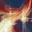 Групповое Основное Лечение 5 ур.   Инкарнация Тела 6 ур.  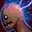 Магический Встречный Пожар 10 ур.  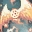 Массовое Воскрешение 6 ур.   Молитва 3 ур.  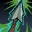 Наведение 3 ур.  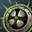 Небесный Щит 1 ур.  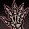 Остановить Нежить 12 ур.   Очищение 3 ур.   Примирение 15 ур.   Пробудить Жизнь 4 ур.   Реквием 14 ур.   Сопротивление Ветру 3 ур.  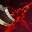 Стигма Шилен 4 ур.  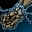 Упокоение 13 ур.   Устойчивость к Святости 3 ур.   Фокусировка 3 ур.  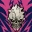 Шепот Смерти 3 ур.   Шторм Маны 5 ур.   Ярость Вампира 4 ур. |  Благословение 1 ур.   Благословение Щита 6 ур.   Великое Боевое Лечение 33 ур.   Возвращение 2 ур.   Возвращение группы 2 ур.   Групповое Основное Лечение 5 ур.   Инкарнация Тела 6 ур.   Испугать Нежить 10 ур.   Легкость 3 ур.   Магический Встречный Пожар 10 ур.   Массовое Воскрешение 6 ур.   Молитва 3 ур.   Небесный Щит 1 ур.  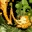 Оживление 27 ур.   Основное Лечение 11 ур.   Остановить Нежить 12 ур.   Примирение 15 ур.   Пробудить Жизнь 4 ур.  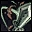 Проворство 3 ур.  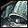 Регенерация 3 ур.   Реквием 14 ур.  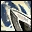 Святое Оружие 1 ур.   Серенада Евы 13 ур.  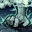 Сила Небес 19 ур.   Сопротивление Оглушению 4 ур.   Сопротивление Яду 3 ур.  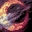 Транс 10 ур.   Упокоение 13 ур.  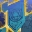 Усиленная Блокировка 3 ур   Устойчивость к Тьме 3 ур.   Чистота 3 ур.   Шторм Маны 5 ур. |  Благословение Крови 7 ур.   Благословение Щита 6 ур.   Возвращение 2 ур.   Возвращение группы 2 ур.   Воодушевление 3 ур.  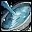 Восстановление 32 ур.  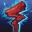 Дикая Магия 2 ур.   Легкость 3 ур.   Наведение 3 ур.   Проворство 3 ур.   Серенада Евы 13 ур.   Сопротивление Ветру 3 ур.   Сопротивление Оглушению 4 ур.   Сопротивление Яду 3 ур.   Стигма Шилен 4 ур.   Усиленная Блокировка 3 ур   Устойчивость к Святости 3 ур.   Устойчивость к Тьме 3 ур.   Чистота 3 ур.   Шепот Смерти 3 ур.   Ярость Вампира 4 ур. |

## Новые умения
- Темным Мистикам на 14 уровне добавлено новое умение.

| Название | Описание |
| --- | --- |
|  Дети Шилен | Скор. Маг. Атк. Увеличивается на 13, а восстановление МР на 2%. |

## Изменения существующих умений
- При использовании трансформации Авангард, больше не будет уменьшаться Физ. Защ. персонажа.
- Следующим умениям добавлена возможность нанести критический удар:

|  |  |  |  |
| --- | --- | --- | --- |
| 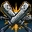 Тройное Рассечение |  Разрушитель Душ |  Импульс Силы | 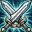 Двойной Удар |
| 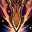 Фатальный Удар | 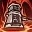 Разрушение Брони | 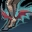 Демонический Танец Клинков | 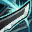 Полный Размах |
| 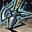 Землетрясение |  Симфония Меча | 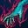 Раскалывание |  Ураган Клинков |
| 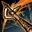 Вихрь | 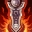 Сокрушение Судьбы | 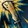 Звуковая Волна |  |
| 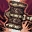 Сокрушение Молотом |  Трибунал |  Взрыв Силы |  |
|  Сокрушительная Оценка |  Правосудие | 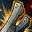 Двойной Звуковой Разрез |  |
| 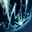 Грозовой Шторм | 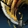 Звуковой Импульс |  Силовой Шторм |  |
|  Горящий Кулак |  Ментальная Симфония | 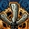 Тройное Звуковое Рассечение |  |
| 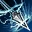 Шокирующий Заряд | 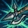 Сокрушительная Мощь | 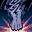 Ураганное Нападение |  |
| 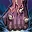 Удар Судьбы | 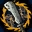 Звуковой Шторм |  Сила Разрушения |  |

- Увеличено восстановление MP следующими умениями:
    - 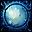 **Фокусировка Разума**
    - 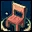 **Жизненная Сила**
    - 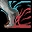 **Боевой Дух**
- Мощность следующих умений повышена:
    -  **Ураган Клинков**
    -  **Полный Размах**
    - 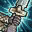 **Раскол**
    -  **Двойная Атака**

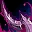 **Безумие** - больше не повышает урон при использовании копий.  
 **Пробудить Жизнь** - больше не может быть использовано на врага  
 **Раскалывание** - для Вестников Войны и Верховных Шаманов изучение умения продлено на 72 и 74 уровень  
 **Основное Лечение** - Мудрецы могут изучить 11 уровень умения.

