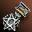
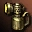

# Изменения Семени Бессмертия
Изменена сложность и доступность Зоны Охоты Семя Бессмертия

## Изменения в прогрессе
- Игроки атакуют **Зал Страданий** и **Зал Гибели**
- Игроки атакуют **Источник Бессмертия**
- Завершение фазы атаки
- Игроки могут защищать **Зал Страданий** и Зал Гибели**
- Игроки могут защищать **Источник Бессмертия**

## Общие изменение
Ограничения по уровню для доступа в **Зал Гибели** изменены на 75-85. Максимальное количество игроков которое может войти в **Зал Гибели / Источник Бессмертия** изменено на 18-27 человек. Сложность **Зала Гибели / Источника Бессмертия** уменьшена.

## Изменение награды
- Трофеи за убийство промежуточного босса Кохеменеса улучшены.
- Шанс получить Слезы Освобожденной Души увеличен

Персонажи получившие  Символ Кецеруса: 2-й Уровень теперь могут купить следующие предметы у NPC Торговец Душами Асъятэ:

| Название | Описание |
| --- | --- |
|  Ключ Страданий | Устраняет ограничения входа в Зал Страданий |
|  Ключ Гибели | Устраняет ограничения входа в Зал Гибели |
|  Ключ Источника Бессмертия | Устраняет ограничения входа в Источник Бессмертия |
|  Устройство для Извлечения Душ | Устройство, позволяющее извлечь Слезы Освобожденной Души. |

