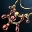
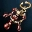
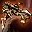
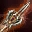

# Предметы
## Плащи
Плащи больше не разделяются по типам доспехов.

## Пояса
Добавлены новые возможности для украшения поясов.

### Пояса с магической заклепкой A и S рангов

|  |  |
| --- | --- |
| Восстановление HP | Повышает скорость восстановления HP и когда персонаж стоит и когда отдыхает |
| Восстановление MP | Повышает скорость восстановления MP и когда персонаж стоит и когда отдыхает |

### Пояса с магическим украшением A и S рангов

|  |  |
| --- | --- |
| PvP нормальные атаки | Повышает урон от обычных ударов в PvP |
| PvP атаки умениями | Повышает урон умениями в PvP |
| PvP защита | Уменьшает урон получаемый в PvP от обычных атак и умений. |

### Другие изменения
- Несколько Кодексов Гигантов теперь занимают только одну ячейку инвентаря.
- Теперь можно улучшить следующие предметы:
    -  Ожерелье Благословения   
    -  Кольцо Благословения   
    -  Серьга Благословения   
- Специальная возможность луков и арбалетов Экономия теперь уменьшает потребление MP для всех умений.
- При смене оружия во время боя, смена оружия произойдет только после окончания текущей атаки.
- Описание брони Апелла было изменено, чтобы соответствовать действительности.
-  Страж Венеры. Изменена работа специальной возможности "Экономия". Теперь потребление MP всеми умениями уменьшается на 12%. Ранее работало неправильно - был 12% шанс, что потребление составит 1 MP.
- Скорость применения талисманов увеличена:
    -  Красный Талисман Восстановления
    -  Синий Талисман Неуязвимости
    -  Черный Талисман - Перевязка
    -  Черный Талисман Физической Свободы
    -  Черный Талисман Тайной Свободы
    -  Черный Талисман Свободы
    -  Черный Талисман Освобождения
    -  Черный Талисман Голоса
    -  Черный Талисман Свободной Речи
- Фантом Династии - Мудрость переименован в Фантом Династии - Природа
- Шлем Кристалла Тьмы Работы Мастера - теперь правильно описаны пассивные умения.
-  Буревестник Венеры - описание специальной возможности "Наведение" исправлено.
- Изменены повторяющиеся иконки для предметов:
    - Кристалл Души (Синий/Зеленый/Красный)
    - Куски Чудесного Кубика
    - Красный Самоцвет
    - Кольцо Героя Олимпиады / Ожерелье Героя Олимпиады / Серьга Героя Олимпиады
    - Пропуск в Гробницы
- Теперь при ударе двойные мечи и кастеты правильно потребляют Заряды Души.
- Исправлена невозможность нанести урон голыми руками или оружием ближнего боя по мужским персонажам расы Эльф 1-го уровня.
- Исправлена ошибка, возникавшая при изготовлении Двойных Кинжалов Венеры.
- Шлемы Работы Мастера теперь можно переделать в нужный тип у Кузнеца Маммона.
- Ошибка с PvP бонусом Красивой Туники Венеры исправлена.
- Бутылка Душ потребует для заполнения 5 душ вместо 6.
- Всплывающее описание для Святого Копья - PvP было исправлено.