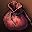
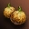
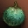

# Другие изменения
## Лента новостей*
NPC Лента новостей был помещен в каждом городе, чтобы уведомлять людей об изменениях в Зонах Охоты. Тут можно телепортироваться в соответствующие зоны, или закончить задание, которое было изменено в этом обновлении и не может быть закончено. Ленты новостей пробудут в игре некоторое время, а затем они будут убраны, о чем будет объявлено.

**Не добавлено на русские сервера*

## Возвращение предметов
Добавлена система возвращения проданных предметов. Для того, чтобы можно было вернуть предметы проданные по ошибке.

- Нельзя вернуть предмет после отключения от сервера, выхода из игры или выбора другого персонажа.
- Вернуть можно только 12 последних проданных предметов.
- Ссылки на покупку продажу предметов были заменены на единую ссылку, в открывающемся интерфейсе будут вкладки для покупки, продажи и возвращения предметов.

## Изменения Рейд-Боссов Стальной Цитадели
- Время повторного появления Принца Демонов и Ранку было уменьшено. Награда скорректирована в соответствии с этим.

## Изменения в системе питомцев
### Новые питомцы

| Название | Как получить |
| --- | --- |
| Дейноних | Можно получить на Первобытном Острове |
| Ездовой Дракон Хранителя | Можно купить у Капитана Наемников за 80 значков земель. |

- Новый корм был добавлен.
    -  Обогащенная Еда для Питомца - для Великих Волков и Ферниров. Восстанавливает примерно 45% уровня сытости питомца.

### Изменения работы инвентаря питомцев
Раньше: После отзыва питомца если в инвентаре не хватало свободных ячеек или лимита веса - предметы из инвентаря питомца падали на землю Теперь: Все содержимое остается у питомца после его отзыва. Когда питомца призывают вновь тогда проверяется наличие места и лимит веса хозяина и предметы либо падают на землю, либо попадают в инвентарь.

- Предмет для вызова питомца нельзя продать, если у отозванного питомца остались в инвентаре предметы.
- Дейноних не может носить броню, но может носить аксессуары.
- Ездовой Дракон Хранителя - может носить броню/оружие и аксессуары для Ездовых Драконов.

## Фермерство
- Были изменены семена и плоды покупаемые и продаваемые в Адене, Хейне и Шутгарте.
- Аден:
    - Добавлено:  Двойная Коба ,  Новая Двойная Коба
    - Удалено:
- Хейн, Шутгарт
    - Добавлено:  Морская Коба ,  Новая Морская Коба ,  Двойная Коба ,  Новая Двойная Коба
    - Уменьшен предыдущий максимальный объем продажи семян и максимальная сумма покупки урожая.

## Другие изменения
- Во время входа в игру персонаж не будет атакован ближайшими агрессивными монстрами около 10 минут. Но если персонаж совершит какое-либо действие (например, выделение цели), кроме использования Свитка Телепорта в Город, он может быть атакован агрессивными монстрами как обычно.
- Окно обработки редких предметов у Кузнеца Маммона было упрощено.
- Если вы успешно зачаруете броню с +5 на +6 или оружие с +6 на +7 и с +14 на +15 то будет фейерверк и специальное системное сообщение.
- При использование команды /target, без указания имени будет выбраться ближайшая цель.
- Команда /target будет работать даже при частичном указании имени.
- Помощник новичков теперь будет предлагать вспомогательную магию персонажам вплоть до 75 уровня.
- Внешний вид некоторых NPC изменен.
- Персонаж, который подберет Изначальную Настойку - Убийца не получит никаких эффектов, если был выше убитого монстра на 6 уровней или больше.
- Формула, используемая для определения повреждений наносимых монстрам уровня 78+ немного изменена:
    - Количество урона наносимого монстрам снижается если ваш уровень на 2 или более ниже уровня монстра.
        - Урон не понижается если персонаж одного уровня с монстром или выше его.
        - Урон наносимый слугой или питомцем будет зависеть от уровня владельца, а не - уровня слуги/питомца.
    - Урон уменьшен для всех видов атак (оружием, умениями и т.д.)
    - Данное изменение не касается PvP.
- Формула сопротивления магическому урону для монстров 78+ немного изменена:
    - Если уровень атакующего на 3 или более ниже уровня монстра, повышается шанс, что монстр будет успешно сопротивляться магическому урону.
    - Изменен метод определения сопротивления монстров магическим атакам:
        - Шанс монстров отклонить магический урон теперь основывается на уровне персонажа, а не его характеристиках или экипировке.
    - Данное изменение не касается PvP.
- Уровень некоторых монстров на Острове Ада, Семени Бессмертия и Семени Разрушения был изменен:
    - Уровень Белета, Тиады, Экимуса, Скарлета Ван Халиши были уменьшены.
    - Из-за изменения уровня, таблица трофеев тоже была изменена. Помните, что Вы должны попадать в диапазон уровней, чтобы получить максимальное количество трофеев.