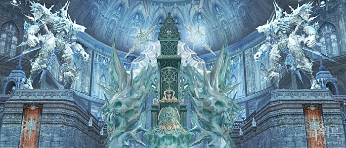
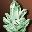
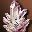
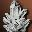
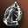

# Общие изменения

## Изменения НПЦ
Изменен уровень НПЦ участвующих в осадах замков, крепостей и обителей, уровень монстров в крепостных и замковых подземельях.

| Мероприятие или зона | Было | Стало |
| --- | --- | --- |
| Осада больших замков (Аден и Руна) | 74 | 80 |
| Осада малых замков (Глудио, Дион,  Гиран, Орен, Иннадрил, Годдард, Шутгарт) | 69 | 78 |
| Временная Зона крепости | 71 | 79 |
| Временная Зона замка | 80 | 82 |
| Осада крепости | 66 | 76 |
| Подземелье замка | 75 | 78 |
| Лагерь Монстров | 64 | 75 |
| Крепость Неупокоенных | 69 | 76 |
| Разоренный Замок | 69 | 76 |
| Загон Диких Зверей | 60 | 73 |
| Лагерь Разбойников | 60 | 73 |
| Лагерь Партизан | 48 | 70 |

## Система атрибутов

1. Доспехам теперь можно добавить до трех атрибутов в зависимости от их типа
    - Из шести парных атрибутов - [Вода-Огонь], [Ветер-Земля], [Свет-Тьма] - можно вставить по одному атрибуту из каждой пары (всего три). Нельзя вставить в предмет одновременно два противоположных атрибута, например «Вода, Огонь».
    - В соответствии с изменениями в системе от любого из атрибутов можно отказаться, предварительно выбрав тот атрибут, который вы хотите удалить.
2. Изменилось действие защитных и атакующих атрибутов:
    - Снижены атрибуты атаки.
    - Если атрибут защиты игрока высокий, то эффект снижения урона атрибута атаки по атрибуту защиты уменьшается. Например, если атрибут защиты игрока 150, урон, нанесенный оружием со 150 атрибута, приравнивается к урону, нанесенному оружием с 300 атрибута. (требуется уточнение!)

## Осады Замков

1. Изменены уровни НПЦ, связанных с осадами замков.

| Мероприятие или зона | Было | Стало |
| --- | --- | --- |
| Осада больших замков (Аден и Руна) | 74 | 80 |
| Осада малых замков (Глудио, Дион,  Гиран, Орен, Иннадрил, Годдард, Шутгарт) | 69 | 78 |

2. Изменены свойства осадных механизмов:

- Во время атаки ворот или стен замка сила атаки возросла в 2,5 раза.
- Время до повторного вызова уменьшилось с 300 до 180 сек.
- Стоимость вызова и поддержания осадных механизмов уменьшилась следующим образом:

::spantable::
| Осадный механизм | Изменения |
| --- | --- |
| Осадный Голем @span=1:2 @class="vmiddle"| Вызов:  Кристалл: C-Ранг - 300 шт. → 180 шт.|
| | Поддержание:  Самоцвет: C-Ранг - 70 шт. → 40 шт. |
| Стальной Вепрь @span=1:2 @class="vmiddle"| Вызов:  Кристалл: B-Ранг - 120 шт. → 70 шт.|
| | Поддержка:  Самоцвет: B-Ранг - 30 шт. → 20 шт. |
| Осадное Орудие @span=1:2 @class="vmiddle"| Вызов:  Кристалл: A-Ранг - 46 шт. → 27 шт.|
| | Поддержка:  Самоцвет: B-Ранг - 21 шт. → 13 шт. |
::end-spantable::

3. За два часа до начала осады и вплоть до её конца невозможно пользоваться Подземельем Замка.
4. Возросли HP ворот/стен замка.
5. В списке товаров, которые можно купить у Камергера, появились браслеты и рубахи S-ранга.

## Битвы за Земли

1. Теперь в случае смерти на поле битвы вы сможете воскреснуть с помощью свитка или навыка (правила воскрешения во время осады замков и крепостей остались прежними).
2. Захваченным территориям добавлена водная защита, погибнув в бою за территорию под такой защитой, вы будете перемещены в мирную зону.
3. Изменились возможности трансформаций-наемников.
    - Возросла защита у всех трансформаций-наемников.
    - Уровень навыков всех трансформаций-наемников вырос до 85-го.
4. Добавились новые навыки для трансформаций-наемников:

| Трансформация | Умения |
| --- | --- |
| Обычный Наемник | Рывок, Мощь, Оглушающий Удар |
| Дракон-страж | Рывок, Оглушающий Удар |
| Начальник стрелков | Снайперский огонь, Оглушающий выстрел |
| Верховный маг | Ледяная Стена, Удар Ветра, Концентрация |
| Начальник стражи Камаэля | Рывок, Удар Плечом |
| Рыцарь Рассвета | Рывок, Ненависть, Аура Ненависти, Оглушающий Удар |
| Начальник крепости | Ледяной Удар, Концентрация, Сон |

## Осады крепостей
1. Изменился уровень неигровых персонажей, связанных с осадами крепостей.
    - Текущий (уровень 66) → Новый (уровень 76)
2. Увеличилось количество рыцарских эполет, выпадающих из неигровых персонажей во время осады крепости.
3. Возросли HP ворот крепости.

## Обители кланов
1. Изменен уровень НПЦ охраняющих обители кланов:

| Название обители | Было | Стало |
| --- | --- | --- |
| Лагерь Партизан | 48 | 70 |
| Лагерь Разбойников | 60 | 73 |
| Загон Диких Зверей | 60 | 73 |
| Разоренный Замок | 69 | 76 |
| Крепость Неупокоенных | 69 | 76 |

2. Добавлены в продажу следующие предметы
    - Камень Жизни Высшего Ранга - Уровень 76, Свиток SP: Высший Ранг (восстанавливает 500,000 SP)
    - Свитки зачарования брони / оружия на ранг выше, чем до обновления
3. Добавлены в продажу рецепты и части украшений:

| Обитель | Украшения |
| --- | --- |
| Лагерь Партизан | Элегантная Черная Диадема Скелета, Элегантная Оранжевая Диадема Скелета |
| Лагерь Разбойников | Элегантная Шляпа Акулы |
| Загон Диких Зверей | Элегантная Шляпа Коровы |
| Разоренный Замок | Элегантная Зеленая Диадема Скелета, Элегантная Коричневая Диадема Скелета |
| Крепость Неупокоенных | Элегантный Коричневый Тюрбан, Элегантный Желтый Тюрбан |
| Дворец Радужных Источников | Элегантная Шляпа Пингвина |

4. Изменения в Обители Клана Дворце Радужных Источников
    - Возросла вероятность подобрать Свидетельство Участия в Войне за Обители Клана Горячего Источника.
    - Найдя Свидетельство, вы можете получить дополнительное вознаграждение.
    - В список товаров крепости добавлено Зелье Восстановления CP.

## Подземелья замков / крепостей

1. Изменены уровни монстров внутри подземелий замков и крепостей:

| Подземелье | Было | Стало |
| --- | --- | --- |
| Пайлака в крепости | 71 ур. | 79 ур. |
| Пайлака в замке | 80 ур. | 82 ур. |
| Подземелье в крепости | 64 ур. | 75 ур. |
| Подземелье в замке | 75 ур. | 78 ур. |

2. Трофеи и опыт получаемый за убийство монстров в подземельях увеличены.
3. Боссам подземелий добавлены трофеи -  Рыцарский Эполет