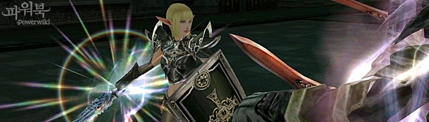
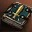
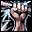
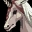
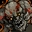

# Классы и умения
## Изменения классов
- Для некоторых классов (и их третьих профессий) увеличено максимальное количество CP

| Классы | Увеличение CP |
| --- | --- |
| Властитель Огня, Певец Заклинаний, Заклинатель Ветра | Макс. CP увеличено на 20% от того, что было |
| Епископ | Макс. CP увеличено на 29% от того, что было |
| Мудрец Евы, Мудрец Шилен | Макс. CP увеличено на 80% от того, что было |
| Верховный Шаман | Макс. CP увеличено на 13% от того, что было |

## Изменения умений
В этом дополнении были изменены и добавлены некоторые умения

- Добавлены умения:

| Класс | Умение |
| --- | --- |
| Рыцари | Боевая Аура - На 20 минут повышает силу атаки всей группы Терпение - Шанс, что сила нанесенного удара повысится. |
| Мастер | Создать Вещь - 10 ур. (для изучения требуется  `Забытый Свиток: Создать Вещь 10-го Уровня` ) |

- Изменены умения:

| Название | Изменение |
| --- | --- |
|  Агрессия | Мощность умения увеличена на 35% от существующей |
|  Магическое Сопротивление | Магическая защита увеличена на 20% от существующей |
|  Благословение Евы и   Прикосновение Жизни | нельзя применять к монстрам. |
|  Подпитка от Трупа | Устранена проблема невозможности применить эффект возврата СР в случае усиления умения с помощью дополнительной Храбрости.|
| Горящая Смола | Исправлены ошибки в описании навыка Горящая Смола.|
|  Пророчество Огня | исправлены ошибки в описании штрафа магического снижения умения |
|  Печать Привязи | исправлены ошибки в описании Стоимости умения |
|  Пророчество Воздуха | исправлены ошибки в описании Стоимости умения |
|  Смертоносный Удар | исправлены ошибки в описании умения Противостояния Стихиям |
|  Защита от Стихий | исправлена ошибка в описании времени умения |

## Изменения в системе питомцев/слуг
- Колдун, Последователь Стихий, Последователь Тьмы, Некромант - слуги больше не забирают часть опыта хозяев, но ПвП слуги все равно забирают 90% опыта:  
 **Призвать Мяу**  
 **Призвать Миража**  
 **Призвать Гекату**  
 **Призвать Порочного**  

- Изменена стоимость призыва и поддержания жизни слуги: теперь для этого необходима  `Руда Духов` .
- Время жизни всех слуг Некроманта изменено возросло с 20 минут до 1 часа.
- Добавлен новый питомец Магвен:
    - Его можно получить в новых Охотничьих Угодьях, которые называются Территория Семени Уничтожения.
    - Магвен обладает уникальной способностью перемещать своего хозяина на Территорию Семени Уничтожения.
    - Элитный Магвен обладает уникальной способностью перемещать напарников своего хозяина на Территорию Семени Уничтожения.
-  **Барьер Слуги** - умение временно отключёно для последующего устранения проблемы с его использованием.
- Порядок автоматического подбора провизии Великим Волком изменился следующим образом:
    - Пища Великого Волка > Обогащенная еда для Питомца > Волчий корм
- Исправлена проблема, когда питомцы не узнавали своего хозяина после его (хозяина) смерти и воскрешения.
- Изменена стоимость призыва Кубов.
    1. Для призыва кубов теперь нужна  `Руда Духов` .
    2. Стоимость призыва кубов уменьшена
- Теперь слугам передается 100% от использованного в оружии атрибута. Хозяину достается всего 20%
    1. Касается профессий: Колдун, Чернокнижник, Последователь Стихий, Мастер Стихий, Последователь Тьмы, Владыка Теней
- Мощность умения  Лечение Слуги увеличена на 16% от существующей.
- Эффект от преимуществ, полученных слугой, теперь распространяется и на его хозяина.
