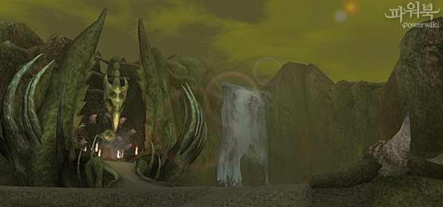
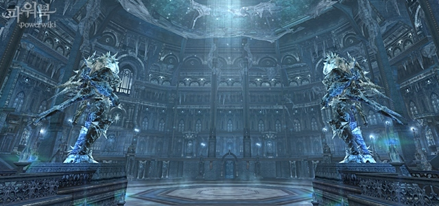
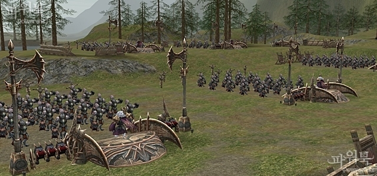
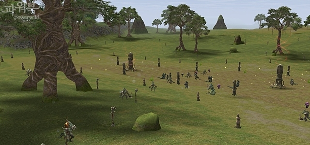
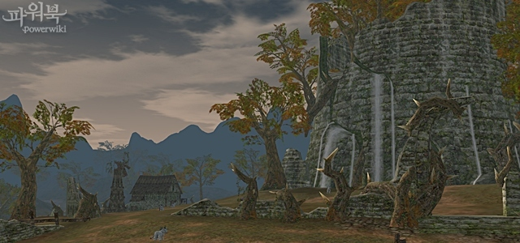
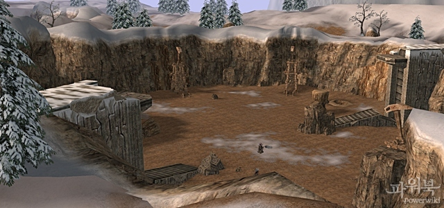
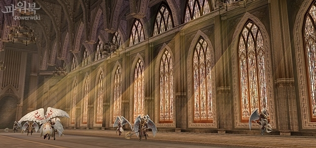
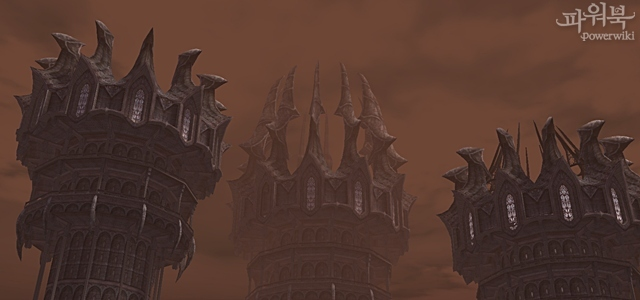
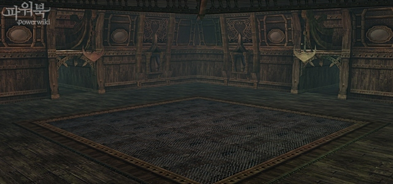

# Зоны Охоты
## Новые Зоны Охоты
### Семя Уничтожения

**Уровень Зоны Охоты**: 85 ур.   
**Тип**: Для групповой охоты    
**Особенности Зоны Охоты**:   

1. Семя Уничтожения – это огромный живой организм, корни которого уходят глубоко в землю и впитывают энергию живых существ. Полученная энергия передается Матери-Истине, в самый центр организма, и используется для создания рас. Каждая раса, родившаяся от Истины, ведет жестокую борьбу за выживание внутри Семени Уничтожения, чтобы стать единственной.   
2. Зона делится на 3 района – Бистакон / Рептиликон / Кокракон, и могут быть использованы независимо от состояния Семени.   
3. В каждом районе можно получить определённые положительные эффекты, такие, как Энергия Усиления, Энергия Ускорения, Энергия Мудрости, которые отвечают охотничьим способностям каждого класса.   
    - Энергия Усиления – Увеличение наносимого урона   
    - Энергия Ускорения – Серия выстрелов  
    - Энергия Мудрости – Серия чар   
4. Каждый понедельник в 13.00 состояние Мест Охоты обновляется, причем распределение положительных эффектов по районам меняется случайным образом.   
5. В каждом районе есть Главный Монстр (Такракхан, Торумба, Допаген), который появляется, если постоянно охотиться в данном районе или в какой-то особый момент.  
6. Система сбора Плазмы Магвена   
    - В момент убийства монстра в Семени Уничтожения вы можете получить один из 3 видов Плазмы Магвена (вероятность его появления одна и та же). Положительный эффект распространяется на всех членов группы.  
    - При получении Плазмы Магвена вы можете также получить Рог Магвена или Рог Элитного Магвена (вероятность одна и та же), с помощью которых можно получить питомца Магвена или Элитного Магвена.   
    - Информацию о Магвенах можно уточнить у неигрового персонажа Нимо из Воздушной Гавани в Семени Уничтожения.   

### Фрея

**Уровень Зоны Охоты**: 82-85 ур.  
**Тип**: Временная зона для рейда  
**Особенности Зоны Охоты**:     

1. Осколки кристалла, который не смогла собрать Фрея, рассыпались по всему замку, и теперь замок Великолепной Мелисы превратился в царство зимы, кишащее монстрами.  
2. Временная зона, в которой может находиться 10~27 игроков.   
3. Войдя в зону, можно выбрать между обычным и улучшенным режимом.   
4. Каждую среду и субботу в 6 ч. 30 мин. зона возвращается к первоначальному состоянию.  

### Школа Полномочий

**Уровень Зоны Охоты**: 82-85 ур.  
**Тип**: Временная зона для рейда  
**Особенности Зоны Охоты**:   

1. Ксель-Махумы всегда жили в северных районах Адена, а теперь они терпят поражения в территориальных войнах с Гноллами и вынуждены перемещаться на юг, в Долину Ящеров, где обитает Ящер Тантаар. Для того чтобы прибрать эту равнину изобилия к рукам, раса Ксель-Махумов построила к югу от Замка Орена «Школу Полномочий», набрала инструкторов и теперь в условиях строжайшей дисциплины тренирует своих воинов.   
2. В разных местах угодий горят костры. Если разгорается большой костер, это значит, что вокруг него собрались монстры, чтобы отдохнуть.    
   - Уровень силы у отдыхающих монстров ниже.
3. Шеф-повар Ксель-Махумов бродит по Угодьям и готовит на костре пищу для монстров.   
    - Уровень силы у монстров, занятых едой, ниже.   
4. Во время сдерживания атаки монстрами лагеря им на помощь приходят все воины этой части лагеря и участвуют в бою.   

### Лабиринт Бездны (83 ур.)

**Уровень Зоны Охоты**: 80-85 ур.   
**Тип**: Временная зона для одной группы   
**Особенности Зоны Охоты**:  

1. Добавлен новый Лабиринт Бездны, который проходится тем же образом, что и прежний, 81 уровня.
    - Каждый день в 6 ч. 30 мин. происходит сброс таймера доступа в зону для персонажей

## Изменение Зон Охоты
### Долина Ящеров

**Уровень Зоны Охоты**: 83-84 ур.   
**Тип**: Для одиночной охоты (лучники)   
**Особенности Зоны Охоты**:  

1. Долина Ящеров совершенно преобразилась благодаря магии, вызванной пролитой кровью Антараса. Она стала землей вечного конфликта, отравленной зловонным газом. Ящер Лито тоже испытал влияние этих паров и основал новую расу – Ящеров Тантаар, которая намного сильнее предшествующей ей.
2. В каждом из трёх районов Угодий уровень загрязнения (уменьшение НР и увеличение вероятности критического выстрела) разный – персонаж может охотиться в любом районе на выбор.
3. Ядовитый газ уничтожает слабые растения в Долине Ящеров. Он обладает агрессивной способностью всасываться, поэтому опадающие во время охоты травы разрушаются и автоматически подбираются персонажем.
4. Во время охоты могут пригодиться: Радужная Лягушка, нейтрализующая действие ядовитого газа, Гриб, способный ненадолго задержать взгляд Воинственного Монстра, а также Гриб восстановления персонажа и лекарственные травы.
5. Также здесь водится ‘Провидец Тантаара Югор’, который может атаковать в одиночку, поэтому охотиться в окрестностях можно только с использованием лекарственных трав.

### Ферма Диких Зверей

**Уровень Зоны Охоты**: 83-84 ур.   
**Тип**: Для одиночной охоты (ближний бой)   
**Особенности Зоны Охоты**:  

1. Вы можете постепенно растить диких животных, подкармливая их. Они помогут вам увеличить количество выпадающих предметов/получаемых очков опыта.
2. Есть определенная вероятность, что между 3 и 4 стадией из дикого животного удастся вырастить монстра-питомца.
3. Полученными во время выполнения задания питомцами можно управлять с помощью предметов-аксессуаров «идти следом», «получить положительный эффект», «разрушить препятствие спереди»

### Заброшенная Мастерская

**Уровень Зоны Охоты**: 83-84 ур.   
**Тип**: Для одиночной охоты (ближний бой)   
**Особенности Зоны Охоты**:  

1. Заброшенная Мастерская в древности была огромной лабораторией, где проводили свои исследования Гномы и Темные Эльфы. Но появился сумасшедший ученый Доктор Хаос, мечтавший о мировом господстве, который вытеснил их с помощью созданной им армии Големов и захватил Заброшенную Мастерскую. 2.2.2. Позже Гном Дороти стала ассистировать Хаосу. В результате была создана ужасная армия Големов.
3. **Карьер**: при убийстве монстра есть определенная вероятность, что появится еще один (Место для одиночной игры).
4. **Лаборатория Доктора Хаоса**: Место для групповой охоты.

### Монастырь Безмолвия

**Уровень Зоны Охоты**: 83-84 ур.   
**Тип**: Для одиночной и групповой охоты   
**Особенности Зоны Охоты**:

1. В результате длительных молитв и медитаций жрецы Эйнхасад, последователи Святой Солины, предсказывают скорый Конец Света. Для того, чтобы его избежать, жрецы возносят к небу искренние молитвы. В ответ ли на их прошения, или нет, но на верхних этажах Монастыря появились новые Ангелы. Кроме того, среди путешественников, ищущих Священный Грааль, появились слухи, будто где-то в Монастыре спрятаны сокровища, которые находятся недалеко от Тайной Комнаты и Рыцарей Солины.
2. С помощью полученных у монстров предметов можно принять участие в мини-игре в Тайной Комнате.
3. Обновлена рейдовая зона Главы Флиндов Анаиса.

### Остров Ада – Стальная Цитадель

**Уровень Зоны Охоты**: 83-84 ур.   
**Тип**: Для групповой охоты   
**Особенности Зоны Охоты**:

1. В этой Зоне, где раньше велась одиночная охота, теперь возможна и групповая.
2. Добавлен телепорт между этажами.
3. Внесены изменения в расположение монстров.
4. Рейдовые Боссы Принц Демонов и Ранку могут появляться по собственному желанию. Войти в Рейдовую Зону можно только после входа во Временную Зону.

### Фринтеза
**Уровень Зоны Охоты**: 80-85 ур.   
**Тип**: Для групповой охоты   
**Особенности Зоны Охоты**:

1. Так же, как и раньше, Рейдовый Босс Фринтеза доступен во Временной Зоне.
2. В зону может зайти от 36 до 45 человек.
3. Каждую среду и субботу в 6 час. 30 мин. Временная Зона возвращается к первоначальному состоянию.

### Дневной Закен Высшего Ранга

**Уровень Зоны Охоты**: 78-85 ур.   
**Тип**: Временная Зона для рейда   
**Особенности Зоны Охоты**:   

1. Добавлен новый Дневной Закен 83 уровня, который проходится тем же образом, что и нынешний Дневной Закен.
2. В Зону может зайти от 9 до 27 человек.
3. Каждый понедельник, среду и пятницу в 6 ч. 30 мин. Временная Зона возвращается к первоначальному состоянию.

### Антарас и Валакас
**Уровень Зоны Охоты**: 85 ур.   
**Тип**: Рейдовая Зона   
**Особенности Зоны Охоты**:   

1. Из-за того, что Седьмой Знак (Седьмая Печать) не был надежно спрятан, сила Шилен, полученная от Адена, возросла. А вместе с ее силой поразительно возросла и мощь Антараса и Валакаса.
2. Уровень монстров Антараса и Валакаса в настоящий момент соответствует самому высокому уровню игроков.
3. Максимальное количество игроков, которые могут одновременно бросить вызов Антарасу, 200 человек.

## Другие изменения
- Решена проблема бесконечного нахождения мертвого персонажа в зоне - Грань Реальности.
- В случае смерти в Гранях Реальности время воскрешения ограничено 1 минутой.
- Раньше при атаке Баюма персонажем, который выше него на 9 уровней (и больше), либо при помощи Боссу, персонаж не получал «рейдового проклятия» - теперь эта проблема решена.
- Теперь Призыватель Грабителей Могил и Маг Грабителей Могил из Мифрилового Рудника не могут призывать дополнительных слуг.
