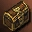
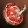

# Квесты
## Новые квесты
- Квесты Фрея - Добавлено 5 квестов, позволяющих узнать историю Замка Снежной Королевы Фреи. Квесты Фреи можно выполнять только после достижения 82 уровня. Для старта квеста обратитесь к Рафорти у хижины торговца льдом.
- Добавлен новый тип квестов - Ежедневный квест, который можно выполнять регулярно, но не чаще одного раза в день. Сброс таймера для повторного начала происходит каждый день в 6:30 утра.
- Добавлен новый тип квестов - Сопровождение (охрана). Добавлен квест на сопровождение НПЦ по Монастырю Безмолвия.
- Добавлен новый тип квестов - Предметный. При охоте на монстров в Монастыре Безмолвия можно получить предмет, начинающий квест.
- Новые квесты:

| Название | Ур. | Описание | Стартовый НПЦ |
| --- | --- | --- | --- |
| Поручение торговца льдом | 82 | Один из квестов, рассказывающих историю Замка Снежной Королевы | Хижина Торговца Льдом [Рафорти] |
| Получение чудесного меча| 82 | Один из квестов, рассказывающих историю Замка Снежной Королевы | Хижина Торговца Льдом [Рафорти] |
| Встреча с Сиррой | 82 | Один из квестов, рассказывающих историю Замка Снежной Королевы | Хижина Торговца Льдом [Рафорти] |
| Повторная встреча с Сиррой | 82 | Один из квестов, рассказывающих историю Замка Снежной Королевы | Хижина Торговца Льдом [Рафорти] |
| Рассказ оставшихся | 82 | Один из квестов, рассказывающих историю Замка Снежной Королевы | Хижина Торговца Льдом [Рафорти] |
| В Семя Уничтожения | 84 | Доставьте указания в Семя Уничтожения | База Альянса Кецеруса Командир [Ковальдир] |
| Найти пропавших солдат | 84 | Ежедневное задание в Семени Уничтожения | Семя Уничтожения Офицер [Джейкхан] |
| Своими силами | 84 | Охотьтесь на монстров в Семени Уничтожения | Семя Уничтожения Офицер [Клемис] |
| Где же мы? | 84 | Сопроводите раненых солдат с поля боя | Семя Уничтожения [Раненый Солдат] |
| Клятва | 82 | Ежедневный квест в Монастыре Безмолвия | Монастырь Безмолвия Квестовый предмет:  Сейф Клятвы |
| Секретное задание | 82 | Квест по передаче послания Жрецу Гремори, находящемуся в Монастыре Безмолвия по просьбе Жреца Доминика | Руна [Жрец Доминик] |
| Погасивший свет | 82 | Квест на убийство Рейдового Босса Анаис | Монастырь Безмолвия [Жрец Гремори] |
| Нарушитель безмолвия | 82 | Повторяющийся квест на убийство монстров в Монастыре Безмолвия | Монастырь Безмолвия  [Жрец Гремори] |
| Конца и края нет | 82 | Проводите потерявшихся охотников за сокровищами к выходу из Монастыря Безмолвия | Монастырь Безмолвия Искатель Сокровищ [Кумиэл] |
| Сразить одним ударом | 82 | Ежедневный квест, позволяющее получить вознаграждение за охоту на монстров Фермы Диких Зверей | Ферма Диких Зверей [Келая] |
| Окружи заботой | 82 | Квест, позволяющий получить вознаграждение за уничтожение монстров, похищающих диких зверей на Ферме Диких Зверей | Ферма Диких Зверей [Пастух Тунатун] |
| Найди слабое место | 82 | Квест на уничтожение Ранку, Принца Демонов и др. (одноразовый квест) | Стальная Цитадель Джериан |
| Захватить Дракона | 83 | Квест, позволяющий в качестве награды получить диадему, которая дается только убийце Антараса, для того, чтобы показать авантюристам, победившим Антараса, кто на самом деле является лучшим из них | Долина Драконов [Страж Антараса Теодрик] |
| Убить Огненного Дракона | 83 | Квест, позволяющий в качестве награды получить диадему, которая дается только убийце Валакаса, для того, чтобы показать авантюристам, победившим Валакаса, кто на самом деле является самым лучшим авантюристом. | Кузница Богов [Страж Валакаса Клейн] |
| Отравленная Долина Ящеров | 82 | Исследование появления новых Ящеров в Долине Ящеров | Орен Капитан [Моен] |
| Подумайте, прежде чем съесть | 82 | Исследовать эффекты растений в Долине Ящеров | Долина Ящеров [Гарри] |
| Когда-нибудь обязательно узнаешь | 82 | Повторяемый квест на убийство Ящеров | Долина Ящеров [Лаки] |
| Покажи свою силу | 82 | Повторяющееся задание, позволяющее получить предмет для перемещения в место, где находится Провидец Югор | Долина Ящеров [Джанни] |
| Избавьте меня от беспокойства | 82 | Повторяемый квест в Долине Ящеров | Долина Ящеров [Анкуми] |
| Аппетитный запах | 82 | Одноразовое задание по проверке эффекта Каши с Лососем в Школе Полномочий | Орен Страж [Стэн] |
| Разрушай от основания | 82 | Ежедневное задание по охоте на тренирующегося в Школе Полномочий Ксель-Махума и Шеф-повара, готовящего Кашу с Лососем | Орен Страж [Стэн] |
| Все вкусное - мое | 82 | Задание, в котором необходимо отнимать бочонки с кашей у монстров Школы Полномочий | Орен Страж [Стэн] |
| Секретов нет | 82 | Одноразовое задание, в котором необходимо добыть информацию о тренировках Ксель-Махума в Школе Полномочий | Орен Страж [Пинапс] |
| Устранить источник опасности | 82 | Повторяющееся задание, в котором можно получить вознаграждение за охоту на монстров Школы Полномочий | Орен Страж [Пинапс] |
| И все-таки я - гений | 70 | Ежедневное задание, в котором необходимо уничтожить Големов | Заброшенная Мастерская Коллекционер [Гутенхаген] |

## Изменение уровня квестов

| Название | Ур. | Описание | Стартовый НПЦ |
| --- | --- | --- | --- |
| Нашествие машин| 70 | Повторяющийся квест, в котором можно получить вознаграждение за охоту на монстров в Заброшенной Мастерской | Заброшенная Мастерская Коллекционер [Гутенхаген] |
| [Деликатесное мясо] | 82 | Повторяющийся квест, в котором можно получить вознаграждение за высокосортное мясо, полученное во время охоты на монстров Фермы Диких Зверей | Ферма Диких Зверей [Тунатун] |

## Изменения квестов
1. Журнал квестов увеличен с 25 до 40 квестов.
2. Квестовый инвентарь отделен от основного, квестовые предметы больше не учитываются как занимающие слоты инвентаря.
3. Изменены Маркеры у квестовых НПЦ. Так же добавлены маркеры всем НПЦ вовлеченным в квест. Маркер изменен на изображение свитка, изображения свитка зависят от типа задания и шага в задании. Для эпических квестов, квестов на смену профессии, и других специальных квестов цвет свитка будет красным; для одноразовых, повторяемых, ежедневных и других заданий, цвет свитка будет синим.
4. Изменены квесты на третью смену профессии:
    - На шаге задания, когда необходимо убить Архонта Халиши, теперь с монстров в Усыпальнице верности будет падать не 1, а 1- 4  `Знака Халиши` .
    - Для прохождения заданий Магия Огня – ч. 1 и Магия Воды – ч. 1 теперь необходим только 1 уровень альянса с Орками Кетра или Фавнами Варка.
    - Сага Дуэлиста - путь для добычи квестового предмета  `Лучшее Мясо` изменен:
        - До обновления: выполнение задания Деликатесное мясо
        - После обновления: просто получаем его у НПЦ Пастух Тунатун
5. Стражи Святого Грааля, Деликатесное мясо, Нашествие машин, - изменены в связи с изменением Зон Охоты. Задания полученный до обновления невозможно продолжить, награду за задания можно получить у специальных НПЦ в городе.
6. Ящеры Лито ушли из Долины Ящеров, в квестах они были заменены на других Монстров, их местоположение проверяйте по карте, список по описанию квеста:
    - Список заданий для которых требовалось убивать Ящеров Лито: Путь Берсерка, Выполнение условий договора, Испытание верности, Испытание искателя, Испытание мудрости, Испытание жизни, Испытание судьбы, Испытание силы, Испытание мастерства, Испытание меткости, Испытание колдуна, Испытание призывателя, Испытание вестника, Охота на Ящеров Лито, Песня Охотника, Дракончик
7. Сопротивление Злу - в квест включена новая Зона Охоты
8. Прошлое Смотрителя Склада из списка удалены монстры которые ранее водились в Зоне Охоты Луга Небесной Тени - Нидхогр, Упырь, Краснолюд, Люминус, Лик Ужаса.
9. Воскрешение старого управляющего, Исследование Павла, История Големов - уровень заданий изменен на 70+.
10. Ферма Диких Зверей (квест), Нежная забота, Деликатесное мясо - уровень заданий изменен на 82+.
11. Поплавки для рыбалки - в Заброшенной Мастерской больше нельзя получить  Сладкая Жидкость за убийство монстров.
12. По уважительной причине, Эксплуатация полей, Опасность - шанс!, Сражение со злыми духами - количество квестовых предметов необходимых для покупки награды уменьшено.
13. По уважительной причине, Эксплуатация полей - список наград за квесты увеличен.
14. Усиление оружия изменен список монстров для повышения уровня Кристаллов Души:

| Цвет | Шанс | Подробности |
| --- | --- | --- |
|  | Случайный | У одного персонажа из добившей группы. |
|  | Случайный | У 0-9 персонажей из добившей группы. |
|  | 100% | У всех персонажей из добившей группы (макс. 9). |

| Ур. | Монстр | до 11 ур. | до 12 ур. | до 13 ур. | до 14 ур. | до 15 ур. | до 16 ур. | до 17 ур. | до 18 ур. |
| --- | --- | --- | --- | --- | --- | --- | --- | --- | --- |
| 40 | [Королева Муравьев] |  |  |  |  |  |  |  |  |
| 50 | [Ядро] |  |  |  |  |  |  |  |  |
| 50 | [Орфен] |  |  |  |  |  |  |  |  |
| 60 | [Закен (Дневной)] |  |  |  |  |  |  |  |  |
| 60 | [Закен (Ночной)] |  |  |  |  |  |  |  |  |
| 60 | [Ледяная Фея Сирра] |  |  |  |  |  |  |  |  |
| 60 | [Третий Подводный Стражник] |  |  |  |  |  |  |  |  |
| 60 | [Лидия Призрак Родника] |  |  |  |  |  |  |  |  |
| 60 | [Стражник Статуи Гиганта Карума] |  |  |  |  |  |  |  |  |
| 60 | [Древний Астральный Дрейк] |  |  |  |  |  |  |  |  |
| 60 | [Понтифик Тайк Арак] |  |  |  |  |  |  |  |  |
| 60 | [Лорд Ишка] |  |  |  |  |  |  |  |  |
| 61 | [Королева Фей Тиминиэль] |  |  |  |  |  |  |  |  |
| 62 | [Ревущий Лорд Кастор] |  |  |  |  |  |  |  |  |
| 65 | [Рахха] |  |  |  |  |  |  |  |  |
| 65 | [Свирепый Король Тигров] |  |  |  |  |  |  |  |  |
| 65 | [Повелитель Горгулий Тифон] |  |  |  |  |  |  |  |  |
| 65 | [Враждебный Призрак Рамдал] |  |  |  |  |  |  |  |  |
| 65 | [Хисилром Жрец Шилен] |  |  |  |  |  |  |  |  |
| 66 | [Агент Демона Фальстон] |  |  |  |  |  |  |  |  |
| 67 | [Ведьма Келона] |  |  |  |  |  |  |  |  |
| 68 | [Анаказель (68)] |  |  |  |  |  |  |  |  |
| 69 | [Кровавый Жрец Рудельто] |  |  |  |  |  |  |  |  |
| 69 | [Дух Предателя Анраса] |  |  |  |  |  |  |  |  |
| 70 | [Посланец Шилен Кабрио] |  |  |  |  |  |  |  |  |
| 70 | [Корим] |  |  |  |  |  |  |  |  |
| 70 | [Ревущий Налетчик] |  |  |  |  |  |  |  |  |
| 70 | [Герольд Фафуриона Локнес] |  |  |  |  |  |  |  |  |
| 70 | [Королева Фалибати Темис] |  |  |  |  |  |  |  |  |
| 70 | [Повелитель Зверей Бехемот] |  |  |  |  |  |  |  |  |
| 70 | [Закарон Возмездия Анаким] |  |  |  |  |  |  |  |  |
| 70 | [Баракиэль] |  |  |  |  |  |  |  |  |
| 70 | [Минас Анор] |  |  |  |  |  |  |  |  |
| 71 | [Айнхалдер фон Хельман] |  |  |  |  |  |  |  |  |
| 71 | [Бессмертный Спаситель Мадрил] |  |  |  |  |  |  |  |  |
| 72 | [Пророк Фафуриона Шешарк] |  |  |  |  |  |  |  |  |
| 72 | [Глава Ванор Кандра] |  |  |  |  |  |  |  |  |
| 72 | [Клинок Судьбы Танатос] |  |  |  |  |  |  |  |  |
| 73 | [Лорд Смерти Халлет] |  |  |  |  |  |  |  |  |
| 73 | [Чумной Голем] |  |  |  |  |  |  |  |  |
| 74 | [Жрица Антараса Кло] |  |  |  |  |  |  |  |  |
| 74 | [Крок Падиша Собекк] |  |  |  |  |  |  |  |  |
| 74 | [Ледяной Император Бамбаламп] |  |  |  |  |  |  |  |  |
| 75 | [Баюм] |  |  |  |  |  |  |  |  |
| 75 | [Кернон] |  |  |  |  |  |  |  |  |
| 75 | [Нага Буреносец] |  |  |  |  |  |  |  |  |
| 75 | [Последний Младший Гигант Олкут] |  |  |  |  |  |  |  |  |
| 75 | [Палатанос Ужасающей Мощи] |  |  |  |  |  |  |  |  |
| 75 | [Кровавая Императрица Декарбия] |  |  |  |  |  |  |  |  |
| 75 | [Лорд Смерти Ипос] |  |  |  |  |  |  |  |  |
| 75 | [Лорд Смерти Шакс] |  |  |  |  |  |  |  |  |
| 76 | [Ашакиэль Океан Пламени] |  |  |  |  |  |  |  |  |
| 76 | [Гигант из Горящего Камня] |  |  |  |  |  |  |  |  |
| 76 | [Гигантский Голем Хаоса] |  |  |  |  |  |  |  |  |
| 78 | [Шуриэль Пламя Гнева] |  |  |  |  |  |  |  |  |
| 78 | [Последний Младший Гигант Глаки] |  |  |  |  |  |  |  |  |
| 78 | [Белоглазый Дэймон] |  |  |  |  |  |  |  |  |
| 78 | [Божественный Стражник Горячих Источников Гестия] |  |  |  |  |  |  |  |  |
| 78 | [Анаказель (78)] |  |  |  |  |  |  |  |  |
| 79 | [Длиннорогий Голконда] |  |  |  |  |  |  |  |  |
| 79 | [Херувим Галаксия] |  |  |  |  |  |  |  |  |
| 80 | [Андреас Ван Холтер] |  |  |  |  |  |  |  |  |
| 80 | [Сэйлрен] |  |  |  |  |  |  |  |  |
| 80 | [Гордон] |  |  |  |  |  |  |  |  |
| 80 | [Анаис] |  |  |  |  |  |  |  |  |
| 80 | [Лилит] |  |  |  |  |  |  |  |  |
| 80 | [Анаким] |  |  |  |  |  |  |  |  |
| 80 | [Герой Кетра Хекатон] |  |  |  |  |  |  |  |  |
| 80 | [Командир Кетра Тайр] |  |  |  |  |  |  |  |  |
| 80 | [Глава Кетра Бракки] |  |  |  |  |  |  |  |  |
| 80 | [Дух Огня Настрон] |  |  |  |  |  |  |  |  |
| 80 | [Герой Варка Шадит] |  |  |  |  |  |  |  |  |
| 80 | [Командир Варка Мос] |  |  |  |  |  |  |  |  |
| 80 | [Глава Варка Хорус] |  |  |  |  |  |  |  |  |
| 80 | [Дух Воды Ашутар] |  |  |  |  |  |  |  |  |
| 80 | [Эмбер] |  |  |  |  |  |  |  |  |
| 80 | [Урука] |  |  |  |  |  |  |  |  |
| 80 | [Тиранозавр] |  |  |  |  |  |  |  |  |
| 81 | [Ганнибал] |  |  |  |  |  |  |  |  |
| 81 | [Тайфун] |  |  |  |  |  |  |  |  |
| 81 | [Древний Разведчик] |  |  |  |  |  |  |  |  |
| 81 | [Древний Костолом] |  |  |  |  |  |  |  |  |
| 81 | [Древний Жнец Душ] |  |  |  |  |  |  |  |  |
| 81 | [Древняя Возница Душ] |  |  |  |  |  |  |  |  |
| 81 | [Древний Рыцарь Смерти] |  |  |  |  |  |  |  |  |
| 81 | [Древний Вестник Смерти] |  |  |  |  |  |  |  |  |
| 81 | [Древний Пророк] |  |  |  |  |  |  |  |  |
| 81 | [Йохан Клодекус] |  |  |  |  |  |  |  |  |
| 81 | [Йохан Кланикус] |  |  |  |  |  |  |  |  |
| 81 | [Аэнкинель (81)] |  |  |  |  |  |  |  |  |
| 82 | [Командир Каннибалов Стакато] |  |  |  |  |  |  |  |  |
| 82 | [Эпидос] |  |  |  |  |  |  |  |  |
| 82 | [Гигант Марпанак] |  |  |  |  |  |  |  |  |
| 82 | [Горголос] |  |  |  |  |  |  |  |  |
| 82 | [Экимус] |  |  |  |  |  |  |  |  |
| 82 | [Тиада] |  |  |  |  |  |  |  |  |
| 82 | [Аэнкинель (82)] |  |  |  |  |  |  |  |  |
| 82 | [Принц Демонов] |  |  |  |  |  |  |  |  |
| 82 | [Ранку] |  |  |  |  |  |  |  |  |
| 83 | [Тулли] |  |  |  |  |  |  |  |  |
| 83 | [Гвиндорр] |  |  |  |  |  |  |  |  |
| 83 | [Последний Гигант Утенус] |  |  |  |  |  |  |  |  |
| 83 | [Хекатон Прайм] |  |  |  |  |  |  |  |  |
| 83 | [Закен (83 ур.)] |  |  |  |  |  |  |  |  |
| 83 | [Белеф] |  |  |  |  |  |  |  |  |
| 84 | [Анаис] |  |  |  |  |  |  |  |
| 84 | [Аэнкинель (84)] |  |  |  |  |  |  |  |
| 84 | [Дух Воды Лиан] |  |  |  |  |  |  |  |
| 84 | [Дарион] |  |  |  |  |  |  |  |
| 84 | [Королева Шиид] |  |  |  |  |  |  |  |
| 84 | [Дарнель] |  |  |  |  |  |  |  |
| 84 | [Кечи] |  |  |  |  |  |  |  |
| 84 | [Слеза] |  |  |  |  |  |  |  |
| 85 | [Клакиес (обычный)] |  |  |  |  |  |  |  |  |
| 85 | [Клакиес (улучшенный)] |  |  |  |  |  |  |  |  |
| 85 | [Такракхан] |  |  |  |  |  |  |  |  |
| 85 | [Допаген] |  |  |  |  |  |  |  |  |
| 85 | [Байлор] |  |  |  |  |  |  |  |  |
| 85 | [Скарлет Ван Халиша] |  |  |  |  |  |  |  |  |
| 85 | [Фрея (обычная)] |  |  |  |  |  |  |  |  |
| 85 | [Фрея (улучшенная)] |  |  |  |  |  |  |  |  |
| 85 | [Антарас] |  |  |  |  |  |  |  |  |
| 85 | [Валакас] |  |  |  |  |  |  |  |  |

