# Предметы
## Новые предметы
- Добавлено новое оружие 85/86 уровней, которое может использовать персонаж 84 уровня и выше (оружие имеет ранг ).
- Добавлены новые доспехи и аксессуары 82/85/86 уровней (доспехи имеют ранги  и )
- Способ изготовления новых парных мечей и парных кинжалов идентичен существующим.
- Новые предметы можно улучшать (оружие и аксессуары) и добавлять PvP-бонус (оружие и доспехи)

### Оружие

| Тип | Среднее  | Лучшее  |
| --- | --- | --- |
| Одноручный меч | 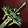 [Меч Очарования] |  [Меч Неиссякаемой Сущности] |
| Одноручный магический меч | 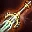 [Кровотворец] | 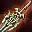 [Меч Архангела] |
| Двуручный меч |  [Клинок Пера] | 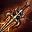 [Пылающая Пила] |
| Одноручное дробящее | 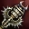 [Топор Вигвика] | 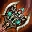 [Дробитель] |
| Одноручное магическое дробящее | 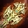 [Кутикула] | 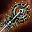 [Сакредюмор] |
| Двуручное дробящее | 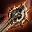 [Булава Злого Бога] | 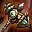 [Молот Берестира] |
| Двуручное магическое дробящее | 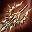 [Лик Тьмы] |  [Трость Могущества] |
| Кинжалы | 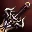 [Кинжал Черепа] | 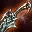 [Зуб Мамбы] |
| Копье | 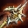 [Обоюдоострое Копье] | 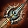 [Призрачный Жнец] |
| Лук | 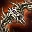 [Карниум] | 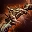 [Лук Изогнутых Шипов] |
| Кастет | 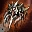 [Когти Окто] |  [Нефритовые Кулаки] |
| Рапира | 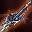 [Драгоценная Рапира] | 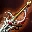 [Рапира Вознесения] |
| Древний Меч | 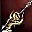 [Клинок Плавника] | 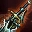 [Клинок Печати] |
| Арбалет |  [Забойщик] | 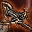 [Арбалет Шипов] |
| Парные мечи |  [Парные Мечи Очарования] |  [Парные Мечи Неиссякаемой Сущности] |
| Парные кинжалы |  [Парные Кинжалы Черепа] | 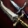 [Парные Зубы Мамбы] |

### Доспехи

|  | Серия | Ранг | Как получить |
| --- | --- | --- | --- |
| 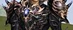 | [Доспехи Дестино] |  | Изготовление, трофеи |
| 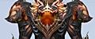 | [Доспехи Верпеса] |  | Изготовление, трофеи |
| 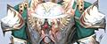 | [Доспехи Элегии] |  | Трофеи |

### Аксессуары

| Предмет | Описание |
| --- | --- |
| 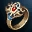 [Кольцо Дестино] | Увеличивает MP на 24. |
| 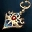 [Серьга Дестино] | Увеличивает MP на 36. |
| 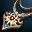 [Ожерелье Дестино] | Увеличивает MP на 48. |
| 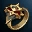 [Кольцо Верпеса] | Увеличивает MP на 26. |
| 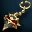 [Серьга Верпеса] | Увеличивает MP на 38. |
| 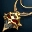 [Ожерелье Верпеса] | Увеличивает MP на 51. |
| 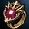 [Кольцо Элегии] | Увеличивает MP на 27. |
| 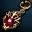 [Серьга Элегии] | Увеличивает MP на 39. |
| 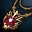 [Ожерелье Элегии] | Увеличивает MP на 52. |

- Эпические аксессуары

| Предмет | Описание | Как получить |
| --- | --- | --- |
|  [Ожерелье Фреи] | Увеличивает сопротивление воде на 10, кровотечению на 20%, параличу на 15%, шокирующим эффектам на 15%, усыплению на 15%, сокращает время повторного использования на 5%. Отражает 4% урона в ближнем бою, увеличивает макс. MP на 50, восстановление MP на 0.23, ментальную атаку на 10%. | Стандартный рейд «Фрея» |
| 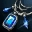 [Благословенное Ожерелье Фреи] | Увеличивает сопротивление воде на 15, кровотечению на 25%, параличу 20%, шокирующим эффектам на 20%, усыплению 20%, сокращает время повторного использования на 5%. Отражает 4% урона в ближнем бою, увеличивает макс. MP на 50, восстановление MP на 0.46, ментальную атаку на 10%, силу исцеляющих умения персонажа на 15.6637, ДУХ +2, ВЫН +1, СИЛ -1, сокращает потребление MP для магических умений на 5%. | Рейд «Фрея» в улучшенном режиме |

### Создание предметов
- Добавлены рецепты для изготовления оружия и доспехов Венеры.
- Добавлены рецепты для изготовления новых доспехов Дестино.
- Мастер Ишума поможет улучшить редкие части доспехов Венеры.

### Кристаллы Души, Камни Жизни
- Добавлены новые Кристаллы Души:
    - Для среднего оружия S84 - Кристалл Души - 17 этап
    - Для лучшего оружия S84 - Кристалл Души - 18 этап
- Добавлены новые Камни Жизни:
    - Камень Жизни / Средний Камень Жизни / Высокий Камень Жизни / Высший Камень Жизни 85 и 86 уровней
    - Камень Жизни для Аксессуара - 85 и 86 уровней

### Продажа Зарядов Духа и Души
Заряды Души и Духа рангов C и D добавлены в продажу следующим НПЦ:

| Нас. пункт | НПЦ |  | Нас. пункт | НПЦ |
| --- | --- | --- | --- | --- |
| [Дион]| [Лара] |  | [Древня Глудин] | [Поэзия] |
| [Деревня Проклятых] | [Виолетта] |  | [Долина Драконов] | [Гальман] |
| [Деревня Фавнов Варка] | [Диуабу] |  | [Долина Драконов] | [Китска] |
| [Деревня Охотников] | [Халли] |  | [Темный Лес] | [Тира] |
| [Орен] | [Сара] |  | [Годдард] | [Лесли] |
| [Деревня Орков Кетра] | [Атан] |  | [Гиран] | [Хельветия] |
| [Деревня Флоран] | [Пано] |  | [Хейн] | [Пауел] |
| [Земли Глудио] | [Роленто] |  | [Руна] | [Вебер] |
| [Земли Глудио] | [Сариен] |  | [Шутгарт] | [Пеле] |
| [Глудио] | [Гармония] |  |  |  |

### Другие изменения предметов
- Вес Руды Духа теперь равен 0.
- Из описания свадебного наряда во всплывающем окне удалено упоминание о восстановлении MP.
- Теперь на Крушителе Рока, зачарованном на +7 или более, чернота проявляется нормально.
- Зал ожидания в Грань Реальности был заменен на зону, не подходящую для свободной установки телепорта (уже существующие установленные телепорты использовать нельзя, поэтому их необходимо изменить или удалить).
- Теперь в процессе улучшения предмета при добавлении самоцветов их количество устанавливается автоматически.
- Теперь при улучшении окно не закрывается и можно продолжать процесс дальше.
- При использовании аксессуаров, получаемых за Битвы за Земли сложение эффектов сопротивляемости не происходит (например, при использовании Кольца Защитника Глудио: Земля и Кольца Хранителя Глудио: Земля используется только Кольцо Гвардейца Глудио: Земля).
- Исправлена проблема, когда при использовании щита во время ожидания у Агатиона не отображалась анимация его особого действия.
- Изменено отображение указанных ниже доспехов на представителях расы Камаэль:

| Комплект Легкой Брони Кристалла Тьмы | Комплект Легкой Брони Кошмаров |
| :---: | :---: |
| 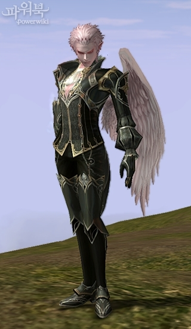 | 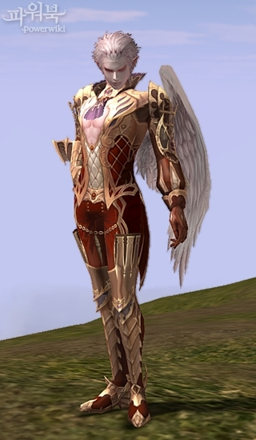 |
| 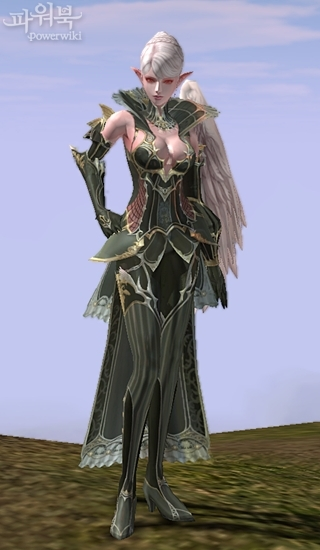 | 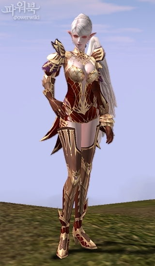 |

