# Игровой процесс

В этом обновлении серьезно модифицирована система кланов и Великой Олимпиады.

## Великая Олимпиада

- Олимпийские стадионы превращены во временные зоны.
- Максимальное количество одновременных боев - 160
- Изменено минимальное количество записавшихся, необходимое для начала боев:

| Тип боев | Мин. количество записавшихся   необходимое ранее | Мин. количество записавшихся   необходимое после обновления |
| --- | --- | --- |
| Индивидуальные соревнование вне классов | 9 человек | 10 человек |
| Индивидуальные соревнования внутри классов | 5 человек | 10 человек |
| Групповые соревнования | 9 команд | 5 команд |

- При подборе пар участников/команд, выбираются противники с максимально близким количеством очков.
- Для Дворян изменено количество автоматически начисляемых очков: в начале месяца (олимпийского цикла) - 10 очков, каждые 7 дней - 10 очков, таким образом всего за олимпийский цикл персонаж получает 50 очков.
- Добавлена команда, позволяющая посмотреть количество очков и оставшихся боев для выбранной цели. Можно использовать только на Дворянах.
- Дворяне теперь будут ограничены в боях, которые они могут провести в неделю:
    - Общее максимальное число боев для персонажа - 70 боев
    - Индивидуальные соревнование вне классов - 30 боев
    - Индивидуальные соревнования внутри классов - 30 боев
    - Групповые соревнования - 30 боев
- Максимальное количество зрителей для 1 стадиона теперь будет ограничиваться 18 людьми.
- Добавлено 3 новых типа стадионов и измене вид существующего (названия арен могут быть изменены)
    - Арена Орбиса   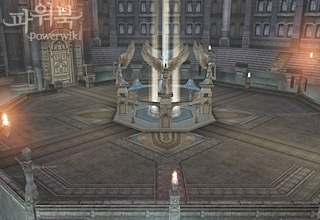 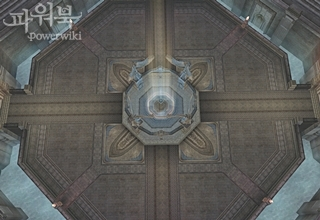   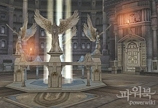 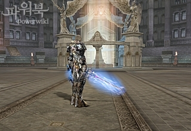
    - Арена Трезубец   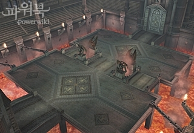 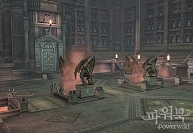   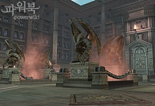 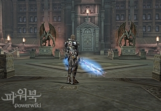
    - Зал Героев   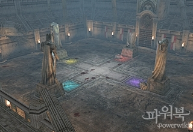 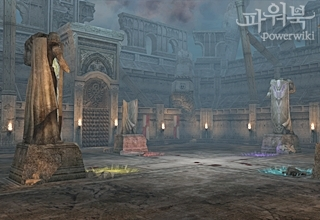   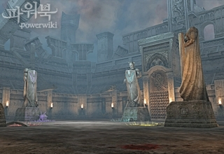 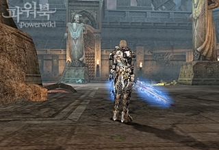
    - Олимпийский Стадион   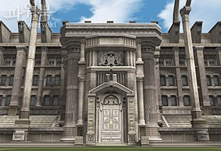 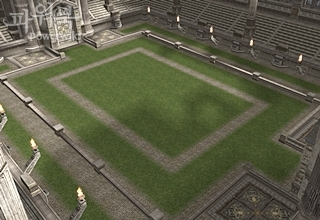   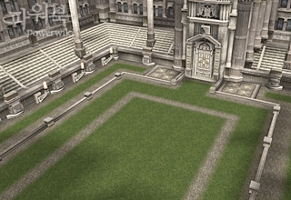 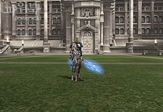
- Управляющий Олимпиады теперь предлагает игрокам специальные ежедневные олимпийские квесты, сброс возможности взятия квестов происходит в 6.30 утра.

| Название | Уровень | Описание | Стартовый НПЦ |
| --- | --- | --- | --- |
| Олимпиада: Навстречу опасности! | 75 | Примите участие в 10 Олимпиадах. Исход сражения не имеет значения. Если вы примете участие в меньшем количестве Олимпиад, то получите только часть награды. | Управляющий Олимпиады |
| Олимпиада: Расширяем границы! | 75 | Расширьте границы своих возможностей, приняв участие в каждом виде Олимпиаде по 5 раз. Если вы не сможете поучаствовать во всех видах Олимпиады, то за каждый вид Олимпиады, где вы участвовали 5 раз, вы получите часть награды. | Управляющий Олимпиады |
| Олимпиада: Только победа! | 75 | Выиграйте 10 Олимпиад подряд. Если вы умрете или проиграете, то счет побед обнулится. Если вы победите менее чем 10 раз подряд, то получите только часть награды. | Управляющий Олимпиады |

- Время действия предметов  Кольцо Героя Олимпиады , 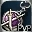 Серьга Героя Олимпиады ,  Ожерелье Героя Олимпиады изменено с 30 до 60 дней.
- Количество получаемых в награду символов / очков олимпиады, изменено:

| Ранг | Место | Количество очков/символов   до обновления | Количество очков/символов   после обновления |
| --- | --- | --- | --- |
| 1 | Топ 1% | 120 очков ( 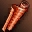 Символ Олимпиады — 120000 шт. ) | 100 очков (  Символ Олимпиады — 100000 шт. ) |
| 2 | Топ 10% | 80 очков (  Символ Олимпиады — 80000 шт. ) | 75 очков (  Символ Олимпиады — 75000 шт. ) |
| 3 | Топ 25% | 55 очков (  Символ Олимпиады — 55000 шт. ) | 55 очков (  Символ Олимпиады — 55000 шт. ) |
| 4 | Топ 50% | 35 очков (  Символ Олимпиады — 35000 шт. ) | 40 очков (  Символ Олимпиады — 40000 шт. ) |
| 5 | Ниже 50% | 20 очков (  Символ Олимпиады — 20000 шт. ) | 30 очков (  Символ Олимпиады — 30000 шт. ) |

- Награда Героя увеличилась с 180 очков до 200 очков (  Символ Олимпиады — 200000 шт. )
- Чтобы получить награду за Олимпиаду необходимо провести минимум 15 боев.
    - Награда на бои внутри класса изменена с 1/3 очков проигравшего на 1/5.
- Оружие Герое усилено:
    - Параметры Физ. и Маг. Атк. повышены, чтобы оружие соответствовало лучшему оружию в игре.
    - PvP бонус усилен.
    - Все существующие эффекты усилены.
    - Всему оружию Героев добавлен атрибут - 250 Святости.
- Список товаров, которые можно обменять у Старшего Менеджера Олимпиады расширен, добавлены:
    - Броня Венеры
    - Красивая Броня Венеры
    - Броня Верпеса
- Стоимость Забытых Свитков уменьшена.
- Билеты Дворянина больше нельзя использовать для покупок, их можно продать в магазин как обычный предмет.
- Расширены возможности управления камерой при просмотре Олимпийских боев.
- Добавлена возможность записывать Олимпийские бои.

## Персонажи

- После установки обновления все персонажи будут перемещены в ближайший нас. пункт.
- Количество опыта необходимого для повышения уровня для персонажей 78+ уменьшено.
- Изменен бонус опыта получаемый в группе.

| Кол-во людей в группе | Бонус опыта   до обновления | Бонус опыта   после обновления |
| --- | --- | --- |
| 2 человека | 30% | 10% |
| 3 человека | 39% | 20% |
| 4 человека | 50% | 30% |
| 5 человека | 54% | 40% |
| 6 человека | 58% | 50% |
| 7 человека | 63% | 100% |
| 8 человека | 67% | 110% |
| 9 человека | 72% | 120% |

- Изменено количество получаемого опыта при разнице в уровнях между персонажами в группе

| Разница в уровнях | Получаемый опыт |
| --- | --- |
| 9 и меньше | 100% |
| 10-14 уровней | 30% |
| Более 15 уровней | 0% |

- Штраф за убийство персонажей (PK) усилен
    - Увеличено количество кармы даваемое за каждое убийство персонажа.
    - Когда у персонажа карма больше 0, количество получаемого опыта и очков умений (SP) уменьшается, и за убийство монстров карма убывает медленнее, чем раньше
    - Шанс выпадения предметов с PK персонажа увеличен
- 탑승 변신체 상태에서 영웅 이펙트 가 지나치게 크게 표현되는 문제가 수정되었다 (что-то нипанятное)

## Кланы

- Изменены условия для повышения уровня клана

| Уровень   клана | SP | Адена | Необходимые предметы | Очки репутации   до обновления | Очки репутации   после обновления | Минимальное количество   членов клана   до обновления | Минимальное количество   членов клана   после обновления |
| --- | --- | --- | --- | --- | --- | --- | --- |
| 1 | 20,000 | 650,000 | - | 0 |  | 1 или более |  |
| 2 | 100,000 | 2,500,000 | - | 0 |  | 1 или более |  |
| 3 | 350,000 | 0 |  Знак Крови | 0 |  | 1 или более |  |
| 4 | 1,000,000 | 0 | 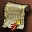 Манифест Альянса | 0 |  | 1 или более |  |
| 5 | 2,500,000 | 0 | 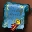 Печать Амбиций | 0 |  | 1 или более |  |
| 6 | 0 | 0 | - | 10,000 | 5000 | 30 или более | 30 или более |
| 7 | 0 | 0 | - | 20,000 | 10,000 | 80 или более | 50 или более |
| 8 | 0 | 0 | - | 40,000 | 20,000 | 120 или более | 80 или более |
| 9 | 0 | 0 |  Клятвенная Кровь — 150 шт. | 40,000 | 40,000 | 120 или более | 120 или более |
| 10 | 0 | 0 |  Кровь Альянса — 5 шт. | 40,000 | 40,000 | 140 или более | 140 или более |
| 11 | 0 | 0 | Владение Землями | 75,000 | 75,000 | 170 или более | 170 или более |

- Изменены Зоны Охоты где можно получить  Знак Крови , для получения 3-го уровня клана

| До обновления | После обновления |
| --- | --- |
| Долина Драконов, Запретные Врата | Могила Смотрителя, Запретные Врата |

- Изменена награда за клановые квесты:
    - Репутация Клана
    - Репутация Клана
    - Престиж Клана
- Устранена проблема с полетами над некоторыми зонами охоты Адена .
- В Обители Кланов добавлены новые товары:

| Город | Добавленные предметы |
| --- | --- |
| Обители Годдарда |  Свиток SP: Высший Ранг , 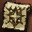 Свиток: Модифицировать Доспех (С) , 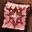 Свиток: Модифицировать Доспех (B) |
| Обители Глудио |  Свиток SP: Высший Ранг ,  Свиток: Модифицировать Доспех (С) ,  Свиток: Модифицировать Доспех (B) |
| Обители Деревни Глудин |  Свиток SP: Высший Ранг ,  Свиток: Модифицировать Доспех (С) |
| Обители Гирана |  Свиток SP: Высший Ранг ,  Свиток: Модифицировать Доспех (С) ,  Свиток: Модифицировать Доспех (B) |
| Обители Диона |  Свиток SP: Высший Ранг ,  Свиток: Модифицировать Доспех (С) |
| Обители Руны |  Свиток SP: Высший Ранг ,  Свиток: Модифицировать Доспех (B) ,  Свиток: Модифицировать Доспех (А) |
| Обители Шутгарта |  Свиток SP: Высший Ранг ,  Свиток: Модифицировать Доспех (С) ,  Свиток: Модифицировать Доспех (B) |
| Обители Адена |  Свиток SP: Высший Ранг ,  Свиток: Модифицировать Доспех (B) ,  Свиток: Модифицировать Доспех (А) |

## Почтовая Система

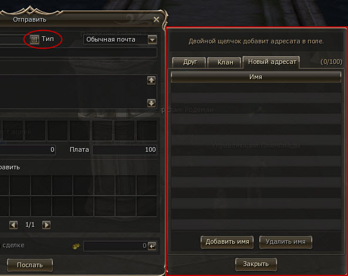

- Добавлена адресная книга, куда автоматически добавляются члены клана и друзья персонажа
    - Двойной клик на имени персонажа в адресной книге, добавляет имя в поле "Кому"
- Добавлена функция автозаполнения по начальным буквам имени получателя

## Поиск Группы

- Внесены улучшения в список персонажей ожидающих вступления в группу:
    - Добавлен поиск по имени и классу персонажа.
    - Для ожидающих в списке добавлена их текущая зона.
- Внесены изменения в комнату группы
    - Добавлена возможность просмотра ролей в группе

## Интерфейс

- Добавлена 4 панель горячих клавиш (12 слотов)
- В эффектах действующих на персонажа добавлена строка для срабатывающих эффектов.

| - | -  |
| --- | --- |
| 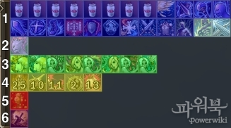 |1. Обычные положительные умения. По умолчанию доступно 20 слотов, расширяется до 24. 2. Включаемые умения. Умения которые можно включить или выключить по желанию игрока. 3. Песни / Танцы. Ауры накладываемые Танцорами Смерти и Менестрелями на группу. 4. Срабатывающие умения. Умения, которые накладываются на персонажа при нанесении или получении урона. 5. Отрицательные эффекты. Вредоносные умения, накладываемые противником на персонажа. 6. Штрафы. Штрафы смерти, перевеса и т.п. |

- При выборе персонажа в лобби теперь отображается уровень его энергии.
- Добавлено системное сообщение о невозможности двигаться во время разговора с NPC.
- Изменено системное сообщение в чате о получаемом опыте и очках умения
    - До обновления: *** опыта и *** SP было получено.
    - После обновления: Опыт *** (бонус: ***) и *** SP (бонус: ***) было получено.
