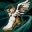
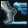
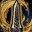
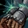

# Классы

## Новые умения

| Название | Классы | Уровень   получения | Описание |
| --- | --- | --- | --- |
| Атака Щитом | Паладин   Мститель   Рыцарь Евы   Рыцарь Шилен | 40 | Наносит урон щитом. Наличие щита обязательно. |
| Вызов Судьбе | Рыцарь Ада   Рыцарь Феникса   Храмовник Евы   Храмовник Шилен | 83 | Привлечение внимания окружающих врагов. Во время действия умения увеличивается Физ. Защ., Маг. Защ. рыцаря. |
| Владением Звуком | Гладиатор | 40 | Во время атаки есть шанс повысить уровень заряда. |
| Владение Силой | Монах | 24 | Во время атаки есть шанс повысить уровень заряда. |
| Бросок Кинжала | Авантюрист   Странник Ветра   Призрачный Охотник | 80 | Бросок кинжала, наносит урон и понижает скорость цели. |
| Двойной Импульс | Авантюрист   Странник Ветра   Призрачный Охотник | 83 | Мощный удар по слабому месту противника. Требуются парные кинжалы. |
| Веер Стрел | Снайпер   Страж Лунного Света   Страж Теней   Диверсант | 82 | Выстрел множеством стрел по окружающим врагам. Требуется Лук / Арбалет. |
| Укол Смерти | Снайпер   Страж Лунного Света   Страж Теней   Диверсант | 83 | Смертельный выстрел. Требуется Лук / Арбалет. |
| Цепное Исцеление | Кардинал   Жрец Евы   Жрец Шилен   Деспот | 83 | Восстанавливает цели и до 10 ближайшим дружественным целям 30%HP. Cумма восстановленного HP отсчитывается от наименьшего HP из всех целей. Потребляет 4 Руды Духа. |
| Массовое Противоядие | Жрец Евы   Жрец Шилен | 76 | Снимает Отравление со всех членов группы. |
| Массовое Очищение | Жрец Шилен | 76 | Снимает эффекты Паралича, нейтрализует слабый Яд и Кровотечение у всей группы. |
| Массовое Оживление | Жрец Евы | 76 | Восстанавливает HP, нейтрализует слабый яд и кровотечение у все группы. |
| Сопротивление Земле | Проповедник | 60 | На 20 минут повышает сопротивление Земле. |
| Напев Стихий | Глас Судьбы | 76 | На 20 минут повышает сопротивление всем атрибутам. |
| Шепот Битвы | Менестрель | 60 | На 2 минуты повышает Физ. Атк., Силу Крит. Ударов, Скорость. |
| Смертельный Ритм | Менестрель   Танцор Смерти | 40 | Мощный удар по цели. |
| Сокрушительный Удар | Охотник За Наградой | 40 | Сильный удар, понижающий Физ. Защ. и Маг. Защ. цели на 3 секунды |
| Молниеносный Бросок | Охотник За Наградой | 40 | Стремительное приближение к цели. |
| Разделение Способностей | Пожиратель Душ   Чернокнижник   Мастер Стихий   Владыка Теней | 83 | Передача умений хозяина слуге |
| Спираль Пространства | Колдун   Последователь Стихий   Последователь Тьмы | 40 | Мощная магическая атака. |
| Заряд Ауры | Инквизитор   Архимаг   Магистр Магии   Повелитель Бури | 81 | Безатрибутная атака цели и окружающих ее врагов, восстанавливает собственное MP. |
| Орудие Ауры | Инквизитор   Архимаг   Магистр Магии   Повелитель Бури | 82 | Безатрибутная атака цели и окружающих ее врагов, восстанавливает собственное MP. |
| Мистический Щит | Инквизитор   Архимаг   Магистр Магии   Повелитель Бури | 83 | В течении 10 секунд наносимые повреждения поглощаются на 90%. Постоянно потребляется MP |

## Добавление умений

| Название | Классы | Уровень   получения | Описание |
| --- | --- | --- | --- |
|  **Парирование** | Мститель | 46 | Обеспечивает защиту щитом от атак со всех направлений. Снижает Защиту Щитом на 40%. |
|  **Стремительный Бросок** | Копейщик   Гладиатор   Разрушитель   Кузнец , Отшельник | 40 | Персонаж устремляется на врага. |
|  **Стремительный Натиск** | Полководец   Дуэлист   Титан   Аватар   Мастер | 83 | Прорывается вперед и атакует врагов спереди, нанося урон. Вводит врагов в состояние шока. |

## Изменение существующих умений

| Название | Описание |
| --- | --- |
|  **Владение Дубиной** | Окончательно заменено на умение  **Владение Мечом/Дробящим Оружием** . |
|  **Парирование** | Эффективность щита теперь понижается только на 30%, вместо 40%. |
|  **Блокировка Оружия** | Умение можно будет изучать с 80 уровня у НПЦ-мастера, а не с 83. |
|  **Танец Шторма Клинков** | Действие улучшение на "Время" снижено. |
|  **Шаг из Тени** | Теперь умение можно будет изучать с 40-го уровня у НПЦ-мастера. |
|  **Смертельный Выстрел** | Мощность умения повышена. |
|  **Мертвый Глаз** | Скорость Атаки теперь понижается только на 10%, вместо 20%. |
|  **Фанатичная Преданность** | Прирост урона слуги увеличился на 15-35% |
|  **Обратная Связь** | Чтобы активировать умение, теперь необходимо сначала использовать новое умение Спираль Измерений |
|  **Шип Смерти** | Для использования умения больше не требуются Проклятые Кости |
|  **Массовый Мрак** | Для использования умения больше не требуются Проклятые Кости |
|  **Призывать Проклятые Кости** | Умение удалено за ненадобностью. |
|  **Удар Судьбы** | Умение больше не будет оглушать самого персонажа, но время до повторного использования увеличится. |
|  **Огненная Ловушка** | Скорость применения (каста) уменьшена на 50% |
|  **Отравляющая Ловушка** | Скорость применения (каста) уменьшена на 50% |
|  **Замедляющая Ловушка** | Скорость применения (каста) уменьшена на 50% |
|  **Обездвиживающая Ловушка** | Скорость применения (каста) уменьшена на 50% |
|  **Ослепляющая Ловушка** | Скорость применения (каста) уменьшена на 50% |
|  **Великое Лечение** | Мудрец Евы и Мудрец Шилен теперь могут изучать это умение как Епископ - с 40 уровня, а не с 48. |
|  **Сокрушительная Оценка** | Теперь умение можно использовать с мечом. |
|  **Безумие** | Активация умения доступна при 60% HP персонажа (а не при 30%), время до повторного использования уменьшено на 50%, но прирост урона при использовании понижен. |
|  **Вихрь Тьмы** | Повышена мощность умения, понижен уровень поглощения HP |
|  **Опыт Коллекционера** | Добавлена возможность использования умения при использовании меча. |

## Другие изменения умений

- Уменьшено количество очков умений (SP) для изучения умений третьей профессии
- Установлена вероятность успеха прохождения отрицательных эффектов: минимум 10%, максимум 90%
- Изменено количество целей, которые можно одновременно поразить копьем
    - Без изучения  **Владение Древковым Оружием** - было: 5, стало: 3
    -  **Владение Древковым Оружием** до 8-го уровня - умениями 1 профессии - было: 10, стало: 8
    -  **Владение Древковым Оружием** 9-го уровня и выше - умениями 2 профессии - было: 15, стало: 13
- Исправлена проблема отката умений Дворян
- Исправлены опечатки в умении  **Обезоружить**
- Умения  **Групповое Основное Лечение** и  **Основное Лечение** имеют одинаковую мощность
- Умению  **Кража Божественности** добавлена возможность сопротивления наложению, также прохождение умения будет зависеть от разницы уровней персонажей.
