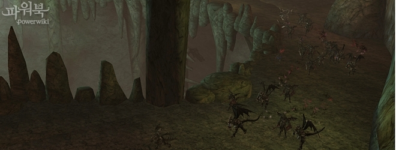
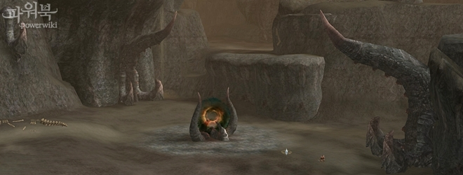

# Зоны Охоты

## Обновление Зон Охоты

Обновления затронули Долину Драконов и Логово Антараса .

- Долина Драконов и Пещера Антараса стали изолированными регионами, переместиться в различные области Долины Драконов и в Пещеру Антараса можно от специального НПЦ в Деревне Охотников.
- Монстры из Логова Антараса и Долины Драконов частично перенесены в новую зону - Могила Смотрителя
- Возвращение из Долины Драконов и Пещеры Антараса теперь будет перемещать персонажей в Деревню Охотников.

### Логово Антараса

|  | |
| --- | --- |
| Рекомендуемый уровень | 85 |
| Тип охоты | Охота группой |
| Основные изменения | - Изменен дизайн Зоны Охоты, зона населена новыми монстрами - Добавлены новые РБ: Повелитель Дрейков, Чудовищный Дракон, Глава Бехимосов - Добавлены новые квесты - В Пещере Антараса будут появляться патрулирующий монстр - Конорикс - Во время оценки монстров можно будет получить положительный эффект на восстановление энергии. |

### Долина Драконов

|   | |
| --- | --- |
| Рекомендуемый уровень | 80-85 |
| Тип охоты | Охота группой или в одиночку |
| Основные изменения | - Различные классы и группы могут охотиться в Долине Драконов. - Во время охоты можно получить специальные предметы для вызова случайного РБ (одного из 7) из специальных вихрей драконов. Вихри разбросаны по всей Долине Драконов. - Иногда в Долине Драконов происходят сейсмический феномены и появляются особые монстры, перемещающиеся группой по Долине Драконов. - Некоторые монстры из Долины Драконов перемещены в новую зону - Могила Смотрителя - При оценке монстров можно получить положительные эффекты восстанавливающие ману и энергию персонажей. |

При попадании в Долину Драконов на группу накладывается положительный эффект - Усиление Боевого Духа, уровень зависит от состава группы:

| Уровень эффекта | Действие |
| --- | --- |
| 1 уровень | Повышает сопротивление к Параличу, Кровотечению, Отравлению, Оглушению на 50, шанс крит. атк. на 10%, силу крит. атк. на 10% |
| 2 уровень | Повышает сопротивление к Параличу, Кровотечению, Отравлению, Оглушению на 80, шанс крит. атк. на 30%, силу крит. атк. на 15%, Физ. Атк на 15%, Маг. Атк. на 15% |
| 3 уровень | Повышает сопротивление к Параличу, Кровотечению, Отравлению, Оглушению на 90, шанс крит. атк. на 50%, силу крит. атк. на 20%, Физ. Атк на 15%, Маг. Атк. на 15%, получаемый опыт на 15% |

### Могила Смотрителя

Эта область расположена недалеко от Долины Смерти, сюда перенесены монстры из Долины Драконов и Логова Антараса связанные с различными заданиями.

## Изменения существующих Зон Охоты

### Башня Дерзости

- Некоторые монстры в Башне Дерзости больше не будут Оглушать персонажей
- Опыт за монстров в Башне Дерзости увеличен.
- Изменены телепорты через Пространственный Водоворот
- Камни Иных Миров для телепорта через Водовороты можно приобрести у НПЦ Исследователь Кеплон

### Болото Криков

- Изменено поведение монстров в зависимости от времени суток.
- Увеличено количество монстров.

## Другие изменения Зон Охоты

- Количество опыта за убийство монстров 76+ увеличено.
- Исправлено поведение питомцев в Семени Уничтожения
- Исправлено исчезновение трупов в Школе Полномочий
- Исправлено исчезновение трупов Капитанов Лабиринта в Стальной Цитадели
- Исправлено неиспользование обычной Фреей умения Вечная Снежная Буря.
- Исправлена проблема с перемещением в Логово Короля Пиратов, через НПЦ Следопыт в городах.
- Исправлена некорректная выдача положительного эффекта после смерти монстра - Королева Шиид после рестарта
- Кровавая Королева - исправлена ошибка, из-за которой на монстра не действовал Страх.
- Увеличено количество опыта за монстров в Разломе Между Мирами
- Увеличено качество наград за убийство Капитана Лабиринта в 83 Лабиринте Бездны
