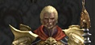
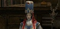
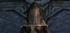
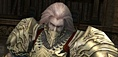

# Квесты

## Новые квесты

### Новые квесты Семи Печатей

|  | Название | Уровень | Стартовый   НПЦ |
| --- | --- | --- | --- |
|  | Семь Печатей, Таинственная Дева | 81 | Жрец Уд ( Аден ) |
|  | Семь Печатей, Запрещенная Эльмореденом книга | 81 | Элькардия |
|  | Семь Печатей, В Монастырь Безмолвия | 81 | Элькардия |
|  | Семь Печатей, Гробница Святой | 81 | Дух Эрис |
|  | Семь Печатей, Ищущий силу печати | 81 | Дух Эрис |

### Другие новые квесты

| Название | Уровень | Описание | Стартовый НПЦ |
| --- | --- | --- | --- |
| Олимпиада: Навстречу опасности! | 75 | Примите участие в 10 Олимпиадах. Исход сражения не имеет значения. Если вы примете участие в меньшем количестве Олимпиад, то получите только часть награды. | Управляющий Олимпиады |
| Олимпиада: Расширяем границы! | 75 | Расширьте границы своих возможностей, приняв участие в каждом виде Олимпиаде по 5 раз. Если вы не сможете поучаствовать во всех видах Олимпиады, то за каждый вид Олимпиады, где вы участвовали 5 раз, вы получите часть награды. | Управляющий Олимпиады |
| Олимпиада: Только победа! | 75 | Выиграйте 10 Олимпиад подряд. Если вы умрете или проиграете, то счет побед обнулится. Если вы победите менее чем 10 раз подряд, то получите только часть награды. | Управляющий Олимпиады |
| Именем легенды | 80 | Одноразовый квест на убийство всех 7-ми РБ в Долине Драконов | Страж Антараса Гильмор |
| Крылья из песка | 80 | Ежедневный квест на убийство РБ в Долине Драконов | Неприкаянный Дух |
| Не заставляйте человека ждать | 80 | Одноразовый квест на получение предметов для вызова РБ в Долине Драконов и для облегчения рейда на Антараса | Изаэль Серебряная Тень |
| Рассказ безымянного духа | 80 | Ежедневный квест на убийство РБ в Логове Антараса | Неприкаянный Дух |

## Другие изменения в квестах

- Следующие квесты выполняемые в Логове Антараса были удалены из игры, закончить из можно будет у НПЦ Лента Новостей в любом городе.
    - Власть Тьмы (55)
    - Шепот Грез, ч. 1 (56)
    - Шепот Грез, ч. 2 (60)
- Некоторые монстры из Долины Драконов и Логова Антараса были перемещены в новую зону - Гробница Наблюдателей, для квестов:
    - Усиление оружия
    - Эликсир Мимира
    - Поплавки для рыбалки
    - Испытание мудрости
    - Волшебные монеты
    - Прошлое Смотрителя Склада
    - Тысяча Лет: Конец Плача
    - Аудиенция у Дракона Земли
    - Драгоценная душа, ч. 1
    - Игра в карты
- Амбиции Клана - НПЦ необходимые по квесту перенесены в Долину Смерти
- Изменено требование к инвентарю для взятия или продолжения квеста - с 80% заполненности до 90%
